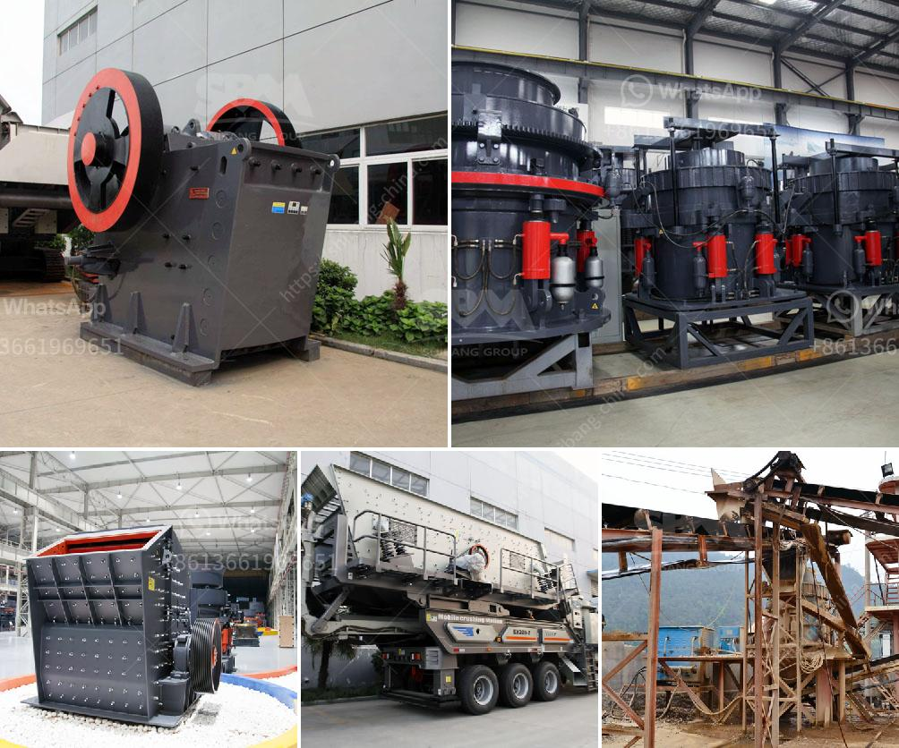

<h3>سعة آلة الكسارة 5 أطنان في الساعة</h3>
تعتبر آلة الكسارة بسعة 5 أطنان في الساعة من الآلات الهامة في صناعة التعدين والبناء. تستخدم هذه الآلة لكسر الصخور والمواد الصلبة إلى أحجام أصغر وتسهيل عمليات البناء والتعدين.

سعة آلة الكسارة 5 أطنان في الساعة تشير إلى الكمية المقدرة للمواد التي يمكن أن تتم معالجتها في ساعة واحدة. يمكن أن تشمل هذه المواد الصخور والحصى والخرسانة وأنواع أخرى من المواد الصلبة.

للآلة قدرة كبيرة على المعالجة وهذا يجعلها مفيدة في عدة صناعات. على سبيل المثال، في صناعة التعدين، يمكن استخدام آلة الكسارة لكسر الصخور والخامات إلى حجم مميز يمكن استخدامه في عمليات الفصل والتعدين اللاحقة. بفضل هذه الآلة، يمكن زيادة كفاءة استخلاص المعادن وتقليل تكاليف عمليات التعدين.

في صناعة البناء، تستخدم آلة الكسارة لتكسير الحصى والصخور المستخدمة في إنتاج الخرسانة والأسفلت. تمثل هذه الآلة حلاً فعالاً لتحويل المواد الصلبة الكبيرة إلى أحجام صغيرة تناسب احتياجات عملية البناء. تصميمها يسمح بإنتاج مواد عالية الجودة وفقًا للمعايير الصناعية.

تعتبر سعة الآلة بمقدار 5 أطنان في الساعة مثالية للعديد من التطبيقات. إنها قادرة على معالجة كميات كبيرة من المواد بشكل فعال وسريع. اعتمادًا على طبيعة المادة المعالجة وحجمها، يمكن أن تتفاوت سعة الآلة من 200 إلى 400 طن في اليوم.

تحتوي آلة الكسارة على عدة أجزاء رئيسية، بما في ذلك المحرك الكهربائي، الفك الثابت والفك المتحرك، ومنظومة الحماية والتحكم. يعمل المحرك الكهربائي على تشغيل الفك المتحرك الذي ينقل المادة إلى الفك الثابت للكسر. تسمح المنظومة بالحماية والتحكم بمراقبة أداء الآلة وضبط سرعة الإنتاج.

باختصار، آلة الكسارة بسعة 5 أطنان في الساعة تعد أداة هامة في صناعة التعدين والبناء. تمتاز بقدرتها على كسر وتكسير المواد الصخرية والصلبة بكفاءة وفعالية. تعتبر هذه الآلة مفيدة في تحقيق أهداف البناء والتعدين من حيث تحسين إنتاجية العمل وتقليل التكاليف.
<h3>Contact us</h3><ul><li><strong>Whatsapp:&nbsp;<a href="https://wa.me/8613661969651">+8613661969651</a></strong></li><li><a href="https://swt.shibang-china.com/?git&amp;zhl&amp;سعة آلة الكسارة 5 أطنان في الساعة"><strong>Online Service(chat now)</strong></a></li></ul><h3>Related</h3><ul><li><a href='معدات جص صنع الجدار الخرساني في ألمانيا.md'>معدات جص صنع الجدار الخرساني في ألمانيا</a></li><li><a href='أحجام كسارة الفك الحجر الجيري.md'>أحجام كسارة الفك الحجر الجيري</a></li><li><a href='تكلفة كسارة الحصى.md'>تكلفة كسارة الحصى</a></li><li><a href='التكلفة المقدرة لإنشاء محجر.md'>التكلفة المقدرة لإنشاء محجر</a></li><li><a href='مخطط تدفق التعدين ومعالجة المعادن للنيكل.md'>مخطط تدفق التعدين ومعالجة المعادن للنيكل</a></li></ul>