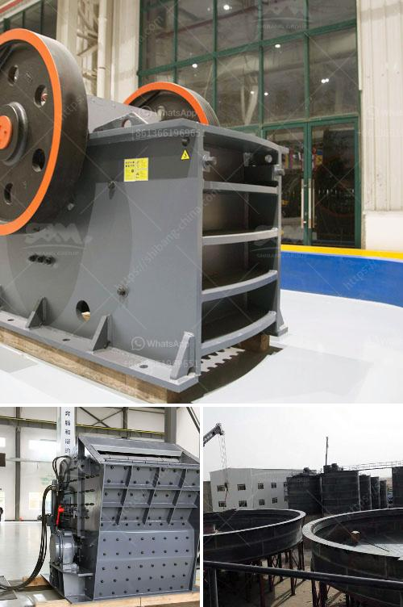

<h3>سعة الكسارة المحمولة ٢٠٠ طن في الساعة</h3>
تعدّ الكسارة المحمولة ذات السعة 200 طن في الساعة أحدث التقنيات المتاحة في صناعة التعدين والبناء. تأتي هذه الكسارة بعدة أحجام وموديلات، ولكن أكثر الموديلات شيوعًا هو الذي يتراوح بين 100-200 طن في الساعة.

توفر الكسارة المحمولة مرونة وسهولة في النقل والتركيب، حيث يمكن نقلها بسهولة بين مواقع العمل المختلفة. تعمل هذه الكسارة على سحق المواد الخام إلى حجم أصغر، مما يتيح استخدامها في تكسير الصخور والحجارة والخرسانة والاستخدامات الأخرى.

تتميز الكسارة المحمولة بمحركات قوية تعمل بواسطة الديزل أو المحركات الكهربائية، مما يوفر كفاءة عالية وأداء قويًا. تتمتع أيضًا بآلية سهلة الاستخدام لتغيير الفك الثابت والفك المتحرك، مما يسمح بتعديل سريع لحجم الكسارة حسب المتطلبات.

يعتبر تغذية الكسارة المحمولة من أحد الجوانب الأكثر أهمية، حيث تتميز بمغذي تلقائي لتحقيق معدل تدفق مستقر ومنتظم للمواد. تتميز الكسارة أيضًا بنظام ضبط الجانب، مما يمنح المشغل القدرة على ضبط الغرابيل والتأكد من تناسب المواد التي يتم تفريغها.

تُستخدم الكسارة المحمولة بشكل واسع في الصناعات المختلفة مثل التعدين والبناء واستخراج المحاجر وإعادة تدوير المواد. تجعل هذه الكسارة المحمولة عملية السحق أكثر كفاءة، مما ينتج عنه استخدام أقل للطاقة وتقليل التلوث البيئي.

باختصار، تعتبر الكسارة المحمولة ذات السعة 200 طن في الساعة خيارًا مثاليًا لتكسير المواد الخام والحجارة بكفاءة عالية. توفر هذه الكسارة السرعة والمرونة في التنقل والتركيب، مما يجعلها مناسبة للعمل في الظروف الصعبة. قدمت تطورات التكنولوجيا في هذا المجال العديد من التحسينات التي تزيد من قوة وكفاءة الكسارة المحمولة، وتسهم في تحقيق أداء استثنائي في صناعة التعدين والبناء.
<h3>Contact us</h3><ul><li><strong>Whatsapp:&nbsp;<a href="https://wa.me/8613661969651">+8613661969651</a></strong></li><li><a href="https://swt.shibang-china.com/?git&amp;zhl&amp;سعة الكسارة المحمولة ٢٠٠ طن في الساعة"><strong>Online Service(chat now)</strong></a></li></ul><h3>Related</h3><ul><li><a href='آلة سحق الكالسيت.md'>آلة سحق الكالسيت</a></li><li><a href='تكلفة مشروع وحدة طحن الكلنكر.md'>تكلفة مشروع وحدة طحن الكلنكر</a></li><li><a href='مصنع كسارة مسحوق الرخام.md'>مصنع كسارة مسحوق الرخام</a></li><li><a href='أريد شراء كسارة البوزولان.md'>أريد شراء كسارة البوزولان</a></li><li><a href='مصنعون صينيون للمعدات الإنشائية.md'>مصنعون صينيون للمعدات الإنشائية</a></li></ul>