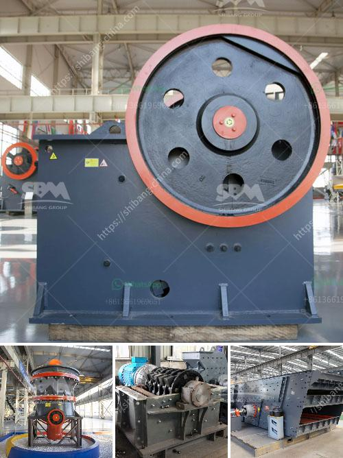

<h3>سعة كسارة الحجر</h3>
سعة كسارة الحجر هي عبارة عن الكمية التي يمكن للكسارة معالجتها وسحقها في وقت واحد. تعتبر كسارات الحجر أدوات أساسية في صناعة البناء والتشييد، حيث تقوم بتحويل الصخور الضخمة إلى قطع صغيرة من الحجارة. تدخل هذه القطع في العديد من التطبيقات مثل بناء الطرق والأبنية وإقامة المشاريع الكبيرة.

يعتمد حجم وسعة الكسارة على العوامل المختلفة مثل نوع الصخرة وقوة الضغط المطلوبة لسحقها وكمية الإنتاج المطلوبة. هناك عدة أحجام مختلفة لكسارات الحجر، بدءًا من الأحجام الصغيرة المحمولة التي تستخدم في المشاريع الصغيرة وصولاً إلى الأحجام الكبيرة التي تستخدم في المشاريع الكبيرة والاستخراج المعدني. تتراوح سعة الكسارات من 200 إلى 400 طن في الساعة.

يتم قياس سعة الكسارة بوحدة الوزن (طن في الساعة)، وتعتمد على عدة عوامل مثل سرعة التغذية وحجم الفتحة في الكسارة وقوة المحرك. يتم تشغيل الكسارات بواسطة محرك كهربائي أو محرك ديزل ويتم توجيه الصخور إلى الكسارة عبر الناقلات الناقلة.

تتيح سعة كسارة الحجر الكبيرة معالجة كميات ضخمة من الصخور في وقت قصير، مما يزيد من كفاءة العمل ويوفر الجهد والتكاليف. كسارات الحجر ذات السعة الكبيرة تستخدم عادة في المشاريع الضخمة مثل بناء الطرق السريعة وتطوير المرافق الكبيرة.

لتحقيق أقصى استفادة من كسارة الحجر ذات السعة الكبيرة، يجب الاهتمام بالصيانة الدورية والتشحيم المناسب للماكينة والاستفادة من التكنولوجيا الحديثة في تحسين أداء الكسارة. كما يجب أيضًا العمل بالإرشادات الأمنية لتجنب أي حوادث أو أضرار.

بشكل عام، يلعب حجم وسعة كسارة الحجر دورًا حاسمًا في صناعة البناء، حيث تساهم في تحويل الصخور الضخمة إلى قطع صغيرة يمكن استخدامها في العديد من التطبيقات المختلفة. وبفضل تطور التكنولوجيا وزيادة الطلب على المواد الكسارة، فإن سعة الكسارات الحجرية تزداد بشكل مستمر لتلبية احتياجات السوق المتزايدة.
<h3>Contact us</h3><ul><li><strong>Whatsapp:&nbsp;<a href="https://wa.me/8613661969651">+8613661969651</a></strong></li><li><a href="https://swt.shibang-china.com/?git&amp;zhl&amp;سعة كسارة الحجر"><strong>Online Service(chat now)</strong></a></li></ul><h3>Related</h3><ul><li><a href='كسارة حجر لاستخراج الحجر.md'>كسارة حجر لاستخراج الحجر</a></li><li><a href='كسارة صخور الحجر الجيري.md'>كسارة صخور الحجر الجيري</a></li><li><a href='سحق وفحص روستنبرج.md'>سحق وفحص روستنبرج</a></li><li><a href='تصنيع مكره مطحنة الكرة.md'>تصنيع مكره مطحنة الكرة</a></li><li><a href='كسارة مخروطية في المملكة العربية السعودية.md'>كسارة مخروطية في المملكة العربية السعودية</a></li></ul>