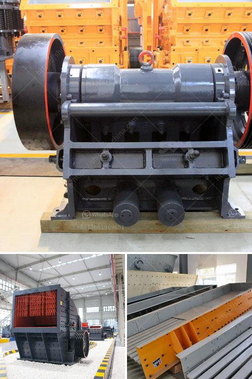

<h3>سعة مطحنة الكرة 10 تف في ماليزيا</h3>
ماليزيا هي إحدى الدول الرائدة في مجال التصنيع والتعدين في جنوب شرق آسيا. يعتبر القطاع التعديني من القطاعات الأكثر أهمية في الاقتصاد الماليزي ويشهد نمواً مستداماً على مدار السنوات الماضية. واحدة من المعدات الأساسية في صناعة التعدين هي مطحنة الكرة.

تعتبر مطاحن الكرة من أكثر المعدات استخداماً في مجال تكسير المواد الخام في صناعة التعدين. وتتميز مطاحن الكرة بسعتها العالية وقدرتها على معالجة كميات كبيرة من المواد في وقت قصير. واحدة من أكبر مطاحن الكرة في ماليزيا هي مطحنة الكرة بسعة 10 طن في الساعة.

تستخدم مطاحن الكرة لطحن المواد الخام مثل الرمل والصخور الصلبة والسيراميك. تتكون مطاحن الكرة من أسطوانة طويلة مع كرات صلبة في الداخل. عند دوران مطحنة الكرة، تتحرك الكرات داخل الأسطوانة وتقوم بطحن المواد الخام إلى حجم صغير. ويتم استخدام المواد المطحونة في صناعات مختلفة مثل صناعة الأسمنت وصناعة الزجاج وصناعة الكيماويات.

توجد العديد من المزايا التي توفرها مطاحن الكرة بسعة 10 طن في الساعة في ماليزيا. أولاً وقبل كل شيء، فإن السعة الكبيرة لهذه المطاحن تعني أنه يمكنها معالجة كميات كبيرة من المواد في وقت قصير، مما يقلل من تكلفة الإنتاج ويزيد من الكفاءة. كما أنها تسمح بتحسين جودة المنتج النهائي وتقليل تكاليف العمالة.

بالإضافة إلى ذلك، يمتلك مصنع ماليزيا لمطاحن الكرة سمعة طيبة في سوق التعدين عالمياً. وتحظى منتجاته بثقة العديد من العملاء في جميع أنحاء العالم بسبب جودتها العالية والتكنولوجيا المتقدمة التي تم استخدامها في تصنيعها.

على الرغم من أن ماليزيا تحتل مكانة ريادية في صناعة التعدين، إلا أنها تواجه بعض التحديات. تشمل هذه التحديات ضعف التمويل ونقص المهارات الفنية في بعض الأحيان. ومع ذلك، يتوقع أن يستمر القطاع التعديني في النمو والتطور في المستقبل القريب بفضل الاستثمارات المستمرة في التكنولوجيا وتطوير المهارات البشرية.

وفي الختام، يعد استخدام مطحنة الكرة بسعة 10 طن في الساعة مهماً لصناعة التعدين في ماليزيا. تعتبر هذه المطاحن من أنجح الأدوات في مجال تكسير المواد الخام وتحسين جودة المنتج النهائي. وبفضل الاستثمارات الحكومية والتوجه نحو تحسين التكنولوجيا والمهارات، يمكن توقع أن يستمر القطاع التعديني في ماليزيا في النمو القوي في السنوات القادمة.
<h3>Contact us</h3><ul><li><strong>Whatsapp:&nbsp;<a href="https://wa.me/8613661969651">+8613661969651</a></strong></li><li><a href="https://swt.shibang-china.com/?git&amp;zhl&amp;سعة مطحنة الكرة 10 تف في ماليزيا"><strong>Online Service(chat now)</strong></a></li></ul><h3>Related</h3><ul><li><a href='شركة الإسمنت في بروتيا جلين.md'>شركة الإسمنت في بروتيا جلين</a></li><li><a href='معلمات كسارة الهامر المقدمة بالتفصيل.md'>معلمات كسارة الهامر المقدمة بالتفصيل</a></li><li><a href='كسارة صخور وشاشات في الفلبين.md'>كسارة صخور وشاشات في الفلبين</a></li><li><a href='هل هناك طاحونة فائقة الدقة عمودية للأسطوانة.md'>هل هناك طاحونة فائقة الدقة عمودية للأسطوانة</a></li><li><a href='كسارات حجر مستعملة للبيع.md'>كسارات حجر مستعملة للبيع</a></li></ul>