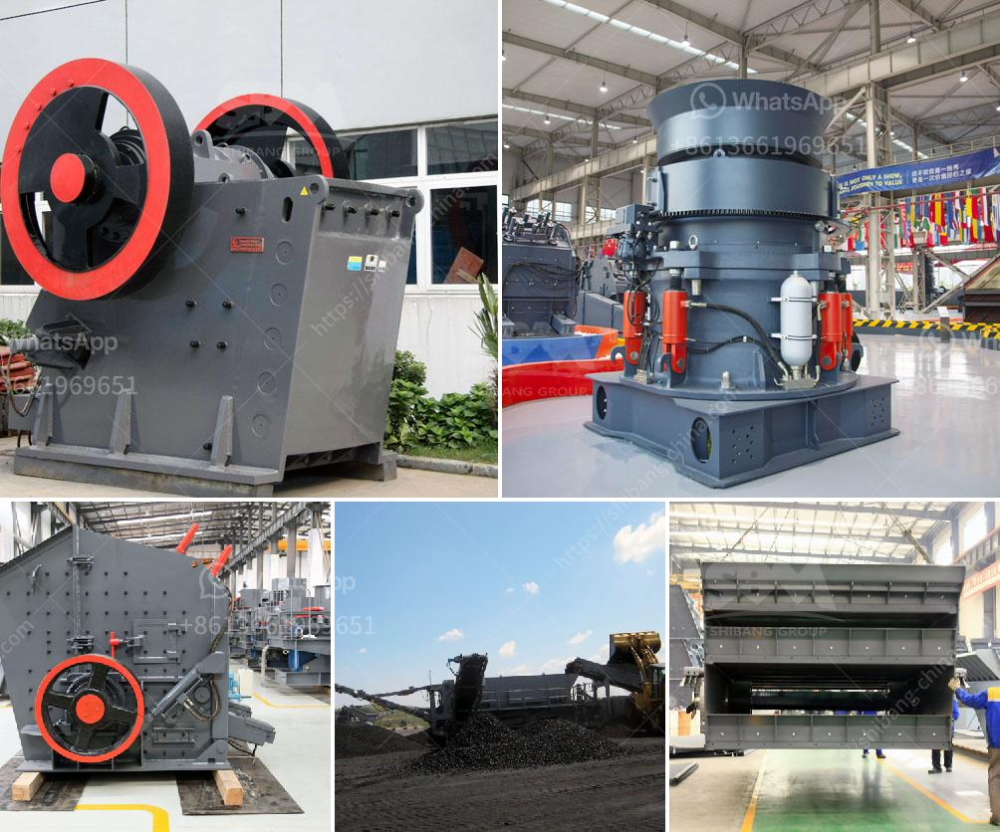

<h3>سعة مطحنة الكرة بالأطنان</h3>
تُعتبر مطاحن الكرة من أهم المعدات المستخدمة في صناعة الطحن، والتي تتميز بقدرتها على سحق المواد الخام بفعالية وإنتاج الحبيبات المطلوبة بشكل مناسب. وتُعد سعة مطحنة الكرة من العوامل الرئيسية التي يتم النظر إليها أثناء اختيار المعدات المناسبة.

سعة مطحنة الكرة تشير إلى الكمية القصوى من المواد الخام التي يمكن معالجتها في وحدة زمنية واحدة، وتُقاس بوحدة الأطنان. وتتفاوت سعة مطحنة الكرة من موديل لآخر، حيث يمكن أن تتراوح بين 200 إلى 400 طن.

تعتمد سعة مطحنة الكرة على عدة عوامل، أهمها: حجم المطحنة الذي يتم اختياره وفقًا لاحتياجات المعالجة، كم كرات الطحن المستخدمة وسرعة دوران المطحنة. كلما زاد حجم المطحنة وسرعة دورانها وعدد كرات الطحن، زادت قدرتها على معالجة كميات أكبر من المواد الخام.

وعادةً ما يتم استخدام مطاحن الكرة الكبيرة ذات السعات العالية في صناعات التعدين ومعالجة المعادن، حيث يتطلب الإنتاج الكبير والقدرة على سحق كميات كبيرة من الخام. بينما تكون مطاحن الكرة الصغيرة ذات السعات الأصغر أكثر شيوعًا في الصناعات الخفيفة مثل الصناعات الكيماوية والأغذية وصناعة الأدوية.

يجب أن يتم اختيار سعة مطحنة الكرة بناءًا على احتياجات ومتطلبات المشروع. فعندما يكون الإنتاج كبيرًا ومستمرًا، فإن الاستثمار في مطاحن الكرة الكبيرة هو الأمثل. أما عندما يكون الإنتاج صغيرًا وغير مستمر، فإن الاستثمار في مطاحن الكرة الصغيرة يكون الأكثر جدوى.

بالاختصار، تُعتبر سعة مطحنة الكرة من العوامل الأساسية التي يجب مراعاتها عند اختيار المعدات. إذ تكون السعة المثلى للمطحنة محددة بناءًا على احتياجات المشروع ومتطلبات الإنتاج. وباختيار السعة المناسبة، يمكن تحسين كفاءة العملية وزيادة إنتاجية المصنع بشكل كبير.
<h3>Contact us</h3><ul><li><strong>Whatsapp:&nbsp;<a href="https://wa.me/8613661969651">+8613661969651</a></strong></li><li><a href="https://swt.shibang-china.com/?git&amp;zhl&amp;سعة مطحنة الكرة بالأطنان"><strong>Online Service(chat now)</strong></a></li></ul><h3>Related</h3><ul><li><a href='استفسار حول كسارة الصدم.md'>استفسار حول كسارة الصدم</a></li><li><a href='أنواع الجبس.md'>أنواع الجبس</a></li><li><a href='مطحنة كرات صغيرة لهنان الصين.md'>مطحنة كرات صغيرة لهنان الصين</a></li><li><a href='مطحنة الأسطوانة للطحن.md'>مطحنة الأسطوانة للطحن</a></li><li><a href='موزعون لمعدات المحاجر والتعدين في الصين.md'>موزعون لمعدات المحاجر والتعدين في الصين</a></li></ul>