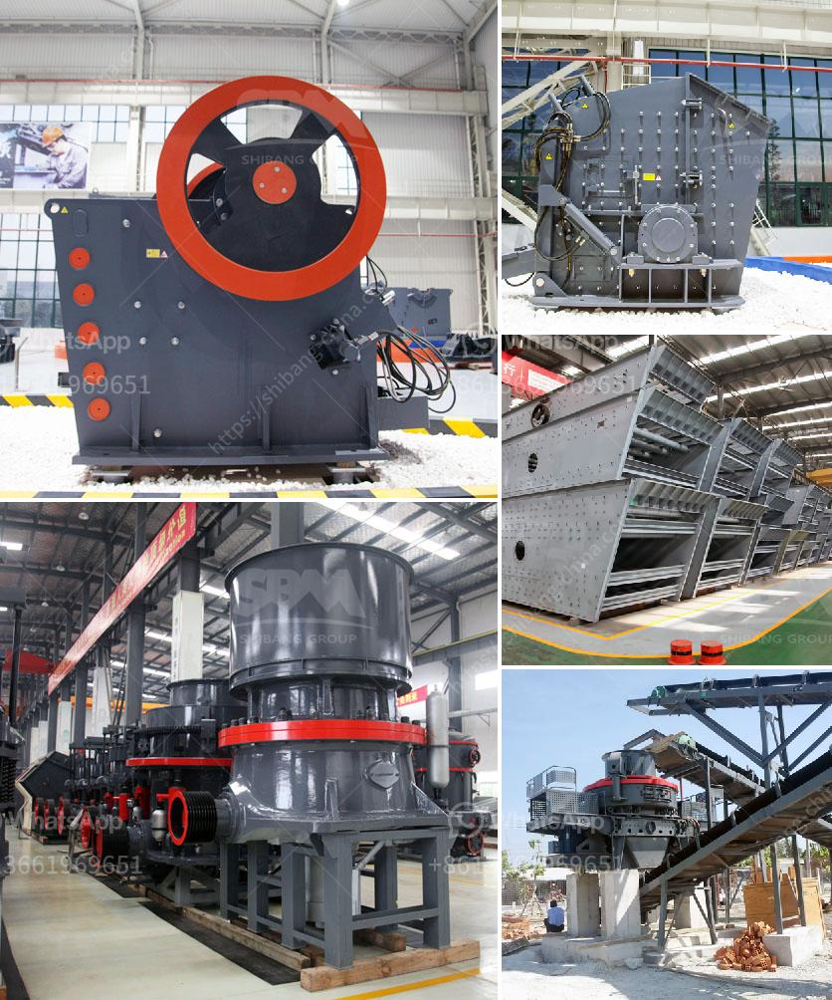

<h3>سعة مطحنة الكرة للطين</h3>
تعتبر مطحنة الكرة أحد الأدوات الرئيسية المستخدمة في صناعة الطين. تستخدم هذه المطاحن لطحن وسحق الطين إلى حجم صغير، مما يتيح استخدامه في عدة تطبيقات مختلفة مثل صناعة الأسمنت والسيراميك ومواد البناء.

تتميز مطحنة الكرة بسعة تتراوح بين 200 إلى 400 طن في الساعة، مما يجعلها مناسبة للإنتاج الكبير. تعتمد سعة المطحنة على العديد من العوامل مثل حجم المواد الخام وصلابتها ورطوبتها وحجم الكرات المستخدمة في المطحنة.

مبدأ عمل مطحنة الكرة يعتمد على تحويل الطاقة الكهربائية إلى طاقة ميكانيكية لسحق الطين. تتكون المطحنة العادية من أسطوانة صلبة تدور حول محورها الرأسي. يتم وضع الطين داخل الأسطوانة، وتتحرك الكرات المعدنية داخل المطحنة وتصطدم بالطين، مما يؤدي إلى سحقه وتجفيفه.

يعمل الطين في المطحنة الكروية على زيادة سطح الاتصال بين الطين والكرات المعدنية، مما يسرع عملية السحق. بالإضافة إلى ذلك، تساهم الكرات المعدنية في تحويل الطاقة الحركية الكينتيكية إلى طاقة ميكانيكية قدرية تستخدم لكسر الروابط الكيميائية في الطين.

تعتبر المطاحن الكروية ذات السعة العالية من الأدوات الحديثة والفعالة في صناعة الطين. بفضل سعتها الكبيرة، يمكنها معالجة كميات كبيرة من الطين في وقت قصير، مما يجعلها اختيارًا مناسبًا لعمليات الإنتاج الضخمة.

بصفة عامة، تعد مطحنة الكرة للطين ذات سعة 200-400 طن في الساعة أداة أساسية في صناعة الطين. وباستخدام تكنولوجيا حديثة وتحسينات مستمرة، يمكن تحسين كفاءة وسعة هذه المطاحن لتلبية احتياجات صناعة الطين المتنامية.
<h3>Contact us</h3><ul><li><strong>Whatsapp:&nbsp;<a href="https://wa.me/8613661969651">+8613661969651</a></strong></li><li><a href="https://swt.shibang-china.com/?git&amp;zhl&amp;سعة مطحنة الكرة للطين"><strong>Online Service(chat now)</strong></a></li></ul><h3>Related</h3><ul><li><a href='آلة كسارة لصنع الرمل من الحجر.md'>آلة كسارة لصنع الرمل من الحجر</a></li><li><a href='أنواع كسارات الفحم المستخدمة في الصناعة.md'>أنواع كسارات الفحم المستخدمة في الصناعة</a></li><li><a href='مطحنة الكرة لمسحوق الكوارتز في تاميل نادو.md'>مطحنة الكرة لمسحوق الكوارتز في تاميل نادو</a></li><li><a href='سعر مطحنة ريموند الفائقة الدقة.md'>سعر مطحنة ريموند الفائقة الدقة</a></li><li><a href='تقرير مشروع مصنع الرخام بتنسيق PDF.md'>تقرير مشروع مصنع الرخام بتنسيق PDF</a></li></ul>