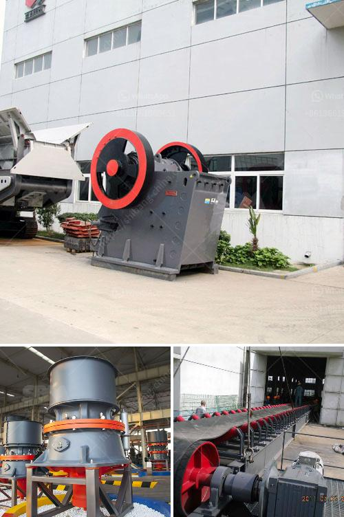

<h3>سعر stoner cusher في كينيا</h3>
في كينيا ، تعد صناعة التعدين والبناء قطاعًا مهمًا يساهم في النمو الاقتصادي وتوفير فرص العمل. ومن بين المعدات الرئيسية المستخدمة في هذه الصناعة هي آلة ستونر كراشر (Stoner Crusher) ، وهي ماكينة تستخدم لسحق الأحجار والصخور الكبيرة في حجم أصغر وتحويلها إلى ركام لاستخدامها في البناء والطرق وغيرها من المشاريع البنائية الأخرى.

تتفاوت أسعار ماكينات ستونر كراشر في كينيا بناءً على جودة وحجم وأداء المعدات. في المجمل ، تتراوح أسعار ستونر كراشر من 200 دولار إلى 400 دولار. ومع ذلك ، يجب ملاحظة أنه قد يتغير السعر بناءً على مزايا إضافية ، مثل القوة والكفاءة والمتانة للماكينة.

لا يمكن النظر إلى سعر المعدة وحده بدون مراعاة العوامل الأخرى المتعلقة بالتكاليف والعوائد المحتملة. فعلى سبيل المثال ، إذا كنت تعتزم استخدام الماكينة بشكل متكرر في مشاريع البناء الخاصة بك وتحقيق أرباح مالية منها ، فقد تكون استثماراتك في جهاز أكثر تكلفة تجديدًا. ومن ناحية أخرى ، إذا كنت تحتاج فقط إلى هذه المعدة لمشروع واحد أو لاستخدامها لبضع مرات فقط ، فإن شراء ماكينة أقل تكلفة يمكن أن يكون الخيار الأفضل لك.

عند شراء أي ماكينة في كينيا ، من المهم أيضًا النظر في خدمات ما بعد البيع المقدمة ، مثل الصيانة وتوفير قطع الغيار ، حيث يمكن أن تؤثر هذه الخدمات في تكاليف التشغيل وفترة التشغيل الفعالة للماكينة.

بالمجمل ، فإن سعر ماكينة ستونر كراشر في كينيا يتراوح بين 200 و 400 دولار ، ولكن يجب أن يكون الاختيار الأمثل يعتمد على احتياجات المشروع ومتطلباته المحددة بالإضافة إلى الجودة ودعم ما بعد البيع المتاح للماكينة المحددة.
<h3>Contact us</h3><ul><li><strong>Whatsapp:&nbsp;<a href="https://wa.me/8613661969651">+8613661969651</a></strong></li><li><a href="https://swt.shibang-china.com/?git&amp;zhl&amp;سعر stoner cusher في كينيا"><strong>Online Service(chat now)</strong></a></li></ul><h3>Related</h3><ul><li><a href='آلة كسارة حجر صغيرة.md'>آلة كسارة حجر صغيرة</a></li><li><a href='شراء مصنع غسيل الرمل في سريلانكا.md'>شراء مصنع غسيل الرمل في سريلانكا</a></li><li><a href='مورد آلة طحن الكرة في إندونيسيا.md'>مورد آلة طحن الكرة في إندونيسيا</a></li><li><a href='سير ناقل لسعر كسارة الحجر.md'>سير ناقل لسعر كسارة الحجر</a></li><li><a href='عملية تصنيع لوح الجبس.md'>عملية تصنيع لوح الجبس</a></li></ul>