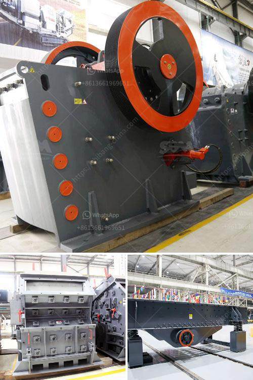

<h3>سعر آلات كسارة المحجر</h3>
تعتبر آلات كسارة المحجر من الأدوات الحديثة والتكنولوجية التي تستخدم في عمليات تكسير وطحن الصخور والحجارة في محجر. وتلعب الكسارة الحجرية دورًا مهمًا في صناعة البناء والإنشاءات، حيث تستخدم لتحويل الصخور الكبيرة إلى قطع أصغر وأكثر صالحة للاستخدام.

تختلف أسعار آلات كسارة المحجر بناءً على العديد من العوامل، مثل الحجم والطاقة والقدرة على المعالجة وأداء الآلة. وتشتمل الآلات الحجرية على مجموعة متنوعة من الأنواع والموديلات، بدءًا من الآلات الكبيرة ذات القدرة العالية لمعالجة كميات كبيرة من الحصى والصخور، إلى الآلات الصغيرة والمتنقلة التي تستخدم لعمليات تكسير الحجارة في الحجم المحدود، مثل مشاريع البناء الصغيرة.

يتراوح سعر آلة كسارة المحجر بين 200-400 دولارًا تقريبًا، وذلك بناءً على حجم وطاقة الآلة. عادةً ما تكون الأجهزة الصغيرة ذات القدرة الأقل أقل تكلفة، بينما يزيد سعر الأجهزة الكبيرة وذات القدرة العالية.

تهدف عمليات الكسارة إلى تحويل الحجارة الكبيرة إلى قطع أصغر يمكن استخدامها في مجموعة متنوعة من التطبيقات، مثل بناء الطرق والأبنية والأعمال الإنشائية الأخرى. تعتبر آلات كسارة المحجر استثمارًا مهمًا للشركات والمقاولين الذين يعملون في صناعة البناء والإنشاءات، حيث تقلل من تكاليف الشراء والتوريد للمواد الخام وتحسن كفاءة عملية الإنتاج.

ومع زيادة الطلب على مواد البناء والتطور التكنولوجي في هذا المجال، من المتوقع أن يزداد الاهتمام بتوفير آلات كسارة المحجر بأسعار معقولة وفعالة من حيث التكلفة. ويمكن للمشترون مقارنة العروض المتاحة والتحقق من الجودة والأداء وسمعة العلامات التجارية للآلات قبل اتخاذ القرار النهائي.

باختصار، تعتبر آلات كسارة المحجر أدوات ضرورية في صناعة البناء والإنشاءات، حيث تساهم في تحويل الحصى والصخور الكبيرة إلى مواد صغيرة قابلة للاستخدام. تختلف أسعار الآلات وفقًا لعدة عوامل مثل القدرة والحجم والموديل، ويجب على المشترين دراسة العروض المتاحة وتقييم الاحتياجات قبل الشراء.
<h3>Contact us</h3><ul><li><strong>Whatsapp:&nbsp;<a href="https://wa.me/8613661969651">+8613661969651</a></strong></li><li><a href="https://swt.shibang-china.com/?git&amp;zhl&amp;سعر آلات كسارة المحجر"><strong>Online Service(chat now)</strong></a></li></ul><h3>Related</h3><ul><li><a href='كسارة الخرسانة المصنوعة في اليابان.md'>كسارة الخرسانة المصنوعة في اليابان</a></li><li><a href='شاشات وكسارات الركام.md'>شاشات وكسارات الركام</a></li><li><a href='كسارات فك متنقلة للبيع في المملكة المتحدة.md'>كسارات فك متنقلة للبيع في المملكة المتحدة</a></li><li><a href='مطحنة الكرة للجبس.md'>مطحنة الكرة للجبس</a></li><li><a href='آلة تصنيع الكرة الجبسية.md'>آلة تصنيع الكرة الجبسية</a></li></ul>