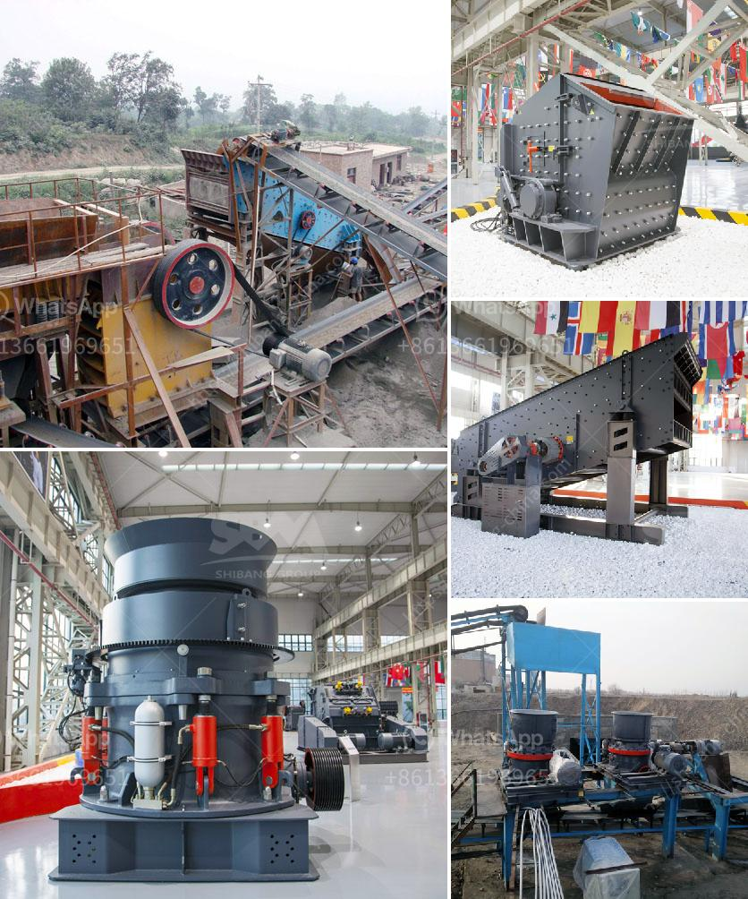

<h3>سعر آلة الطحن في ماليزيا</h3>
آلة الطحن هي واحدة من الأدوات الحيوية في صناعة المواد الغذائية، وتستخدم لطحن المكونات الخام مثل الحبوب والبقوليات إلى مسحوق ناعم. تعد ماليزيا واحدة من الأسواق الرئيسية لآلات الطحن في جنوب شرق آسيا، حيث تتوفر مجموعة واسعة من هذه الآلات بأسعار تتراوح بين 200 و 400 رنجت ماليزي.

يتوفر في السوق الماليزي العديد من الماركات المشهورة لآلات الطحن التي تلبي احتياجات المستهلكين. سعر آلات الطحن يعتمد على عوامل مثل الجودة والسعة والوظائف المتاحة، حيث يكون سعر الآلات ذات الجودة العالية والأداء الممتاز أعلى من تلك ذات الجودة المتوسطة أو الضعيفة.

قد تكون هناك آلات الطحن اليدوية المتاحة بأسعار معقولة بين 200 و 400 رنجت ماليزي. تعتبر هذه الآلات مناسبة للاستخدام المنزلي العادي وتتميز بالسهولة في الاستخدام والتنظيف. قد يكون لهذه الآلات سعة صغيرة وتكون مصنوعة بشكل رئيسي من البلاستيك والمعدن، مما يجعلها متينة وقوية للاستخدام العادي.

بالمقابل، للمستهلكين الذين يبحثون عن آلات طحن ذات جودة عالية وأداء ممتاز قد يضطرون لتخصيص ميزانية أكبر. قد يصل سعر هذه الآلات إلى 400 رنجت ماليزي أو أكثر. تتميز هذه الآلات بتصميماتها العصرية والأنيقة، فضلاً عن قدراتها الأعلى والمزيد من الوظائف المتاحة. تعتبر مناسبة للاستخدام المهني في المخابز والمطاعم والوحدات الصناعية الصغيرة.

بالنهاية، عند البحث عن آلة طحن في ماليزيا، يجب النظر في احتياجات المستخدم والميزانية المتاحة. يجب البحث عن الأداء والجودة واختيار آلة تلبي احتياجات الطحن المطلوبة. يمكن العثور على العديد من الخيارات المتاحة في السوق الماليزي، سواءً كانت آلات طحن يدوية أو آلات آليّة متطورة، بأسعار تتناسب مع ميزانية المستهلكين.
<h3>Contact us</h3><ul><li><strong>Whatsapp:&nbsp;<a href="https://wa.me/8613661969651">+8613661969651</a></strong></li><li><a href="https://swt.shibang-china.com/?git&amp;zhl&amp;سعر آلة الطحن في ماليزيا"><strong>Online Service(chat now)</strong></a></li></ul><h3>Related</h3><ul><li><a href='سعر آلة كسارة الفك.md'>سعر آلة كسارة الفك</a></li><li><a href='آلة طحن الكرات بتقنية ألمانية.md'>آلة طحن الكرات بتقنية ألمانية</a></li><li><a href='مصنع تكسير حجر صغير.md'>مصنع تكسير حجر صغير</a></li><li><a href='طحن الحجر الجيري.md'>طحن الحجر الجيري</a></li><li><a href='تصنيع آلات التعدين.md'>تصنيع آلات التعدين</a></li></ul>