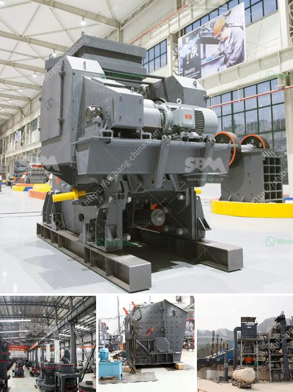

<h3>سعر آلة الكسارة في سريلانكا</h3>
تعد آلة الكسارة من أهم الآلات المستخدمة في صناعة البناء والتعدين، حيث تقوم بسحق الصخور والأحجار الكبيرة لإنتاج مواد بناء قابلة للاستخدام. وفي هذا المقال، سنتناول الموضوع الذي يدور حول سعر آلة الكسارة في سريلانكا.

بالنظر إلى سوق آلات الكسارة في سريلانكا، يتأثر سعر الآلة بعدة عوامل. أحد هذه العوامل هو الحجم والقدرات التي تتمتع بها الآلة. تتوفر آلات الكسارة في مجموعة متنوعة من الأحجام والموديلات، حيث تتراوح القدرات من 50 طنًا في الساعة إلى 1000 طن في الساعة. وكلما زادت القدرة والحجم، زاد سعر الآلة.

عامل آخر يؤثر على سعر الآلة هو المواصفات التقنية والتكنولوجية التي تتمتع بها الكسارة. يُفضل العديد من المشترين اختيار الآلات التي تحتوي على أحدث التكنولوجيات والمزايا الإضافية مثل نظام التحكم الآلي، والتشغيل السلس، وخاصية إعادة تدوير المواد. هذه المواصفات الإضافية تعزز كفاءة العمل وتوفر الوقت والجهد، وبالتالي، تؤثر في تحديد سعر الآلة.

بشكل عام، يتراوح سعر آلة الكسارة في سريلانكا بين 200,000 دولار و 400,000 دولار، وذلك يعتمد على العوامل المذكورة سابقًا. تنوع الأسعار يمكن أن يكون مفيدًا للمشترين، حيث يمكنهم اختيار الآلة التي تتناسب مع احتياجاتهم وميزانياتهم المالية.

وفي الختام، تعد آلة الكسارة من الآلات الأساسية في صناعة البناء والتعدين في سريلانكا، وسعرها يتأثر بعدة عوامل مثل الحجم والقدرة، والمواصفات التقنية والتكنولوجية. وفي ضوء هذه العوامل، فإنه من المهم أن يقوم المشتري بالبحث والتحقيق جيدًا قبل اتخاذ قرار شراء لضمان الحصول على آلة عالية الجودة والأداء الممتاز.
<h3>Contact us</h3><ul><li><strong>Whatsapp:&nbsp;<a href="https://wa.me/8613661969651">+8613661969651</a></strong></li><li><a href="https://swt.shibang-china.com/?git&amp;zhl&amp;سعر آلة الكسارة في سريلانكا"><strong>Online Service(chat now)</strong></a></li></ul><h3>Related</h3><ul><li><a href='سعر كسارة الفك المحمولة.md'>سعر كسارة الفك المحمولة</a></li><li><a href='كسارة محمولة في الفلبين بسعر مناسب.md'>كسارة محمولة في الفلبين بسعر مناسب</a></li><li><a href='مصنع سيور الفحم في ألمانيا.md'>مصنع سيور الفحم في ألمانيا</a></li><li><a href='تكلفة آلة الطحن.md'>تكلفة آلة الطحن</a></li><li><a href='تصميم مصنع تكسير وتخطيطه.md'>تصميم مصنع تكسير وتخطيطه</a></li></ul>