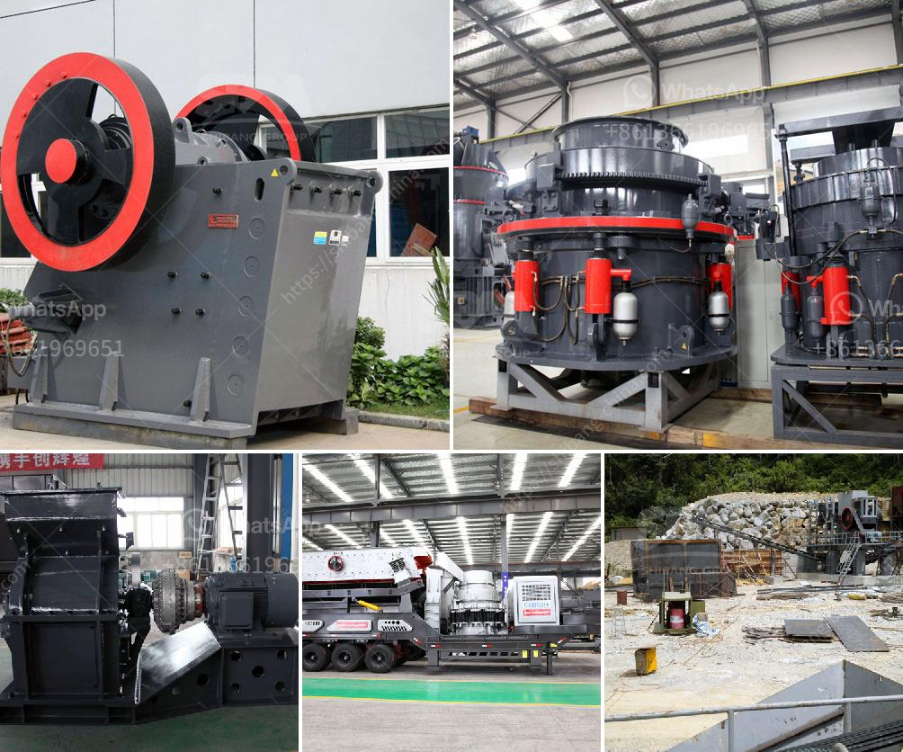

<h3>سعر آلة الكسارة في كينيا</h3>
تعتبر آلة الكسارة أحد الأدوات الأساسية في صناعة البناء والتشييد، حيث تستخدم لتكسير الصخور والحجارة الكبيرة إلى قطع صغيرة قابلة للاستخدام في بناء المباني والطرق. في كينيا، تشهد صناعة البناء نموا سريعا مع زيادة الطلب على الإسكان والبنية التحتية، الأمر الذي يؤدي إلى زيادة الحاجة إلى آلات الكسارة.

تتفاوت أسعار آلات الكسارة في كينيا حسب الطراز والحجم والوظائف التي يمكن أن ينفذها. في المتوسط، تتراوح أسعار آلات الكسارة في كينيا بين 200 إلى 400 ألف شيلينج كيني، وهي العملة المحلية. تتأثر الأسعار بعوامل عدة منها العلامة التجارية للآلة ومنشأها، فهناك العديد من العلامات التجارية المشهورة عالميا تتوفر في السوق الكيني وتقدم آلات عالية الجودة بأسعار أعلى.

علاوة على ذلك، يجب أيضا أن نأخذ في الاعتبار تكاليف الشحن والتسليم. يعتبر إيصال الآلة من المصنع إلى موقع العمل أمرا مهما، وقد يتطلب استخدام شاحنات خاصة بالشحن الثقيل، وهذا ينطوي على تكاليف إضافية. لذا يجب على المشتري أن يحسب هذه التكاليف أيضا عند حساب السعر الإجمالي للماكينة.

مع زيادة الطلب على آلات الكسارة في كينيا، ازدادت منافسة بين العديد من الشركات المحلية والعالمية لتقديم أفضل الأجهزة بأسعار تنافسية. لذلك، من المستحسن القيام بمقارنة بين العديد من العلامات التجارية المختلفة والاطلاع على آراء المستخدمين والاعتماد على تقييماتهم لاختيار الجهاز المناسب الذي يناسب احتياجاتك وميزانيتك.

في النهاية، يجب أن يتم اختيار آلة الكسارة بناءً على الجودة والكفاءة والسعر المناسب. ينبغي أيضا النظر في توافر قطع الغيار وصيانة الآلة لضمان استمرارية عملها لفترة طويلة. في الاقتصاد المزدهر لكينيا، تعتبر آلات الكسارة استثمارًا مربحًا يساهم في تحسين قدرة البناء وتعزيز التنمية الاقتصادية.
<h3>Contact us</h3><ul><li><strong>Whatsapp:&nbsp;<a href="https://wa.me/8613661969651">+8613661969651</a></strong></li><li><a href="https://swt.shibang-china.com/?git&amp;zhl&amp;سعر آلة الكسارة في كينيا"><strong>Online Service(chat now)</strong></a></li></ul><h3>Related</h3><ul><li><a href='كسارة الحجر للجرار.md'>كسارة الحجر للجرار</a></li><li><a href='تعليم مطحنة الكرة.md'>تعليم مطحنة الكرة</a></li><li><a href='استخدام كسارة الفك المتنقلة.md'>استخدام كسارة الفك المتنقلة</a></li><li><a href='بائعي آلة المحجر المحمولة في نيجيريا.md'>بائعي آلة المحجر المحمولة في نيجيريا</a></li><li><a href='مطحنة المطرقة للبيع على إيباي.md'>مطحنة المطرقة للبيع على إيباي</a></li></ul>