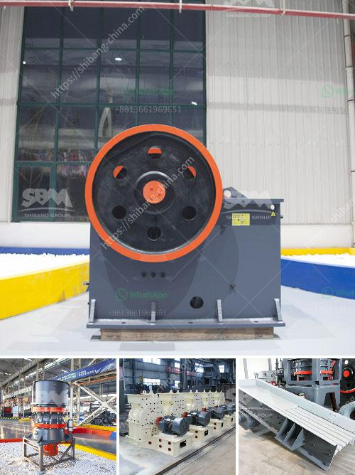

<h3>سعر آلة المحجر</h3>
تعتبر آلة المحجر أداة رئيسية في صناعة التعدين والبناء، حيث تُستخدم لاستخراج المواد الصخرية من الأرض. يتفاوت سعر آلة المحجر حسب الحجم والموديل والعلامة التجارية، والخصائص التقنية الأخرى.

في المتوسط، تتراوح أسعار آلات المحجر بين 200 و400 ألف دولار. ومع ذلك، من الضروري الأخذ في الاعتبار أن الأسعار يمكن أن تتفاوت اعتمادًا على العوامل المذكورة سابقاً. فعلى سبيل المثال، الآلات بحجم أكبر ستكون غالبًا أكثر تكلفة من الآلات الأصغر حجمًا.

عند اختيار آلة المحجر، يجب أن يتم النظر في العديد من العوامل الأخرى. من بين هذه العوامل، يتضمن اختيار الموديل والعلامة التجارية الموثوقة وذات السمعة الجيدة، حيث أن هذه الجوانب تؤثر على جودة الآلة وأدائها. كما يجب أيضًا مراعاة صيانة الآلة وقطع الغيار المتوفرة والتكلفة الإضافية المرتبطة بذلك.

بالإضافة إلى ذلك، يمكن أن تتأثر الأسعار بالميزات التقنية الإضافية التي يمكن أن تكون متوفرة في الآلة مثل أنظمة التشغيل الآلي أو الحواسيبية. توفر هذه الميزات قدرة أكبر على الإنتاج وتحسين كفاءة العمل.

بشكل عام، يعتمد سعر آلة المحجر على المواصفات التقنية والحجم والعلامة التجارية والميزات الإضافية المطلوبة. ينبغي للمشتري أن يقوم بدراسة تفصيلية لاحتياجاته والميزانية المتاحة قبل الشراء لضمان الحصول على أفضل عائد على الاستثمار.

في الختام، يُلاحظ أن سعر آلة المحجر يتراوح بين 200 و400 ألف دولار، ولكن يجب أخذ العديد من العوامل في الاعتبار عند اتخاذ قرار الشراء. بعد دراسة الاحتياجات المطلوبة والميزانية المتاحة، يمكن اتخاذ قرار مبني على معايير تجارية وتقنية.
<h3>Contact us</h3><ul><li><strong>Whatsapp:&nbsp;<a href="https://wa.me/8613661969651">+8613661969651</a></strong></li><li><a href="https://swt.shibang-china.com/?git&amp;zhl&amp;سعر آلة المحجر"><strong>Online Service(chat now)</strong></a></li></ul><h3>Related</h3><ul><li><a href='كسارة لفة مسننة جاجيد.md'>كسارة لفة مسننة جاجيد</a></li><li><a href='آلة تعدين النحاس.md'>آلة تعدين النحاس</a></li><li><a href='شركات سيور النقل في المكسيك.md'>شركات سيور النقل في المكسيك</a></li><li><a href='معدات تعدين الكروم للبيع في جنوب أفريقيا.md'>معدات تعدين الكروم للبيع في جنوب أفريقيا</a></li><li><a href='كسارة الحجر غانا.md'>كسارة الحجر غانا</a></li></ul>