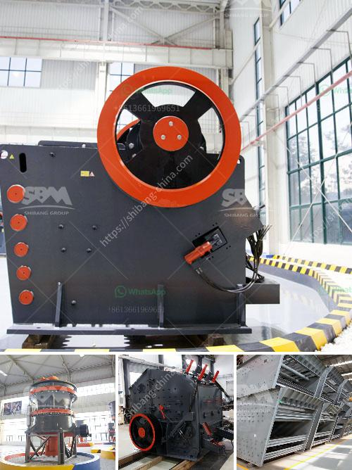

<h3>سعر آلة تكسير الذهب في الولايات المتحدة</h3>
تعتبر صناعة تكسير الذهب في الولايات المتحدة من الصناعات الهامة التي تساهم بشكل كبير في تلبية الطلب على الذهب وتحويله إلى قطع أصغر وأشكال مختلفة. وتعتمد تكلفة آلة تكسير الذهب على عدة عوامل من بينها الحجم والقدرة والتكنولوجيا المستخدمة في التصنيع.

تتراوح أسعار آلات تكسير الذهب في الولايات المتحدة عادةً بين 200 دولار و 400 دولار، ولكن يمكن أن تتفاوت هذه الأسعار حسب النموذج والمواصفات المختلفة. يمكن أن تكون الآلات ذات السعر الأقل مصممة للاستخدام المنزلي أو تكسير كميات صغيرة من الذهب، في حين أن الآلات ذات السعر الأعلى قد تكون مصممة للاستخدام الصناعي وتكسير كميات كبيرة من الذهب.

تتوفر آلات تكسير الذهب بأحجام وأشكال مختلفة. يمكن أن تكون بعض الآلات صغيرة ومحمولة، مما يجعلها سهلة الاستخدام والتنقل. بينما يتطلب البعض الآخر مساحة كبيرة وتوصيل كهربائي قوي. قبل شراء آلة تكسير الذهب، يجب على المستثمرين دراسة احتياجاتهم وتحديد النموذج الذي يتناسب مع تلك الاحتياجات والميزانية المتاحة.

عند البحث عن آلة تكسير الذهب، ينصح بالتحقق من مواصفات الآلة ومعرفة مدى كفاءتها في تكسير الذهب بشكل فعال وبدقة عالية. بالإضافة إلى ذلك، يجب أيضًا مراجعة تقييمات المستخدمين السابقين واستشارة الخبراء المتخصصين في هذا المجال للحصول على آراءهم وتوصياتهم.

بالنظر إلى طبيعة ونوعية عملية تكسير الذهب، يعتبر التحكم في التكاليف واختيار الآلة الملائمة هما عاملان مهمان. ومع ذلك، يجب أن يكون الجودة والمتانة هما الأساس، حتى تكون الاستثمارات في آلة تكسير الذهب ذات عائد مادي جيد في المستقبل.

في الختام، قد يكون سعر آلة تكسير الذهب في الولايات المتحدة يتراوح بين 200 دولار و 400 دولار وقد يزيد أو ينقص حسب النموذج والمواصفات. ينصح المستثمرون بدراسة متطلباتهم والتحقق من المواصفات المفضلة وجودة الآلة قبل الشراء لضمان الحصول على أداء جيد وعائد جيد على الاستثمار.
<h3>Contact us</h3><ul><li><strong>Whatsapp:&nbsp;<a href="https://wa.me/8613661969651">+8613661969651</a></strong></li><li><a href="https://swt.shibang-china.com/?git&amp;zhl&amp;سعر آلة تكسير الذهب في الولايات المتحدة"><strong>Online Service(chat now)</strong></a></li></ul><h3>Related</h3><ul><li><a href='تكلفة إعداد مصنع طحن الكلنكر في الهند.md'>تكلفة إعداد مصنع طحن الكلنكر في الهند</a></li><li><a href='كسارة محمولة في الفلبين.md'>كسارة محمولة في الفلبين</a></li><li><a href='مطحنة السيليكا المطحونة للبيع.md'>مطحنة السيليكا المطحونة للبيع</a></li><li><a href='سعر حزام النقل.md'>سعر حزام النقل</a></li><li><a href='موردين مطاحن الكرة في جنوب أفريقيا.md'>موردين مطاحن الكرة في جنوب أفريقيا</a></li></ul>