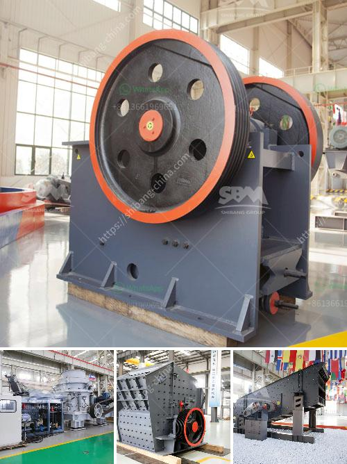

<h3>سعر آلة تكسير الصخور</h3>
تعد آلة تكسير الصخور أداة هامة في صناعة التعدين والبناء. فهي تستخدم لتحطيم الصخور الكبيرة إلى قطع صغيرة أو ركام يمكن استخدامه في العديد من التطبيقات المختلفة. واحدة من العوامل الرئيسية التي يتم اعتبارها عند النظر في شراء آلة تكسير الصخور هي سعرها.

يتراوح سعر آلة تكسير الصخور في المدى من 200 إلى 400 دولار، ولكن هذا السعر يعتمد على العديد من العوامل. أحد العوامل الرئيسية التي تؤثر على السعر هي قدرة الآلة على تحطيم الصخور. وتتنوع قدرات الآلات من آلات صغيرة ذات سعة منخفضة وتصل إلى آلات كبيرة ذات سعات عالية. يميل سعر الآلات ذات السعات العالية إلى أن يكون أعلى من الآلات ذات السعات المنخفضة.

بالإضافة إلى ذلك، تؤثر جودة ومواصفات الآلة على السعر أيضًا. آلات التكسير ذات الجودة العالية والمواصفات المتقدمة عادةً ما تكون أغلى من تلك ذات الجودة المنخفضة والمواصفات البسيطة. قد تكون الآلات ذات السمات المتقدمة قادرة على تكسير الصخور بفعالية أكبر وتوفير الوقت والجهد في العمل.

فيما يتعلق بالتكنولوجيا المستخدمة في الآلة، فإن الآلات التي تنطوي على تقنيات حديثة أو تحسينات تكنولوجية متقدمة عادةً ما تكون أغلى. يستخدم بعض الصناعيين التكنولوجيا الحديثة في تصنيع آلات التكسير مثل الهيدروليك والتحكم الآلي والأتمتة لزيادة كفاءة العمل وتقليل أي خلل يحدث أثناء الاستخدام.

عوامل أخرى يتم اختيار آلة التكسير بناءً عليها هي العلامة التجارية وتوفر قطع الغيار وخدمة العملاء والضمانات المقدمة. الشركات المعروفة وذات السمعة الجيدة عادة ما تقدم منتجات عالية الجودة وتوفر الدعم الفني وخدمة ما بعد البيع.

في النهاية، يجب أن يتم اختيار آلة تكسير الصخور وفقًا لاحتياجات المشروع والميزانية المتاحة. يجب أن يتم تقييم السعر بالاعتبار للتوازن بين الجودة والأداء وتكلفة الآلة. قد يكون من المفيد استشارة الخبراء أو الشركات المصنعة قبل اتخاذ القرار النهائي.
<h3>Contact us</h3><ul><li><strong>Whatsapp:&nbsp;<a href="https://wa.me/8613661969651">+8613661969651</a></strong></li><li><a href="https://swt.shibang-china.com/?git&amp;zhl&amp;سعر آلة تكسير الصخور"><strong>Online Service(chat now)</strong></a></li></ul><h3>Related</h3><ul><li><a href='مصنع محطم للبيع في الإمارات.md'>مصنع محطم للبيع في الإمارات</a></li><li><a href='مصنع غسيل الرمال للبيع في الإمارات.md'>مصنع غسيل الرمال للبيع في الإمارات</a></li><li><a href='مطاحن الكرة للتعدين.md'>مطاحن الكرة للتعدين</a></li><li><a href='المواصفات الفنية لمطحنة الكرة.md'>المواصفات الفنية لمطحنة الكرة</a></li><li><a href='آلات سحق الحجر اليابانية.md'>آلات سحق الحجر اليابانية</a></li></ul>