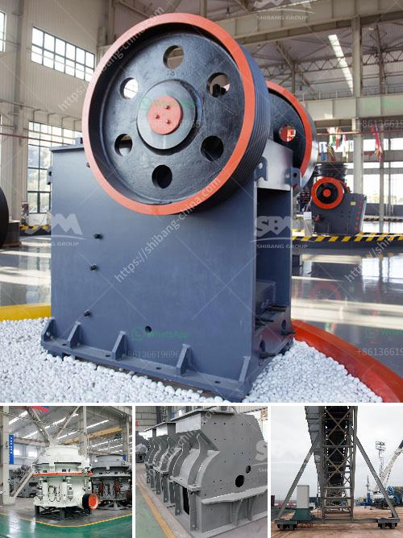

<h3>سعر آلة سحق الحجر في باكستان</h3>
تعد آلة سحق الحجر جهازًا هامًا في صناعة التعدين والبناء، حيث تستخدم لسحق الحجارة الكبيرة إلى أحجام أصغر قابلة للاستخدام في عمليات البناء والبناء. يعتبر سعر آلة سحق الحجر في باكستان معيارًا للعديد من المشترين والمستخدمين لأنه يؤثر على قرار الشراء والاستثمار.

تتأثر أسعار آلات سحق الحجر في باكستان بعدة عوامل. احدى هذه العوامل هي السعة الإنتاجية للآلة الراجعة إلى الكمية المطلوب سحقها في فترة زمنية محددة. بشكل عام، يعتبر الموديل الذي يتمتع بسعة إنتاجية أعلى ممتازًا للمشترين الذين يحتاجون إلى كمية أكبر من الحجارة المسحوقة.

عامل آخر يؤثر على سعر آلة سحق الحجر هو حجم الحجر الذي يتم سحقه. يعتبر سحق الحجارة الكبيرة ذات الأحجام الكبيرة أكثر تحديًا ومكلفة نسبيًا بالمقارنة مع الحجارة الصغيرة، وبالتالي فإن الآلات المصممة لسحق الحجارة الكبيرة قد تتطلب تكوينًا خاصًا ومواد أكثر صلابة، مما يؤثر على التكلفة الإجمالية للآلة.

علاوة على ذلك، يعتمد سعر آلة سحق الحجر أيضًا على العلامة التجارية والجودة. هناك العديد من العلامات التجارية المعروفة في صناعة تصنيع آلات سحق الحجر، والتي تتميز بمزايا مختلفة مثل الأداء العالي والموثوقية العالية. بشكل عام، الآلات ذات الجودة العالية والعلامات التجارية الرائدة تعتبر أغلى من الآلات ذات الجودة المنخفضة والعلامات التجارية الغير معروفة.

بالنسبة لنطاق السعر، فإن سعر آلة سحق الحجر في باكستان يتراوح عادة بين 200 دولار و 400 دولار. ومع ذلك، يجب ملاحظة أن هذه الأسعار تعتمد على العوامل المذكورة أعلاه. بالطبع، يجب أن يتناسب السعر مع المواصفات والاحتياجات المحددة للمستخدم.

بالاختصار، فإن سعر آلة سحق الحجر في باكستان يتأثر بعدة عوامل مثل السعة الإنتاجية، وحجم الحجر المراد سحقه، والعلامة التجارية والجودة. التعرف على هذه العوامل وتحليل المتطلبات الخاصة بك سيساعدك على اتخاذ القرار الصحيح فيما يتعلق بشراء آلة سحق الحجر.
<h3>Contact us</h3><ul><li><strong>Whatsapp:&nbsp;<a href="https://wa.me/8613661969651">+8613661969651</a></strong></li><li><a href="https://swt.shibang-china.com/?git&amp;zhl&amp;سعر آلة سحق الحجر في باكستان"><strong>Online Service(chat now)</strong></a></li></ul><h3>Related</h3><ul><li><a href='كسارات محمولة مستعملة للبيع في جنوب أفريقيا.md'>كسارات محمولة مستعملة للبيع في جنوب أفريقيا</a></li><li><a href='مصانع معالجة الذهب في الصين للبيع.md'>مصانع معالجة الذهب في الصين للبيع</a></li><li><a href='شراء كسارة حجر في الإمارات.md'>شراء كسارة حجر في الإمارات</a></li><li><a href='مطحنة طحن السخام في الهند.md'>مطحنة طحن السخام في الهند</a></li><li><a href='معدات تعدين مستخدمة.md'>معدات تعدين مستخدمة</a></li></ul>