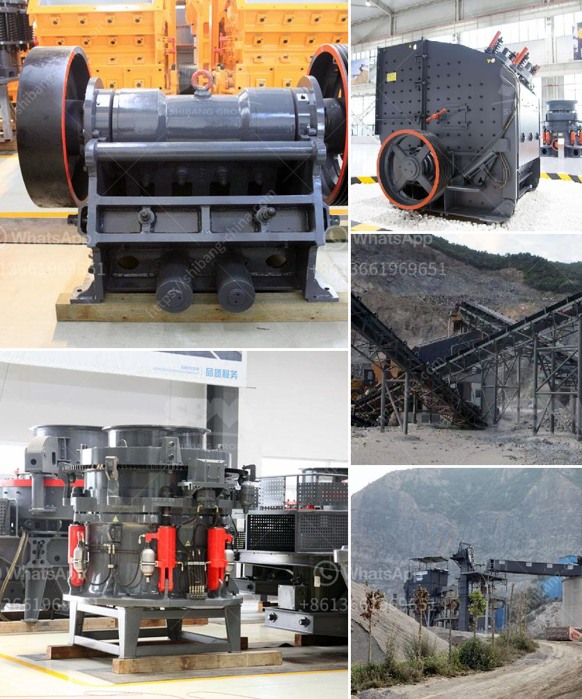

<h3>سعر آلة سحق خام النحاس</h3>
يعتبر خام النحاس أحد الموارد الهامة التي تستخدم في عدة صناعات مختلفة مثل الصناعات الكهربائية والإلكترونية وصناعة البناء والمعدات الصناعية الأخرى. ولكي يتم استخراج النحاس من الخام، يجب سحقه وطحنه باستخدام آلة خاصة تسمى آلة سحق خام النحاس.

تتفاوت أسعار آلات سحق خام النحاس بناءً على عدة عوامل مثل حجم الآلة وقدرتها الإنتاجية والتكنولوجيا المستخدمة في صنعها والجودة. عادةً ما تكون هذه الآلات متوفرة في الأسواق بأسعار مختلفة تتراوح بين 200 دولار إلى 400 دولار، وتختلف الأسعار بناءً على الماركة والموديل.

يعتبر سعر آلة سحق خام النحاس معقولًا نسبيًا، خاصةً إذا ما قورنت فوائدها الكبيرة لصناعة النحاس. فهذه الآلة تسهل عملية الاستخراج والتصفية للنحاس من الخام بشكل سريع وفعال، مما يزيد من كفاءة العمل ويرفع الإنتاجية.

بالإضافة إلى ذلك، يجب النظر في التكلفة الإجمالية للاستثمار في آلة سحق خام النحاس. فتكلفة الآلة في حد ذاتها ربما يبدو مرتفعًا لبعض الأفراد، ولكن إذا ما أخذنا في الاعتبار الفوائد الاقتصادية الطويلة الأجل لاستخراج النحاس وإمكانية التوسع في عمليات الإنتاج وبيع النحاس، فإن ذلك قد يجعل هذا الاستثمار مستدامًا ومجديًا.

الاهتمام بتكنولوجيا الآلات هو عامل مهم في تحديد السعر. هناك آلات سحق خام النحاس تعتمد على التقنيات القديمة وبالتالي رخيصة الثمن، بينما هناك آلات أخرى مجهزة بأحدث التقنيات والميزات المتقدمة وبالتالي غالية الثمن. يجب أن يحدد المشتري بناءً على احتياجاته وتوقعاته ما إذا كان يفضل الاستثمار في آلة تعتمد على التقنيات القديمة أم الأحدث.

بالتالي، تشتمل مقاييس سعر آلة سحق خام النحاس على الجودة والتقنية المستخدمة والفوائد الاقتصادية المتوقعة من النشاط التجاري المرتبط بها. قبل الشراء، يجب أن يقوم المشتري بدراسة السوق والمنتجات المتاحة للتأكد من اختيار الآلة المناسبة بأفضل سعر.
<h3>Contact us</h3><ul><li><strong>Whatsapp:&nbsp;<a href="https://wa.me/8613661969651">+8613661969651</a></strong></li><li><a href="https://swt.shibang-china.com/?git&amp;zhl&amp;سعر آلة سحق خام النحاس"><strong>Online Service(chat now)</strong></a></li></ul><h3>Related</h3><ul><li><a href='عملية تصنيع الرمل الاصطناعي.md'>عملية تصنيع الرمل الاصطناعي</a></li><li><a href='مصنع تحسين الكروم في الصين.md'>مصنع تحسين الكروم في الصين</a></li><li><a href='كسارات الفك المستخدمة في الفلبين.md'>كسارات الفك المستخدمة في الفلبين</a></li><li><a href='تكلفة مصنع الأسمنت.md'>تكلفة مصنع الأسمنت</a></li><li><a href='ورقة تدفق معالجة الحجر الجيري.md'>ورقة تدفق معالجة الحجر الجيري</a></li></ul>