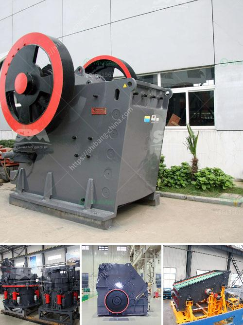

<h3>سعر آلة صنع الرمل الاصطناعي</h3>
تعتبر آلة صنع الرمل الاصطناعي من الآلات الحديثة والتكنولوجية التي تستخدم في صناعة الرمل الاصطناعي، وهي عبارة عن آلة تستخدم لتحويل الصخور الصلبة إلى رمل صناعي بشكل فعال وفقًا للاحتياجات الخاصة بالعمليات الصناعية المختلفة.

يعتبر الرمل الاصطناعي بديلا مثالياً للرمل الطبيعي حيث يعمل على تلبية الاحتياجات الهندسية والبنائية بشكل فعال، ويمتاز بأنه لا يحتوي على الشوائب أو العيوب التي قد تؤثر على جودة المواد الإنشائية. بالإضافة إلى ذلك، يعتبر الرمل الاصطناعي أكثر استدامة للبيئة، حيث أن استخدامه يحد من استغلال الموارد الطبيعية ويقلل من تعديات الحفر والتعدين.

أما بالنسبة للسعر، فإنه يتفاوت حسب نوع وحجم الآلة وكذلك حسب الشركة المصنعة والبلد الذي يتم فيه الشراء. بشكل عام، يتراوح سعر آلة صنع الرمل الاصطناعي بين 200 و 400 دولاراً. ومن الجدير بالذكر أن هناك آلات أخرى تكون أرخص في السعر ولكن ذلك يترتب على جودتها وقدرتها على إنتاج كميات كبيرة من الرمل الاصطناعي بجودة عالية.

بشكل عام، يعتبر سعر آلة صنع الرمل الاصطناعي مناسبًا جدًا مقارنة بالفوائد والمزايا التي يقدمها، فهو يوفر الوقت والجهد في عملية صناعة الرمل، كما أنه يعمل على تحسين جودة المواد الإنشائية وزيادة كفاءة العمليات الإنتاجية.

وفي الختام، تعد آلة صنع الرمل الاصطناعي استثمارًا جيدًا للشركات والمشاريع الهندسية التي تحتاج إلى كميات كبيرة من الرمل الاصطناعي. وبفضل تطور التكنولوجيا، فإن سعرها أصبح أكثر توافرًا ومقبولًا للعديد من الشركات والأفراد الذين يبحثون عن حلول مستدامة واقتصادية في صناعة البناء والإنشاء.
<h3>Contact us</h3><ul><li><strong>Whatsapp:&nbsp;<a href="https://wa.me/8613661969651">+8613661969651</a></strong></li><li><a href="https://swt.shibang-china.com/?git&amp;zhl&amp;سعر آلة صنع الرمل الاصطناعي"><strong>Online Service(chat now)</strong></a></li></ul><h3>Related</h3><ul><li><a href='لكن كسارات الخرسانة نيجيريا.md'>لكن كسارات الخرسانة نيجيريا</a></li><li><a href='كسارة الحجر الجرانيت الهند.md'>كسارة الحجر الجرانيت الهند</a></li><li><a href='موردين تكسير الكوارتز في أوروبا.md'>موردين تكسير الكوارتز في أوروبا</a></li><li><a href='كسارة للإيجار في نيو جيرسي.md'>كسارة للإيجار في نيو جيرسي</a></li><li><a href='معدات إنتاج البازلت.md'>معدات إنتاج البازلت</a></li></ul>