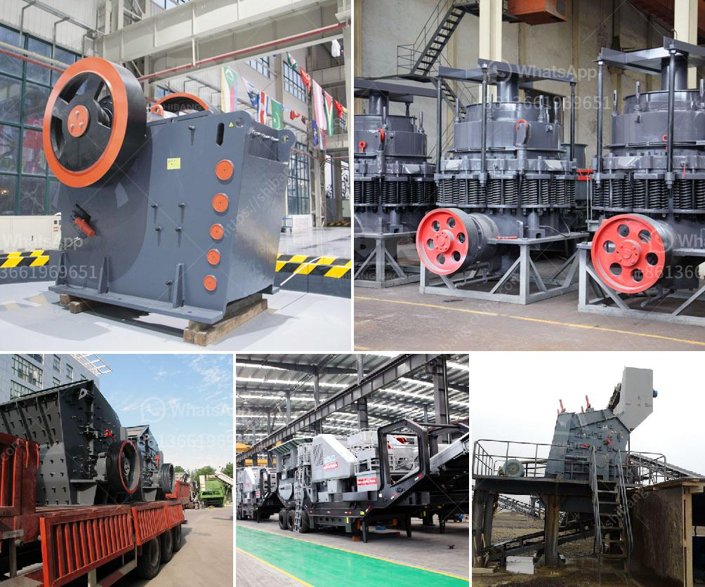

<h3>سعر آلة طاحونة الهامر</h3>
ستتحدث هذه المقالة عن سعر آلة طاحونة الهامر، وهي آلة تستخدم في صناعة الرقائق الزراعية والحبوب.

تعتبر آلة طاحونة الهامر من الأدوات الهامة في عمليات التكسير والطحن، حيث تستخدم لطحن المواد الصلبة إلى قطع صغيرة ذات حجم موحد. استخدام الطواحين الهامر في العديد من الصناعات، ولا سيما في مجال صناعة الأعلاف الحيوانية، حيث تستخدم لطحن الحبوب والحصول على رقائق الأعلاف الغذائية النهائية.

تختلف أسعار آلات طاحونة الهامر بناءً على الحجم والسعة والمواصفات التي تتميز بها كل آلة. ومع ذلك، يمكن القول بأن الآلات ذات السعات الصغيرة والمتوسطة والتي تستخدم في صناعة الأعلاف الحيوانية تتوفر في نطاق سعري يتراوح بين 200 إلى 400 دولار.

قد يتباين السعر بناءً على الموقع الجغرافي والشركة المصنعة، إضافةً إلى المواصفات والتكنولوجيا المستخدمة في صنع الآلة. علاوة على ذلك، فإن بعض العوامل الأخرى قد تؤثر أيضًا في السعر، مثل وجود خاصية القابلية للتحكم عن بعد أو القدرة على طحن أنواع مختلفة من المواد.

عند شراء آلة طاحونة الهامر، يجب أخذ بعض العوامل في الاعتبار بالإضافة إلى السعر، مثل الكفاءة والدقة وسهولة الصيانة وسلامة الاستخدام. قد تكون بعض الآلات ذات سعر مرتفع نسبيًا، لكنها تتميز بميزات إضافية تعتبر مهمة في بعض الصناعات وتوفر الكثير من الوقت والجهد.

في النهاية، تعتبر آلة طاحونة الهامر أداة أساسية في صناعات الرقائق الزراعية والحبوب. بينما يختلف سعرها بناءً على الحجم والسعة والمواصفات، ينبغي النظر في الجودة والكفاءة والميزات الإضافية عند اتخاذ قرار الشراء، لضمان الحصول على آلة بقيمة جيدة تلبي احتياجات الصناعة.
<h3>Contact us</h3><ul><li><strong>Whatsapp:&nbsp;<a href="https://wa.me/8613661969651">+8613661969651</a></strong></li><li><a href="https://swt.shibang-china.com/?git&amp;zhl&amp;سعر آلة طاحونة الهامر"><strong>Online Service(chat now)</strong></a></li></ul><h3>Related</h3><ul><li><a href='كسارات الفك في تنزانيا.md'>كسارات الفك في تنزانيا</a></li><li><a href='سعر كسارة مخروطية 250 طن.md'>سعر كسارة مخروطية 250 طن</a></li><li><a href='آخر خط إنتاج مسحوق الجبس.md'>آخر خط إنتاج مسحوق الجبس</a></li><li><a href='مطحنة الأسطوانة العمودية للإسمنت.md'>مطحنة الأسطوانة العمودية للإسمنت</a></li><li><a href='ورقة تدفق معالجة الحجر الجيري.md'>ورقة تدفق معالجة الحجر الجيري</a></li></ul>