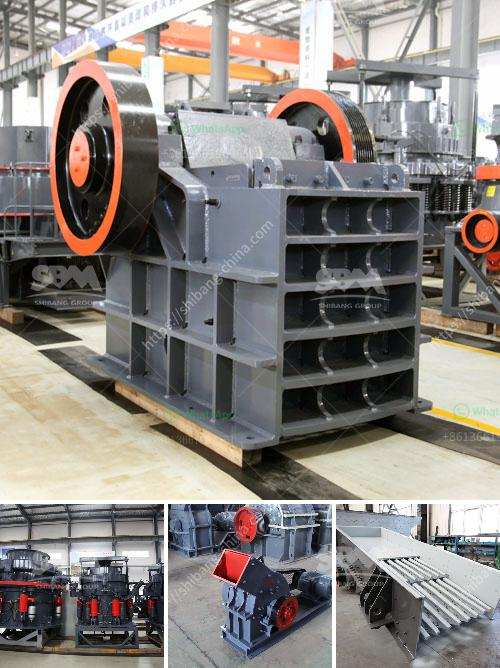

<h3>سعر آلة طحن الحجر الرخامي والجرانيت</h3>
يعد الحجر الرخامي والجرانيت من الخامات الثمينة والفاخرة التي تستخدم في تصنيع العديد من المنتجات الداخلية والخارجية، ومن بين الأدوات التي تستخدم في تشكيل وتشذيب هذه الأحجار هي آلات طحن الحجر الرخامي والجرانيت. يتم استخدام هذه الآلات في الصناعات المرتبطة بالبناء والتجميل، مثل صناعة الأرضيات والأثاث والقطع الديكورية والتماثيل.

تتراوح أسعار آلات طحن الحجر الرخامي والجرانيت بين 200 و 400 دولار، وتعتمد الأسعار على عدة عوامل مثل الحجم والقوة والجودة والميزات الموجودة في الآلة. هناك آلات طحن صغيرة الحجم تستخدم لأعمال التشذيب البسيطة بأسعار تتراوح بين 200 و 300 دولار، بينما توجد آلات طحن كبيرة الحجم وقوية تستخدم للأعمال الكبيرة والمهنية بأسعار تصل إلى 400 دولار.

بالطبع، يجب أن تكون الآلة عالية الجودة ومصنوعة من مواد قوية ومتينة لتحمل التعامل الصعب مع الأحجار الصلبة. يجب أن تتوفر أيضًا في الآلة ميزات تضمن سهولة الاستخدام والأمان، مثل نظام تبريد المياه للحفاظ على درجة الحرارة المناسبة للأحجار ومحرك قوي يضمن سرعة العمل والكفاءة.

عند شراء آلة طحن الحجر الرخامي والجرانيت، يجب النظر في نصائح الخبراء واختيار العلامة التجارية الموثوقة لضمان الحصول على أفضل جودة وأداء. بالإضافة إلى ذلك، يجب أن يتم اختيار الآلة وفقًا لاحتياجاتك واستخداماتك المحددة، حيث يمكن أن تكون هناك آلات مزودة بميزات إضافية مثل إمكانية التحكم في السرعة والانتقال بين الأحجام المختلفة.

وبشكل عام، يعتبر سعر آلة طحن الحجر الرخامي والجرانيت بين 200 و 400 دولار معقولًا بناءً على قيمتها وفوائدها. يتيح توفر هذه الآلات للأفراد والشركات المزيد من الطاقة والسرعة في أعمال الطحن والتشذيب، مما يساهم في زيادة الإنتاجية وتحسين نتائج العمل النهائية.
<h3>Contact us</h3><ul><li><strong>Whatsapp:&nbsp;<a href="https://wa.me/8613661969651">+8613661969651</a></strong></li><li><a href="https://swt.shibang-china.com/?git&amp;zhl&amp;سعر آلة طحن الحجر الرخامي والجرانيت"><strong>Online Service(chat now)</strong></a></li></ul><h3>Related</h3><ul><li><a href='مطاحن الكرة في إندونيسيا.md'>مطاحن الكرة في إندونيسيا</a></li><li><a href='تكلفة تركيب السيور الناقلة.md'>تكلفة تركيب السيور الناقلة</a></li><li><a href='كسارة للبيع في بيرو.md'>كسارة للبيع في بيرو</a></li><li><a href='قائمة المعدات التي تستخدم في مناجم الجرانيت.md'>قائمة المعدات التي تستخدم في مناجم الجرانيت</a></li><li><a href='سعر مطحنة ليما.md'>سعر مطحنة ليما</a></li></ul>