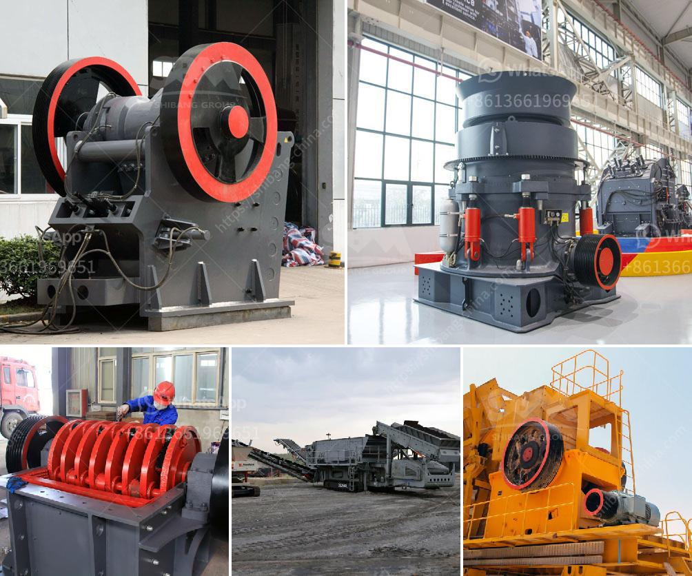

<h3>سعر آلة طحن الرخام في الهند</h3>
تعتبر آلة طحن الرخام أداة أساسية في صناعة تجهيز وتشكيل الرخام. تُستخدم هذه الآلات في طحن وتلميع السطح الخارجي للرخام للحصول على لمعان عالي وتحسين مظهره الجمالي. توفر آلة طحن الرخام عملية ميكانيكية سريعة وفعالة لتنعيم وتجميل الأسطح، مما يوفر الكثير من الوقت والجهد.

يعتمد سعر آلة طحن الرخام في الهند على العديد من العوامل والاعتبارات، بما في ذلك الحجم والقدرة والمواصفات التقنية. بشكل عام، يتراوح سعر هذه الآلة في الهند بين 200 إلى 400 ألف روبية هندية. ومع ذلك، قد يتغير السعر ويختلف بناءً على العلامة التجارية وجودة الماكينة.

تتوفر العديد من العلامات التجارية المختلفة لآلات طحن الرخام في الهند، مثل Bosch و Makita و Hitachi وغيرها. وتختلف الموديلات والمواصفات التقنية للآلات بين تلك العلامات التجارية، مما يؤثر على السعر أيضًا. تتوفر آلات طحن الرخام بأحجام مختلفة لتناسب احتياجات المستخدمين، بدءًا من الآلات الصغيرة وحتى الآلات الصناعية الكبيرة.

بالإضافة إلى الحجم والقدرة والعلامة التجارية، تتأثر الأسعار أيضًا بالتطور التكنولوجي للآلات. بالطبع، تتوفر اليوم آلات طحن الرخام بمواصفات استثنائية تعتمد على أحدث التقنيات، مثل تلك التي تستخدم الكهرباء الصديقة للبيئة وتعمل بواسطة المياه، وتتميز بالصمت والكفاءة العالية. طبعًا، ستكون الآلات ذات التقنيات المتقدمة والميزات الإضافية مكلفة بشكل أعلى.

بشكل عام، يجب على المشترين البحث عن آلة طحن الرخام المناسبة التي تلبي احتياجاتهم وميزانياتهم. يجب مقارنة الموديلات والأسعار من مختلف العلامات التجارية والتأكد من شراءها من مورد موثوق للحصول على جودة عالية وخدمة ما بعد البيع الموثوقة.

باختصار، يمكن القول إن سعر آلة طحن الرخام في الهند يتراوح بين 200 إلى 400 ألف روبية هندية، وتعتمد على الحجم والقدرة والعلامة التجارية والتكنولوجيا المستخدمة. يجب على المشترين القيام بالبحث والمقارنة المناسبة للحصول على أفضل قيمة مقابل المال المستثمر.
<h3>Contact us</h3><ul><li><strong>Whatsapp:&nbsp;<a href="https://wa.me/8613661969651">+8613661969651</a></strong></li><li><a href="https://swt.shibang-china.com/?git&amp;zhl&amp;سعر آلة طحن الرخام في الهند"><strong>Online Service(chat now)</strong></a></li></ul><h3>Related</h3><ul><li><a href='آلة سحق محمولة من إسبانيا.md'>آلة سحق محمولة من إسبانيا</a></li><li><a href='عمليات مصنع كسارة الصخور.md'>عمليات مصنع كسارة الصخور</a></li><li><a href='مصانع إعادة تدوير النحاس في الصين.md'>مصانع إعادة تدوير النحاس في الصين</a></li><li><a href='معدات استخراج الذهب من الصخور.md'>معدات استخراج الذهب من الصخور</a></li><li><a href='مورد سيور ناقلة للفحم من الهند.md'>مورد سيور ناقلة للفحم من الهند</a></li></ul>