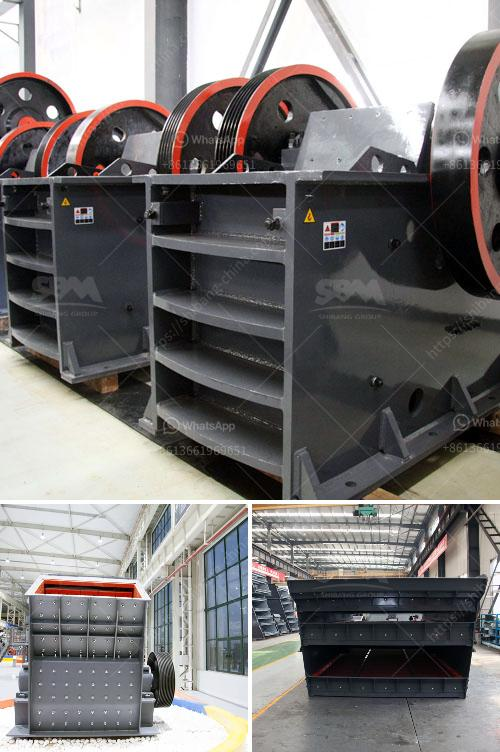

<h3>سعر آلة طحن الرخام</h3>
تعتبر آلة طحن الرخام أداة أساسية في صناعة تجهيز الحجارة والبلاط. تستخدم هذه الآلة لطحن وتجهيز الرخام لإنتاج سطح مثالي ومستوٍ للاستخدام في الأرضيات والجدران والديكورات الداخلية والخارجية.

يختلف سعر آلة طحن الرخام بناءً على عدة عوامل من بينها نوع وحجم الآلة وجودة وأداء العلامة التجارية ومواصفات الحجارة المطلوبة لتجهيزها. عادةً ما يتراوح سعر آلة طحن الرخام من 200 دولار إلى 4000 دولار وقد يزيد أحيانًا حسب التكنولوجيا المستخدمة وقوة وسعة الآلة.

هناك العديد من العلامات التجارية المشهورة التي تقدم جودة عالية لآلة طحن الرخام مثل Makita و Bosch و DEWALT. إلا أن هذه العلامات التجارية الشهيرة قد تكون أغلى قليلاً بالمقارنة مع العلامات التجارية الأخرى ذات الجودة المماثلة.

تعتمد الآلة على عدة ملحقات وأدوات طحن مثل الأقراص والأحجار الطحن والأقمشة الاحتكاكية وغيرها، حيث يؤثر تنوع هذه الأدوات على سعر الآلة. يمكن أن تكون هذه الأدوات مصممة لأغراض مختلفة مثل التلميع وإزالة الخدوش وتجهيز طبقة التشطيب النهائية.

إلى جانب السعر، يُنصح أيضًا بالنظر في خصائص الآلة مثل القدرة على العمل المستمر ومعدل الدوران ومدى قابليتها للتحكم وسهولة الصيانة. قد تتطلب آلة طحن الرخام التجارية سعرًا أعلى بشكل عام بالمقارنة مع الآلات المنزلية، لكنها توفر أداءً ومتانة أفضل للاحتياجات الصناعية.

في الختام، يمكن القول أن سعر آلة طحن الرخام يتفاوت بناءً على العلامة التجارية والمواصفات والأداء المطلوب. يُنصح دائمًا بإجراء البحث ومقارنة الأسعار والعروض قبل الشراء للحصول على أفضل صفقة وضمان جودة المنتج المشترى.
<h3>Contact us</h3><ul><li><strong>Whatsapp:&nbsp;<a href="https://wa.me/8613661969651">+8613661969651</a></strong></li><li><a href="https://swt.shibang-china.com/?git&amp;zhl&amp;سعر آلة طحن الرخام"><strong>Online Service(chat now)</strong></a></li></ul><h3>Related</h3><ul><li><a href='كيفية صنع مسحوق التلك الصناعي.md'>كيفية صنع مسحوق التلك الصناعي</a></li><li><a href='شراء آلة محجر من أوروبا.md'>شراء آلة محجر من أوروبا</a></li><li><a href='مورد كسارة الحجر الجيري.md'>مورد كسارة الحجر الجيري</a></li><li><a href='مصنع الجير والدولوميت في ماليزيا.md'>مصنع الجير والدولوميت في ماليزيا</a></li><li><a href='المعدات المطلوبة لعمل محجر الجرانيت.md'>المعدات المطلوبة لعمل محجر الجرانيت</a></li></ul>