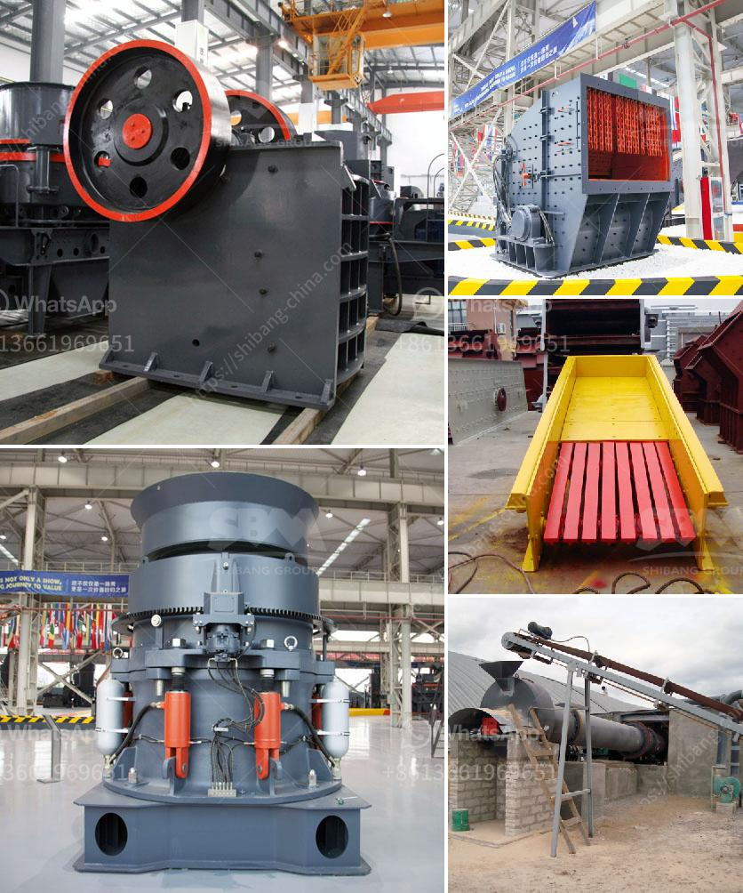

<h3>سعر آلة طحن المطحنة</h3>
آلة طحن المطحنة هي أداة مهمة في عملية طحن الحبوب والتوابل والتبغ وغيرها من المواد القاسية. تستخدم هذه الآلة على نطاق واسع في الصناعات الغذائية والزراعية والتجارية.

تتفاوت أسعار آلات طحن المطاحن وفقًا لعدة عوامل، بما في ذلك الحجم والقدرة والجودة. على سبيل المثال، يمكن أن تكون آلات الطحن المطاحن الصغيرة ذات القدرة الأقل سعرًا مقارنة بالمطاحن الكبيرة ذات القدرة العالية. وفي هذا السياق، يمكن العثور على آلات طحن المطاحن في السوق بأسعار تتراوح بين 200 و 400 دولار.

ومع ذلك، يجب أن يتم مراعاة الحجم والنوع والميزات الأخرى عند شراء آلة طحن المطاحن. عند اختيار الآلة، يجب أن يتم مراعاة القدرة اللازمة لتلبية احتياجات الإنتاج. على سبيل المثال، إذا كنت بحاجة إلى طحن كمية كبيرة من المواد يوميًا، فسيكون من الأفضل شراء آلة طحن المطاحن الكبيرة ذات القدرة العالية.

بالإضافة إلى ذلك، يجب مراعاة جودة الآلة وقدرتها على العمل بشكل فعال ودقيق. يُفضل استشارة الخبراء والبحث عن الماركات المعروفة وذات السمعة الجيدة للحصول على أفضل جودة.

في النهاية، يمكن القول أن سعر آلة طحن المطحنة يتفاوت بناءً على العديد من العوامل مثل الحجم، القدرة، والجودة. يجب أن يتم اختيار الآلة المناسبة وفقًا لاحتياجات ومتطلبات العمل والجودة المطلوبة. وعلاوة على ذلك، ينبغي مراعاة البحث عن ماركات موثوقة وشهادات الضمان والصيانة للحصول على أداء موثوق وطويل الأمد.
<h3>Contact us</h3><ul><li><strong>Whatsapp:&nbsp;<a href="https://wa.me/8613661969651">+8613661969651</a></strong></li><li><a href="https://swt.shibang-china.com/?git&amp;zhl&amp;سعر آلة طحن المطحنة"><strong>Online Service(chat now)</strong></a></li></ul><h3>Related</h3><ul><li><a href='مطحنة أسطوانية بسعة 15 طن.md'>مطحنة أسطوانية بسعة 15 طن</a></li><li><a href='مورد معدات فصل الوسط الكثيف.md'>مورد معدات فصل الوسط الكثيف</a></li><li><a href='آلة مطحنة الدورين.md'>آلة مطحنة الدورين</a></li><li><a href='صناعة تكسير ومعالجة الرخام على نطاق صغير.md'>صناعة تكسير ومعالجة الرخام على نطاق صغير</a></li><li><a href='مطحنة كرات محمولة لتعدين الحجم الصغير.md'>مطحنة كرات محمولة لتعدين الحجم الصغير</a></li></ul>