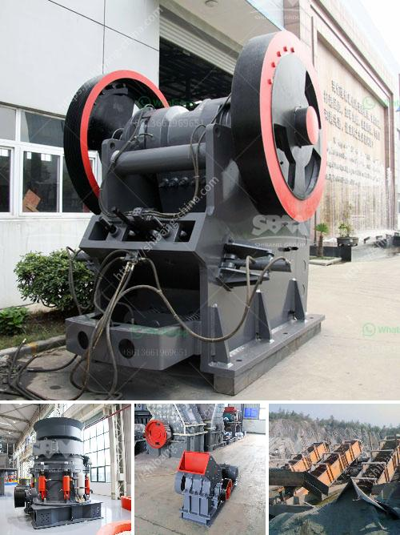

<h3>سعر آلة طحن في الهند</h3>
تعتبر الهند واحدة من أكبر منتجي حبوب الحبوب في العالم ولذلك فإن معدات الطحن تأخذ أهمية كبيرة في البلاد. يستخدم العديد من المزارعين والمنتجين في الهند آلات الطحن لتحويل الحبوب إلى مسحوق أو دقيق للاستخدام في الطهي أو الصناعات الغذائية الأخرى.

تختلف أجهزة الطحن في الهند بناءً على الحجم والقدرة والمواصفات الفنية. تتوفر آلات طحن الحبوب بأحجام وأنواع مختلفة وبأسعار تتراوح بين 200 إلى 400 دولار.

تتراوح أسعار آلات الطحن الصغيرة التي تعمل يدويًا وتستخدم للأغراض المنزلية من حوالي 200 إلى 300 دولار. تتميز هذه الآلات بحجمها الصغير وتصميمها المحمول، مما يجعلها مناسبة للاستخدام في المطابخ الصغيرة. وهي تعمل عن طريق تحويل الحبوب المنزلية إلى دقيق للاستخدام في الخبز والكعك والشوربات والصلصات.

أما بالنسبة للمزارعين والمنتجين الذين يحتاجون لكميات أكبر من الحبوب لتحويلها إلى دقيق، فإن آلات الطحن الصناعية تكون الاختيار الأمثل. تتوفر هذه الآلات بسعات ومواصفات متنوعة وتتراوح أسعارها بين 300 إلى 400 دولار. تتميز تلك الآلات بأنها قوية وقادرة على طحن كميات كبيرة من الحبوب في وقت قصير. يمكن استخدام هذا الدقيق في صناعة المخبوزات وتجهيز الأغذية الغذائية الأخرى.

يجب مراعاة بعض العوامل الأخرى عند شراء آلة طحن في الهند. على سبيل المثال، يجب مراجعة العلامة التجارية وجودة المنتج. يفضل اختيار العلامات التجارية المعروفة والموثوقة للحصول على منتج ذو جودة عالية وفعالية في الاستخدام. أيضًا، يجب أن تتوافر ضمانات وخدمة ما بعد البيع لضمان قدرة الآلة على العمل بشكل صحيح لفترة طويلة.

بالإضافة إلى ذلك، يجب مراعاة الاحتياجات الشخصية والميزانية المتاحة قبل شراء الآلة. يتوجب على المستهلك أن يقرر الحجم المطلوب للآلة والقدرة المطلوبة وتصميمها التي تناسبه. يمكن الحصول على معلومات حول المنتجات المختلفة وأسعارها من العديد من المتاجر عبر الإنترنت أو من محال الأجهزة المحلية.

في النهاية، يجب أن يكون سعر آلة الطحن في الهند في نطاق 200 إلى 400 دولار، ولكن يتوقف تحديد السعر الدقيق على الحجم والقدرة والمواصفات الفنية للآلة. يجب على المستهلك أخذ جميع العوامل في الاعتبار قبل شراء الآلة من أجل الحصول على أعلى جودة وأداء أفضل للاستخدام اليومي.
<h3>Contact us</h3><ul><li><strong>Whatsapp:&nbsp;<a href="https://wa.me/8613661969651">+8613661969651</a></strong></li><li><a href="https://swt.shibang-china.com/?git&amp;zhl&amp;سعر آلة طحن في الهند"><strong>Online Service(chat now)</strong></a></li></ul><h3>Related</h3><ul><li><a href='الآلات المستخدمة في تصنيع الأسمنت.md'>الآلات المستخدمة في تصنيع الأسمنت</a></li><li><a href='التكلفة المقدرة لإنشاء مصنع أسمنت في الهند.md'>التكلفة المقدرة لإنشاء مصنع أسمنت في الهند</a></li><li><a href='تأجير ناقل محمول في فلوريدا.md'>تأجير ناقل محمول في فلوريدا</a></li><li><a href='كسارة حجر محمولة من تايوان.md'>كسارة حجر محمولة من تايوان</a></li><li><a href='طريقة فحص عمودية.md'>طريقة فحص عمودية</a></li></ul>