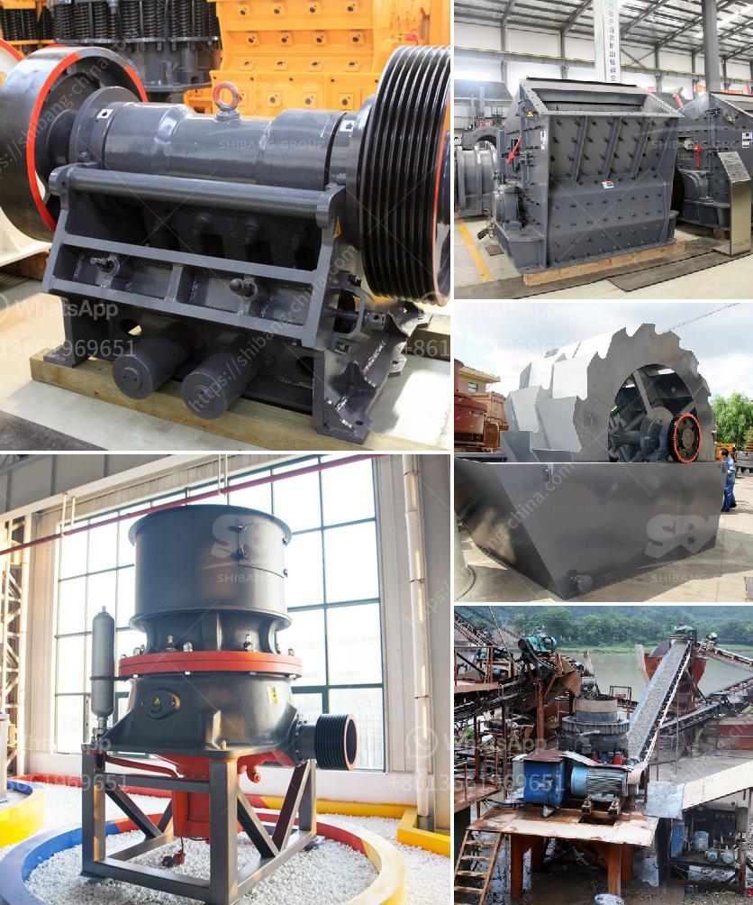

<h3>سعر آلة غسيل الرمل الكوارتز</h3>
تعتبر آلة غسيل الرمل الكوارتز أحد الأدوات المهمة في صناعة التعدين والبناء. فهي تستخدم لغسل الرمال المستخدمة في إنتاج الخرسانة والأسفلت والزجاج والسيراميك والمعادن الأخرى. يهدف استخدام آلة غسيل الرمل إلى إزالة الشوائب الموجودة في الرمل وتحسين جودته ونقاوته.

تتأثر أسعار آلات غسيل الرمل الكوارتز بعدة عوامل، بما في ذلك حجم الآلة وقدرتها وجودتها. وعادةً ما تكون الأجهزة ذات الطاقة العالية والإنتاجية الكبيرة أكثر تكلفة. بالإضافة إلى ذلك، فإن العلامة التجارية والتقنية التي تتميز بها الآلة يمكن أن تؤثر أيضًا على السعر.

قد يتراوح سعر آلة غسيل الرمل الكوارتز بين 200 و 400 دولار في الأسواق العالمية. ومع ذلك، يجب أن يُلاحظ أن هذه الأسعار قابلة للتغيير بناءً على تقلبات العرض والطلب، والعملة، والموقع الجغرافي. علاوة على ذلك، يمكن أن تتأثر الأسعار أيضًا بتكاليف الشحن والضرائب والرسوم الجمركية.

بشكل عام، ينبغي أن يتم اختيار آلة غسيل الرمل الكوارتز بناءً على الاحتياجات الفعلية للمشروع. من المهم أن يتم اختيار آلة ذات قدرة مناسبة للقدرة المطلوبة لغسيل الرمل، وأن تكون الجودة والأداء عاليين. كما يجب مراعاة تعليمات الصيانة وخدمة العملاء المتاحة لضمان استخدام الآلة بكفاءة عالية لفترة طويلة.

باختيار آلة غسيل الرمل الكوارتز المناسبة، يمكن تحقيق العديد من المزايا، مثل تحسين جودة ونقاوة الرمل المستخدم في العديد من الصناعات. لذا، ينصح بإجراء البحث اللازم والتشاور مع الخبراء قبل اتخاذ قرار الشراء لضمان الحصول على أفضل قيمة مقابل المال المدفوع.
<h3>Contact us</h3><ul><li><strong>Whatsapp:&nbsp;<a href="https://wa.me/8613661969651">+8613661969651</a></strong></li><li><a href="https://swt.shibang-china.com/?git&amp;zhl&amp;سعر آلة غسيل الرمل الكوارتز"><strong>Online Service(chat now)</strong></a></li></ul><h3>Related</h3><ul><li><a href='عملية تنشيط الكالسيوم.md'>عملية تنشيط الكالسيوم</a></li><li><a href='مصنعين لشاشات الاهتزاز في جنوب أفريقيا.md'>مصنعين لشاشات الاهتزاز في جنوب أفريقيا</a></li><li><a href='مصنع أسمنت للبيع في ألمانيا.md'>مصنع أسمنت للبيع في ألمانيا</a></li><li><a href='جوال محطم الحجر الجيري.md'>جوال محطم الحجر الجيري</a></li><li><a href='عملية كربونات الكالسيوم المترسبة.md'>عملية كربونات الكالسيوم المترسبة</a></li></ul>