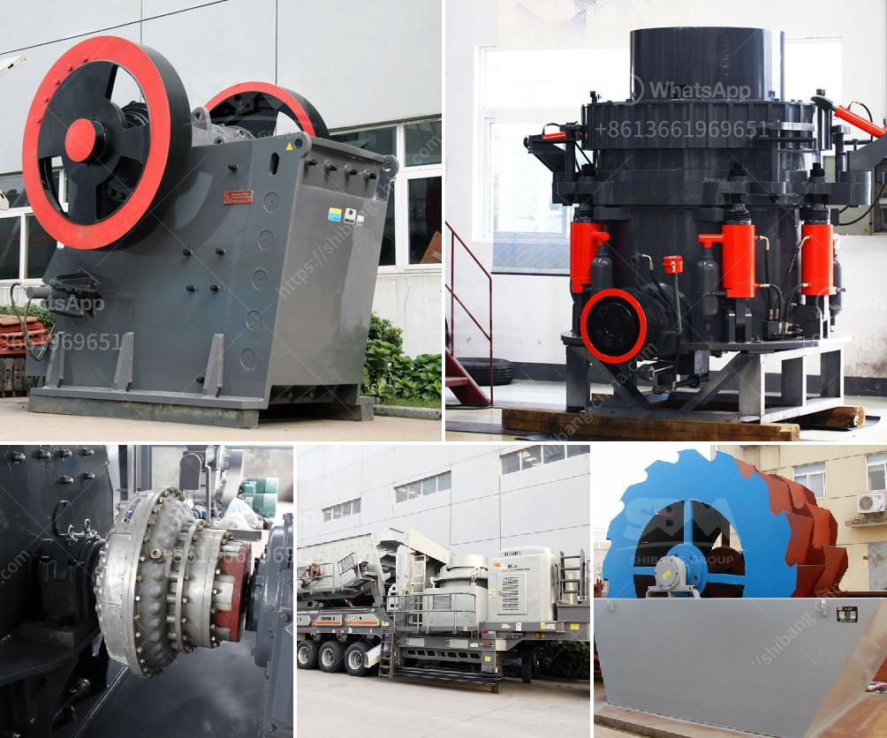

<h3>سعر آلة كسارة الحجر العملاقة</h3>
تعد آلة كسارة الحجر العملاقة من أهم الأدوات في صناعة التعدين والبناء. تستخدم هذه الآلة لكسر وطحن الصخور والأحجار الكبيرة إلى جزيئات صغيرة ورملية للاستخدام في مشاريع البناء المختلفة. تتوفر آلة كسارة الحجر العملاقة بمجموعة متنوعة من الموديلات والأحجام وتتراوح أسعارها عادة بين 200 إلى 400 ألف دولار.

تعتبر آلة كسارة الحجر العملاقة استثمارًا مهمًا لأي شركة تعدين أو بناء. إنها تساعد في تحسين الإنتاجية وتقليل تكاليف العمالة والوقت. بفضل تكنولوجيا التكسير الحديثة والقوة العالية لهذه الآلة، يمكن تحطيم الأحجار الكبيرة بسهولة وفعالية وتحويلها إلى مواد قابلة للإعادة التدوير.

يتكون سعر آلة كسارة الحجر العملاقة من عدة عوامل. العوامل الأساسية التي تؤثر في السعر هي الحجم والسعة وقوة المحرك ومستوى التقنية. كلما زاد حجم الآلة وسعتها، زاد سعرها. بالإضافة إلى ذلك، تعديلات وإضافات مثل وجود أنظمة لتشغيل الفرم وفصل الشوائب وتنظيف الغبار قد يزيد من تكلفة الجهاز. كما يتأثر السعر بكفاءة المحرك وكمية الكهرباء التي يتطلبها.

خلافاً لبعض الآلات الأخرى في صناعة المعدات الثقيلة، آلة كسارة الحجر العملاقة تعتبر من الآلات ذات السعر المرتفع نسبيا. تعتمد عمليات الوزن والتشغيل الكبيرة لهذه الآلة على معدات وأجهزة معقدة وأجزاء متينة تتطلب تصنيعا دقيقا واحترافيا.

يجب على المشترين أن يأخذوا في الاعتبار عدة عوامل قبل القرار بشراء آلة كسارة الحجر العملاقة. ينبغي مراجعة الاحتياجات والميزانية المتوفرة. يجب أيضا أن تكون هناك دراسة جيدة وتقييم للشركات المصنعة والموردين الموثوق بهم للحصول على أفضل العروض والخيارات المتاحة.

باختصار، آلة كسارة الحجر العملاقة تعد أداة ضرورية في صناعة التعدين والبناء. إنها تساعد في تحقيق المزيد من الإنتاجية بتكلفة أقل. تقدم الأداء القوي مع الحفاظ على الجودة والكفاءة. ومع ذلك، ينبغي على المشتري أن يأخذ في الاعتبار العديد من العوامل قبل شراء هذه الآلة، بما في ذلك حجمها وسعتها وكفاءة المحرك والتكنولوجيا المستخدمة.
<h3>Contact us</h3><ul><li><strong>Whatsapp:&nbsp;<a href="https://wa.me/8613661969651">+8613661969651</a></strong></li><li><a href="https://swt.shibang-china.com/?git&amp;zhl&amp;سعر آلة كسارة الحجر العملاقة"><strong>Online Service(chat now)</strong></a></li></ul><h3>Related</h3><ul><li><a href='معالجة الذهب في الفلبين.md'>معالجة الذهب في الفلبين</a></li><li><a href='كسارة تأثير خام الحديد المتنقلة في الهند.md'>كسارة تأثير خام الحديد المتنقلة في الهند</a></li><li><a href='آلة تصنيع الحجر من جنوب أفريقيا.md'>آلة تصنيع الحجر من جنوب أفريقيا</a></li><li><a href='آلات سحق تعمل في بيرو.md'>آلات سحق تعمل في بيرو</a></li><li><a href='سعة مطحنة الكرة بالأطنان.md'>سعة مطحنة الكرة بالأطنان</a></li></ul>