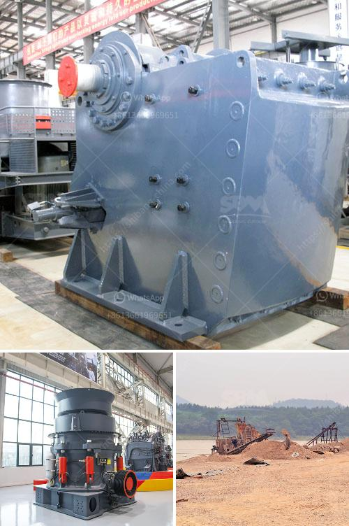

<h3>سعر آلة كسارة الرمل</h3>
تلعب آلة كسارة الرمل دورًا مهمًا في صناعة التعدين والبناء، حيث تُستخدم لكسر المواد الخام مثل الصخور والأحجار الكبيرة والركام للحصول على رمل ناعم يُستخدم في البناء وصناعة المواد الإنشائية.

تتراوح أسعار آلات كسارة الرمل بين 200 و 400 دولار. ولكن يجب مراعاة أن الأسعار قد تختلف حسب العلامة التجارية والمواصفات والحجم المطلوب. بشكل عام، كلما زادت تكلفة الجهاز، زادت قدرته على الكسر والطحن وزادت سرعته ودقته في الأداء.

تحتوي آلة الكسارة على أجزاء رئيسية مثل الفك المتحرك والفك الثابت والأسطوانة والقاطع وصندوق التروس والمحرك. هذه الأجزاء تعمل معًا بشكل متناغم لتكسير المواد الخام. وبالتالي، يعتبر تحديد سعر آلة كسارة الرمل مناسب لنشاط المستخدم واحتياجاته.

بعض العوامل التي قد تؤثر على سعر آلة كسارة الرمل هي حجم المواد الخام المراد كسرها ومتطلبات الإنتاج وطاقة الجهاز والعلامة التجارية والجودة والكفاءة والتوافر في السوق والمنافسة بين الشركات المصنعة.

عندما تشتري آلة كسارة الرمل، يجب عليك التأكد من جودة الجهاز وملائمته لاحتياجاتك. ينصح بالتعاون مع مهندسين أو خبراء متخصصين في هذا المجال لاختيار الجهاز المناسب وفقًا لأغراضك.

إذا كنت بصدد إنشاء منشأة للتعدين أو البناء، فإن اقتناء آلة كسارة الرمل سيكون قرارًا حكيمًا لتحقيق أقصى استفادة من مواردك. على الرغم من أن السعر يعد عاملًا مهمًا، فإن جودة الجهاز وكفاءته لديها تأثير أكبر على تحقيق النتائج المرجوة.

في النهاية، يمكن القول إن آلة كسارة الرمل تعتبر استثمارًا ضروريًا لصناعة التعدين والبناء. يجب اختيار الجهاز المناسب بناءً على الاحتياجات والمتطلبات الفردية. قد تتفاوت الأسعار بين 200-400 دولار، ومع ذلك، يجب إيلاء الاهتمام الأكبر لجودة وأداء الجهاز لضمان العمل المستدام وتحقيق الإنتاجية العالية.
<h3>Contact us</h3><ul><li><strong>Whatsapp:&nbsp;<a href="https://wa.me/8613661969651">+8613661969651</a></strong></li><li><a href="https://swt.shibang-china.com/?git&amp;zhl&amp;سعر آلة كسارة الرمل"><strong>Online Service(chat now)</strong></a></li></ul><h3>Related</h3><ul><li><a href='قائمة أسعار كسارة الجرانيت.md'>قائمة أسعار كسارة الجرانيت</a></li><li><a href='عملية التئام الذاتي للحجر الجيري.md'>عملية التئام الذاتي للحجر الجيري</a></li><li><a href='شاشة اهتزازية للبيع في الفلبين.md'>شاشة اهتزازية للبيع في الفلبين</a></li><li><a href='سعر كسارة الفحم القدرة.md'>سعر كسارة الفحم القدرة</a></li><li><a href='مصنعي مطاحن الرايموند في الهند.md'>مصنعي مطاحن الرايموند في الهند</a></li></ul>