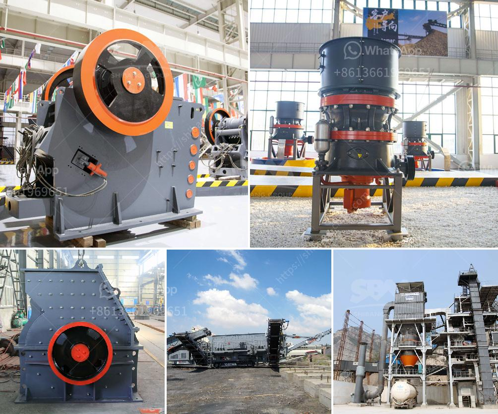

<h3>سعر آلة كسارة الفك</h3>
تعتبر آلة كسارة الفك إحدى الآلات الهامة في صناعة التعدين والبناء. وتستخدم هذه الآلة لكسر المواد الخام إلى جزيئات أصغر يمكن استخدامها في تصنيع المواد الأخرى مثل الإسمنت والحجر الصخري والحجر الجيري والأسمنت وغيرها من المواد.

عندما يتعلق الأمر بسعر آلة كسارة الفك، فإنه يمكن أن يتباين بشكل كبير وفقًا للعديد من العوامل المختلفة. ففي البداية، يتأثر السعر بحجم وطاقة الآلة. فئة الحجم والسعة يمكن أن تؤثر على كفاءة وأداء الآلة، وتحديد تكاليف التصنيع وبالتالي السعر النهائي.

كما يتأثر السعر أيضًا بالموديل والعلامة التجارية للآلة. فهناك العديد من الشركات المصنعة لآلات كسارة الفك، وتختلف أسعارها حسب العلامة التجارية. قد يكون لدى بعض العلامات التجارية سمعة جيدة وتاريخ نجاح في صناعة آلات ذات جودة عالية، وبالتالي فإن أسعارها قد تكون أعلى بقليل مقارنة بالعلامات التجارية الأخرى.

وبالإضافة إلى ذلك، يمكن أن تؤثر الخصائص التقنية الفريدة والمميزات الإضافية في سعر الآلة. فمثلاً، قد تشمل بعض الآلات أنظمة التحكم المتقدمة والتقنيات المبتكرة التي تزيد من كفاءتها وأدائها، وهذا يمكن أن يؤثر في تكلفتها. وقد يتضمن السعر أيضًا تكاليف الصيانة وخدمة ما بعد البيع.

وفي النهاية، يتأثر السعر بظروف السوق والعرض والطلب. فإذا كان هناك طلب كبير على آلات كسارة الفك، قد تزيد الأسعار نتيجة الطلب العالي. وعلى العكس من ذلك، إذا كان هناك توافر كبير للآلات بشكل عام، فقد يكون هناك تنافس بين الشركات المصنعة لتحقيق الأسعار التنافسية.

بشكل عام، يمكن أن يتراوح سعر آلة كسارة الفك بين عدة آلاف إلى عدة مئات من آلاف الدولارات، اعتمادًا على العوامل المذكورة أعلاه. من المهم أن يتم الانتباه إلى أن السعر ليس العامل الوحيد المهم عند شراء آلة كسارة الفك، بل يجب أن يتم اختيار الآلة التي تلبي الاحتياجات الدقيقة للمشروع وتتمتع بجودة عالية وكفاءة عالية.
<h3>Contact us</h3><ul><li><strong>Whatsapp:&nbsp;<a href="https://wa.me/8613661969651">+8613661969651</a></strong></li><li><a href="https://swt.shibang-china.com/?git&amp;zhl&amp;سعر آلة كسارة الفك"><strong>Online Service(chat now)</strong></a></li></ul><h3>Related</h3><ul><li><a href='أسعار مصنع معالجة الكولتان.md'>أسعار مصنع معالجة الكولتان</a></li><li><a href='كسارة الخرسانة للبيع في نيو جيرسي.md'>كسارة الخرسانة للبيع في نيو جيرسي</a></li><li><a href='عملية تصنيع الرمل الاصطناعي.md'>عملية تصنيع الرمل الاصطناعي</a></li><li><a href='سعر آلة طحن المطحنة.md'>سعر آلة طحن المطحنة</a></li><li><a href='مصنع معالجة الحجر الفلدسباري.md'>مصنع معالجة الحجر الفلدسباري</a></li></ul>