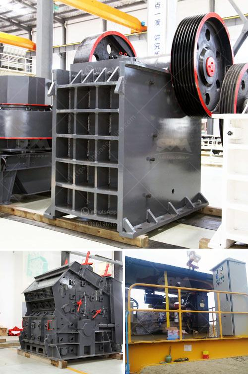

<h3>سعر آلة معالجة الحديد</h3>
تعتبر آلة معالجة الحديد أحد الأدوات الهامة في صناعة البناء والهندسة المعمارية. تُستخدم هذه الآلة لمعالجة الحديد وتشكيله بطريقة تسهل عملية البناء وتحسن جودة الهياكل المعدنية المُصنعة. يختلف سعر آلة معالجة الحديد بناءً على العديد من العوامل، بما في ذلك حجم الآلة ونوعها وقدرتها على معالجة الحديد.

في حالة الآلات الصغيرة التي تُستخدم في الأعمال الصغيرة والمشاريع المنزلية، يكون سعرها ما بين 200-500 دولارًا تقريبًا. هذه الآلات تُستخدم عادة لثني وقص الحديد بأحجام صغيرة ومتوسطة. يمكنها ثني قضبان الحديد وقصها بزوايا محددة وبكفاءة عالية.

ومع ذلك، إذا كنت تبحث عن آلات أكبر الحجم وأكثر تعقيدًا وتقنية، فقد يتطلب الأمر استثمارًا أكبر. يمكن لآلات معالجة الحديد الكبيرة والمتخصصة أن تكلف بين 500-1500 دولارًا أو أكثر. هذه الآلات عادة ما تكون آلات متعددة الوظائف، حيث يمكنها ثني وقطع وتشكيل الحديد بأحجام كبيرة ومعقدة.

ويجب ملاحظة أن هذه الأسعار قابلة للتغيير بناءً على الشركة المُصنعة والعلامة التجارية ومكان الشراء. قد يكون هناك اختلاف في الأسعار بين البلدان والأسواق المختلفة. وبالتالي، يُوصى بالمقارنة بين العروض المتاحة وقراءة المزيد حول المنتجات قبل اتخاذ قرار الشراء.

بشكل عام، يمكن القول إن آلة معالجة الحديد تعتبر استثمارًا ضروريًا للشركات في صناعة البناء والهندسة المعمارية. فإذا توفرت الموارد المالية، ينبغي البحث والاستعلام عن آلات ذات جودة عالية وتقنية متقدمة، حتى يتمكن المستخدم من تحقيق أقصى استفادة منها في أعماله المستقبلية.
<h3>Contact us</h3><ul><li><strong>Whatsapp:&nbsp;<a href="https://wa.me/8613661969651">+8613661969651</a></strong></li><li><a href="https://swt.shibang-china.com/?git&amp;zhl&amp;سعر آلة معالجة الحديد"><strong>Online Service(chat now)</strong></a></li></ul><h3>Related</h3><ul><li><a href='آلة تعدين النحاس.md'>آلة تعدين النحاس</a></li><li><a href='آلات كسارة الحجر في هولندا.md'>آلات كسارة الحجر في هولندا</a></li><li><a href='كسارة الصخور.md'>كسارة الصخور</a></li><li><a href='كسارة صنع الحصى.md'>كسارة صنع الحصى</a></li><li><a href='أسعار كسارات نيجيريا الجديدة.md'>أسعار كسارات نيجيريا الجديدة</a></li></ul>