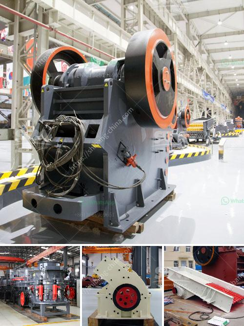

<h3>سعر أحزمة الناقلات</h3>
تعد أحزمة الناقلات جزءًا أساسيًا من صناعة النقل والتصنيع حول العالم. فهي تستخدم لنقل المواد والمنتجات من مكان إلى آخر بكفاءة وسهولة. تختلف أحزمة الناقلات في الأحجام والمواد المستخدمة والخصائص التقنية والتطبيقات المختلفة، مما يجعل أسعارها تتفاوت.

سعر أحزمة الناقلات يتأثر بعدة عوامل. من أهم هذه العوامل هو نوع المادة التي ستنقل عبر الحزام. قد يكون هناك حاجة لأحزمة ناقلة خاصة لنقل المواد السائلة مثل النفط والكيماويات. تكون هذه الأحزمة مصنوعة من مواد مقاومة للتآكل والتأثيرات الكيميائية.

بالإضافة إلى ذلك، يؤثر حجم ووزن الحزام أيضًا على سعره. يتطلب إنتاج أحزمة ناقلة ذات حجم أكبر وقوة أكبر تكاليف إنتاج أعلى. لذا، يتوقع أن تكون أحزمة الناقلات ذات الأحجام الكبيرة أكثر تكلفة من أحزمة الناقلات ذات الأحجام الصغيرة.

علاوة على ذلك، يجب أن نأخذ في الاعتبار تقنيات الإنتاج المستخدمة وجودة المواد المستخدمة في صنع الأحزمة. التطور في التقنية يعني تحسين في أداء الحزام وزيادة عمره الافتراضي. ومع ذلك، قد يترتب على ذلك زيادة في سعر الحزام نظرًا للتكلفة الأعلى لإنتاجه.

في النهاية، يجب أن نلاحظ أن سعر أحزمة الناقلات يختلف حسب البلد وشركة التصنيع وفترة التسليم المطلوبة. قد يكون هناك اختلاف في التكلفة بسبب اختلاف أسعار المواد الخام والأجور في الدول المختلفة.

باختصار، سعر أحزمة الناقلات يتأثر بعدة عوامل مثل نوع المادة المنقولة وحجم الحزام وجودة المواد المستخدمة وتقنيات الإنتاج والبلد المصنع وشركة التصنيع. من المهم اتخاذ هذه العوامل في الاعتبار عند اختيار وشراء أحزمة الناقلات لضمان الحصول على المنتج الأكثر جودة وفعالية بأفضل سعر ممكن.
<h3>Contact us</h3><ul><li><strong>Whatsapp:&nbsp;<a href="https://wa.me/8613661969651">+8613661969651</a></strong></li><li><a href="https://swt.shibang-china.com/?git&amp;zhl&amp;سعر أحزمة الناقلات"><strong>Online Service(chat now)</strong></a></li></ul><h3>Related</h3><ul><li><a href='اتصالات أحزمة الناقلات.md'>اتصالات أحزمة الناقلات</a></li><li><a href='كسارة البليت في كينيا.md'>كسارة البليت في كينيا</a></li><li><a href='مصنعو آلات تكسير الحجر.md'>مصنعو آلات تكسير الحجر</a></li><li><a href='آلة كسارة في الإمارات.md'>آلة كسارة في الإمارات</a></li><li><a href='آلة حبيبات الجبس في الهند.md'>آلة حبيبات الجبس في الهند</a></li></ul>