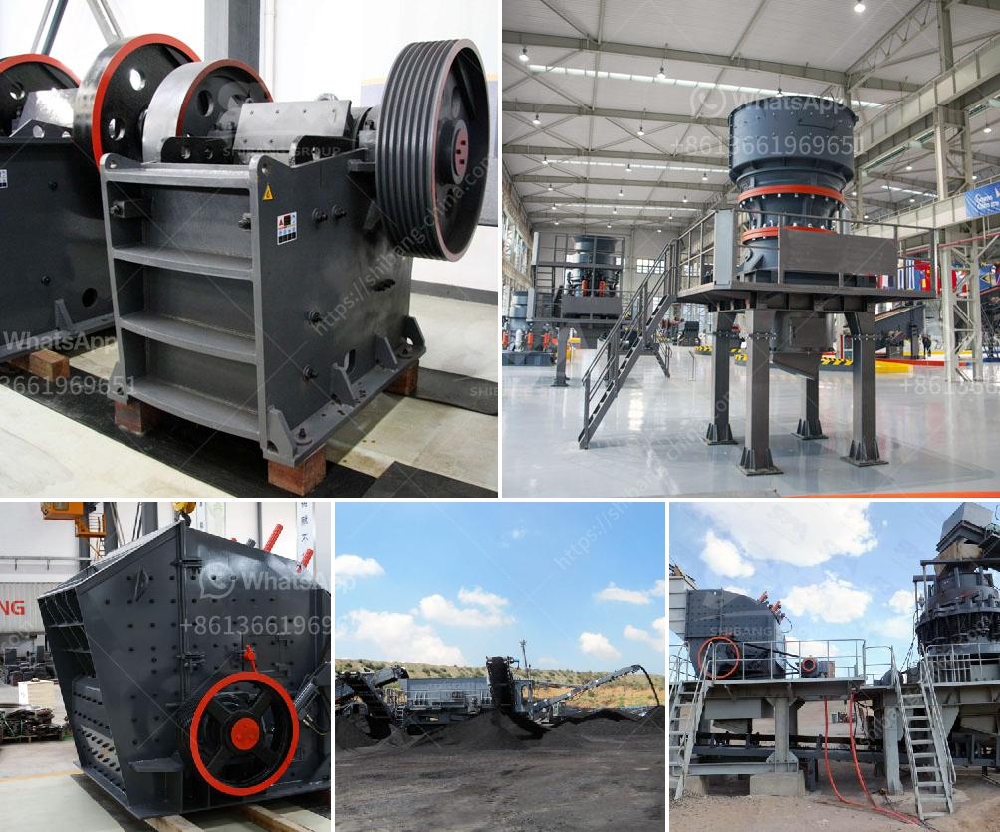

<h3>سعر الأسطوانات للمطاحن الصناعية</h3>
تعد الأسطوانات أحد الأجزاء الأساسية في مطاحن الحبوب الصناعية، حيث تستخدم لطحن الحبوب وتحويلها إلى دقيق. ويرتبط سعر الأسطوانات بعدة عوامل تحدد قيمتها، مثل الجودة والمواصفات التقنية والمادة المصنوعة منها.

أولاً، يتأثر سعر الأسطوانات بجودتها ومواصفاتها التقنية. بشكل عام، تتوفر الأسطوانات بعدة موديلات وأحجام تتناسب مع احتياجات المطاحن المختلفة. تعتبر الأسطوانات ذات الجودة العالية التي تستخدم في المطاحن الكبيرة والمتقدمة التقنية أكثر تكلفة مقارنة بتلك التي تستخدم في المطاحن الصغيرة. يتم تصنيع الأسطوانات العالية الجودة من مواد ممتازة مثل الصلب المقاوم للصدأ، وتحتاج إلى صيانة مستمرة للحفاظ على جودتها وكفاءتها.

ثانياً، يعتمد سعر الأسطوانات أيضًا على المادة المصنوعة منها. وتختلف الخيارات المتاحة في هذا الصدد بين الأسطوانات المصنوعة من الصلب الكربوني والأسطوانات المطاطية. تعتبر الأسطوانات المصنوعة من الصلب الكربوني أكثر تكلفة نظرًا لمتانتها ومقاومتها للتآكل. بالمقابل، تكون الأسطوانات المطاطية أكثر تكلفة في الحالات التي تتطلب تأثيرًا أقل على الحبوب، مثل عمليات الطحن الناعم.

بشكل عام، يتراوح سعر الأسطوانات للمطاحن الصناعية بين 200 و 400 دولار حسب الحجم والمواصفات. وقد يزداد السعر في حالة وجود احتياجات خاصة مثل أحجام مخصصة لتناسب المطاحن الصغيرة أو المواد المصنوعة منها.

وفي الختام، يجب التأكيد على أن سعر الأسطوانات للمطاحن الصناعية يعتمد على العديد من العوامل المختلفة، وهو أمر يجب أن يؤخذ في الاعتبار عند شراء أسطوانات جديدة أو استبدالها في المطاحن الصناعية. إذ ينبغي اختيار الأسطوانات التي تناسب الاحتياجات وتعطي أفضل قيمة مقابل المال المستثمر.
<h3>Contact us</h3><ul><li><strong>Whatsapp:&nbsp;<a href="https://wa.me/8613661969651">+8613661969651</a></strong></li><li><a href="https://swt.shibang-china.com/?git&amp;zhl&amp;سعر الأسطوانات للمطاحن الصناعية"><strong>Online Service(chat now)</strong></a></li></ul><h3>Related</h3><ul><li><a href='تكلفة إعداد مصنع طحن الكلنكر في الهند.md'>تكلفة إعداد مصنع طحن الكلنكر في الهند</a></li><li><a href='مصنعي مطاحن الفحم في الهند.md'>مصنعي مطاحن الفحم في الهند</a></li><li><a href='تكلفة مصنع الإسمنت الصغير بسعة 2000 طن يوميًا.md'>تكلفة مصنع الإسمنت الصغير بسعة 2000 طن يوميًا</a></li><li><a href='معدات مستخدمة في تعدين الفحم.md'>معدات مستخدمة في تعدين الفحم</a></li><li><a href='رسم لآلات غسل الرمل كسارة مطحنة.md'>رسم لآلات غسل الرمل كسارة مطحنة</a></li></ul>