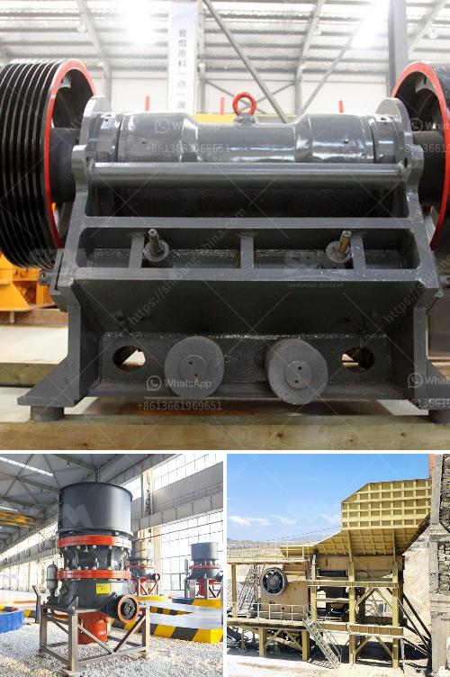

<h3>سعر التحسين العالي لطحن الكرة</h3>
سعر التحسين العالي لطحن الكرة هو عبارة عن استراتيجية تؤثر بشكل كبير على جودة عملية طحن الكرة في مصانع الأسمنت ومصانع الطاقة الحرارية، وهو عبارة عن تحسين التكنولوجيا المستخدمة في طحن المواد الخام لتلبية متطلبات تشغيل المصنع بكفاءة أعلى واستهلاك منخفض للطاقة وتقليل التلوث.

يتطلب سعر التحسين العالي لطحن الكرة استخدام أحدث التقنيات والمعدات المتقدمة في صناعة الطحن، مثل طاحونة الأسطوانة عالية الضغط والطاحونة العمودية والطاحونة الكروية ذات الضغط المنخفض، وغيرها من المعدات المتطورة. تعتبر هذه المعدات أكثر كفاءة في معالجة المواد الخام وتقليل استهلاك الطاقة اللازمة لطحنها.

علاوة على ذلك، يتطلب سعر التحسين العالي لطحن الكرة أيضًا استخدام تقنيات جديدة للتحكم في عملية الطحن وضبطها بشكل أفضل. فعلى سبيل المثال، يتم استخدام نظام التحكم الآلي لضبط تدفق المواد الخام والماء بدقة، وتجنب فقدان الطاقة الناتج عن طحن غير فعال أو فقدان المواد الخام.

وبالإضافة إلى ذلك، يتطلب سعر التحسين العالي لطحن الكرة أيضًا توفر الخراطيم والأنابيب والمواسير عالية الجودة والمقاومة للاحتكاك والتآكل. فالعملية الطويلة لطحن الكرات يمكن أن تتسبب في تآكل المعدات وتقليل كفاءتها، لذا فإن استخدام مواد ذات جودة عالية ضروري لضمان استدامة العملية وتقليل تكاليف الصيانة.

أخيراً، يجب أن نشير أيضًا إلى أن سعر التحسين العالي لطحن الكرة قد يكون مرتفعًا نسبيًا مقارنة بتكاليف الطحن التقليدية. وذلك يعود إلى تكلفة المعدات المتقدمة والتقنيات الحديثة التي يتم استخدامها. ومع ذلك، فإن فوائد استخدام سعر التحسين العالي لطحن الكرة تتجاوز تكلفتها على المدى الطويل، حيث يمكن للشركات تحقيق مدى الحياة المطلوب للمعدات وتحقيق أقصى استفادة من استثماراتها.

وبناءً على ذلك، يمكن القول أن سعر التحسين العالي لطحن الكرة هو استثمار مستدام وذكي يحقق أهداف الإنتاج بكفاءة عالية واستدامة بيئية واقتصادية. يجب على الشركات النظر في هذه التكنولوجيا المتقدمة وتحليل فوائدها المحتملة قبل اتخاذ قرار استثماري في سعر التحسين العالي لطحن الكرة.
<h3>Contact us</h3><ul><li><strong>Whatsapp:&nbsp;<a href="https://wa.me/8613661969651">+8613661969651</a></strong></li><li><a href="https://swt.shibang-china.com/?git&amp;zhl&amp;سعر التحسين العالي لطحن الكرة"><strong>Online Service(chat now)</strong></a></li></ul><h3>Related</h3><ul><li><a href='خدمات مصنع معالجة التعدين المحمول.md'>خدمات مصنع معالجة التعدين المحمول</a></li><li><a href='سؤال حول عملية الطحن بالكرات.md'>سؤال حول عملية الطحن بالكرات</a></li><li><a href='سعر كسارة الهامر للطن الواحد في الساعة.md'>سعر كسارة الهامر للطن الواحد في الساعة</a></li><li><a href='كسارات متنقلة في أبوجا.md'>كسارات متنقلة في أبوجا</a></li><li><a href='كسارة الفك المحمولة في غرب أفريقيا تجار.md'>كسارة الفك المحمولة في غرب أفريقيا تجار</a></li></ul>