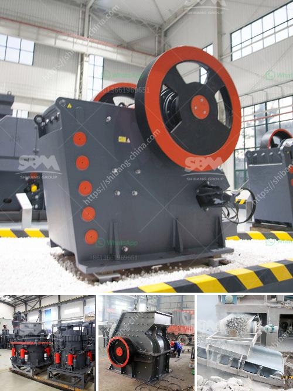

<h3>سعر الشاشة الاهتزازية في الهند</h3>
تعتبر الشاشة الاهتزازية من الأجهزة الحديثة التي تستخدم في مجموعة واسعة من التطبيقات في الهند وجميع أنحاء العالم. يتم استخدامها في الهواتف الذكية والأجهزة اللوحية والأجهزة اللوحية والساعات الذكية والكثير من التكنولوجيا القابلة للارتداء الأخرى.

تطورت الشاشات الاهتزازية بشكل كبير على مر السنين، وأصبحت اليوم توفر تجربة مستخدم مليئة بالبهجة والراحة. تسمح للمستخدمين بتلقي إشعارات حسب تفضيلاتهم عن طريق اهتزاز الشاشة بشكل مختلف، مما يسهل على المستخدم أن يكون على علم بالمكالمات الواردة والرسائل والتنبيهات الأخرى.

واحدة من أهم الميزات التي تقدمها الشاشة الاهتزازية هي إمكانية إشعار المستخدم بدون إزعاج الآخرين من حوله. يمكن للمستخدمين ضبط الشاشة للتنبيه بهم عن طريق الاهتزاز، مما يجعلها مثالية للاستخدام في المناطق الهادئة أو خلال الاجتماعات أو المحاضرات أو حتى في وقت النوم.

تتوفر شاشات الاهتزاز بمجموعة واسعة من الأسعار في الهند، حيث يمكن العثور على الشاشات المتواضعة بأسعار تتراوح بين 200-400 روبية هندية، ولكنها تتفاوت بناءً على العلامة التجارية والجودة والمواصفات الفنية الأخرى. ينصح المستخدمون بالاستثمار في الشاشات ذات الجودة الجيدة، حيث إنها توفر أداءً أفضل ومتانة أكبر.

بغض النظر عن الأسعار، يمكن العثور على العديد من الشركات المصنعة المشهورة التي تقدم الشاشات الاهتزازية بجودة عالية بأسعار مناسبة. يجب على المستخدمين الاهتمام بعوامل أخرى مثل دقة الشاشة والتباين وسطوع الصورة وزمن استجابة الشاشة ومقاومة الماء والغبار والصدمات، حيث تؤثر جميعها على جودة الشاشة وأدائها.

في الختام، تلعب الشاشات الاهتزازية دورًا مهمًا في تحسين تجربة المستخدم وتسهيل الاتصالات عن طريق الاهتزازات المتنوعة التي تنقل المعلومات بصورة سهلة وميسرة. سعر الشاشة الاهتزازية يتناسب مع متطلبات المستخدم وتفضيلاته، ومع العديد من الخيارات المتاحة في السوق الهندية، يمكن للمستخدمين اختيار الشاشة التي تناسب ميزانيتهم واحتياجاتهم.
<h3>Contact us</h3><ul><li><strong>Whatsapp:&nbsp;<a href="https://wa.me/8613661969651">+8613661969651</a></strong></li><li><a href="https://swt.shibang-china.com/?git&amp;zhl&amp;سعر الشاشة الاهتزازية في الهند"><strong>Online Service(chat now)</strong></a></li></ul><h3>Related</h3><ul><li><a href='كيفية اختيار كسارة مخروطية.md'>كيفية اختيار كسارة مخروطية</a></li><li><a href='معدات تعدين الذهب على نطاق صغير للبيع في مزاد.md'>معدات تعدين الذهب على نطاق صغير للبيع في مزاد</a></li><li><a href='آلة تكسير الحصى.md'>آلة تكسير الحصى</a></li><li><a href='مطحنة طحن رايموند في باكستان.md'>مطحنة طحن رايموند في باكستان</a></li><li><a href='آلات غسيل الفحم.md'>آلات غسيل الفحم</a></li></ul>