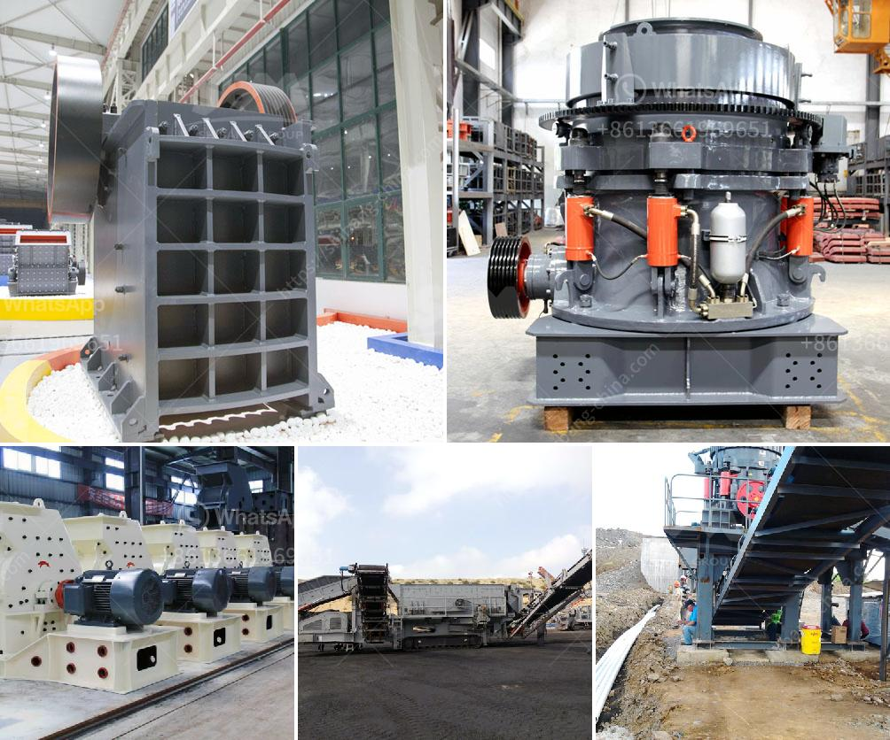

<h3>سعر الطحن بالكرات</h3>
إن سعر الطحن بالكرات هو عامل مهم يؤثر على صناعات متعددة مثل صناعة الإسمنت وصناعة التعدين. يشير سعر الطحن بالكرات إلى التكلفة المرتبطة بعملية طحن المواد الخام باستخدام كرات فولاذية في مطحنة الكرات.

تعتبر عملية الطحن بالكرات من العمليات الرئيسية في مصانع الإسمنت ومناجم الفحم ومقالع الحجر وصناعة السيراميك ومجالات أخرى. تستخدم كرات الطحن في داخل مطحنة الكرات لسحق المواد الخام وتمزج للحصول على مسحوق ناعم يستخدم في العمليات الإنتاجية اللاحقة.

الأسعار المرتفعة للكرات هي أحد عوامل التأثير في سعر الطحن بالكرات. تعتمد تكلفة الكرات على العوامل التالية:

1. المادة الخام: تتأثر تكلفة الكرات بالمواد المستخدمة في صناعتها. عادةً ما تكون الكرات الفولاذية أكثر تكلفة من الكرات الحديدية العادية. كما أنها تتطلب عمليات إنتاج معقدة وذات تقنية عالية للحصول على جودة عالية.

2. الحجم والوزن: سعر الكرات يعتمد أيضًا على حجم ووزن الكرات. عادةً ما يكون سعر الكرات ذات الحجم الكبير أعلى من الكرات ذات الحجم الصغير. الكرات الثقيلة عادةً ما تكون أكثر تكلفة لإنتاجها وشرائها.

3. الكمية المطلوبة: يتأثر سعر الطحن بالكرات أيضًا بالكمية التي يتم شراؤها. عندما يتم شراء الكرات بكميات كبيرة ، قد يتم تقديم خصومات خاصة من قبل الموردين.

تعد تقنية الطحن بالكرات أكثر تطورًا وفعالية في طحن المواد الخام مقارنة بالتقنيات التقليدية الأخرى. يعمل طحن الكرات على زيادة كفاءة الطحن وتحقيق أداء ممتاز في عملية الطحن. تقلل هذه التقنية من استهلاك الطاقة وتحسن جودة المنتج النهائي.

بشكل عام ، فإن سعر الطحن بالكرات يختلف من مورد إلى آخر ويتأثر بعدة عوامل مذكورة سابقًا. قد يكون سعر الطحن بالكرات مرتفعًا نسبيًا ، ولكنه يتناسب مع جودة الكرات المستخدمة والنتائج المتوقعة من عملية الطحن. يعتبر الاستثمار في كرات ذات جودة عالية وكفاءة عملية الطحن بالكرات استثمارًا مستدامًا ومناسبًا على المدى الطويل للمصانع والمناجم.
<h3>Contact us</h3><ul><li><strong>Whatsapp:&nbsp;<a href="https://wa.me/8613661969651">+8613661969651</a></strong></li><li><a href="https://swt.shibang-china.com/?git&amp;zhl&amp;سعر الطحن بالكرات"><strong>Online Service(chat now)</strong></a></li></ul><h3>Related</h3><ul><li><a href='كسارة فكية لتكسير الجرانيت.md'>كسارة فكية لتكسير الجرانيت</a></li><li><a href='كسارات الحجر للبيع في كينيا.md'>كسارات الحجر للبيع في كينيا</a></li><li><a href='معدات التعدين في جنوب أفريقيا.md'>معدات التعدين في جنوب أفريقيا</a></li><li><a href='آلة كسارة حجر صغيرة.md'>آلة كسارة حجر صغيرة</a></li><li><a href='معالجة الذهب بنطاق صغير باستخدام طريقة CIP.md'>معالجة الذهب بنطاق صغير باستخدام طريقة CIP</a></li></ul>