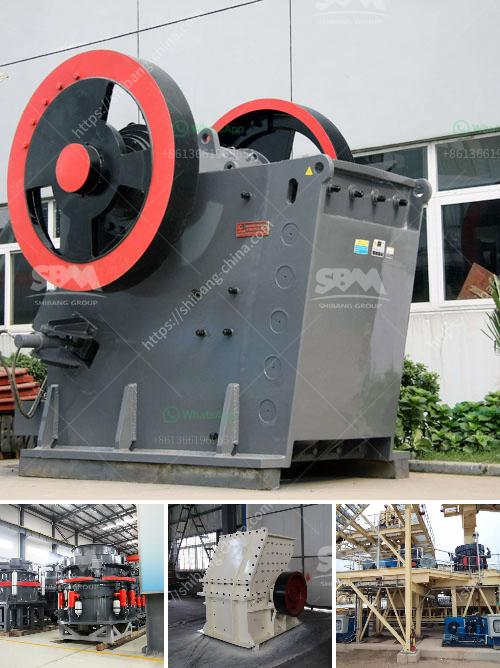

<h3>سعر الكسارة 30 طن</h3>
تعتبر الكسارة من المعدات الثقيلة المستخدمة في صناعة التعدين والإنشاءات، حيث يتم استخدامها لكسر وطحن المواد الخام مثل الصخور والحصى والحجر الجيري. تعتبر الكسارات أداة أساسية في صناعة البناء والبناء، حيث تساعد في تحويل الصخور الكبيرة إلى قطع صغيرة، مما يجعلها أكثر ملاءمة للاستخدام في الإنشاءات المختلفة مثل الطرق والجسور والمباني.

تختلف الكسارات في الحجم والقدرة والاستخدام، وبالتالي فإن الأسعار تختلف أيضًا بناءً على هذه العوامل. ناخذ مثالًا على الكسارة ذات السعة 30 طن، قد يكون سعرها يتراوح بين 200 إلى 400 ألف ريال.

1- الاستخدام: إذا كانت الكسارة مستعملة، فإن السعر سيكون أقل من الكسارة الجديدة، حيث يتم احتساب التآكل والاستخدام السابق في تحديد السعر.

2- العلامة التجارية: تختلف الأسعار بين العلامات التجارية المختلفة، حيث أن الشركات المعروفة والمعترف بها قد تكون أكثر تكلفة نسبيًا من الشركات الجديدة.

3- المواصفات والملحقات: إذا كانت الكسارة تأتي مع ملحقات إضافية ومواصفات متقدمة، فإن السعر سيكون أعلى من تلك التي لا تحتوي على هذه الميزات.

4- السوق: تعتمد الأسعار أيضًا على حالة سوق الكسارات في منطقة معينة. قد تختلف الأسعار في المدن المزدهرة عن تلك في المناطق الريفية.

بشكل عام، يجب على المشتري أن يأخذ في الاعتبار أن شراء الكسارة ليس مجرد شراء المعدة نفسها، بل يجب أيضًا أن يضمن الشراء سهولة الصيانة ودعم ما بعد البيع. فبالإضافة إلى تكلفة الكسارة ذاتها، يجب أيضًا مراعاة تكاليف الصيانة والتشغيل المستقبلية.

قبل شراء الكسارة، ينصح بإجراء البحوث والمقارنات المختلفة للأسعار والعوامل المذكورة أعلاه. كما يجب التعاون مع متخصصين في هذا المجال، الذين يمكنهم تقديم المشورة والتوجيه المناسبين، مع الأخذ في الاعتبار احتياجات المشروع والميزانية المتاحة.
<h3>Contact us</h3><ul><li><strong>Whatsapp:&nbsp;<a href="https://wa.me/8613661969651">+8613661969651</a></strong></li><li><a href="https://swt.shibang-china.com/?git&amp;zhl&amp;سعر الكسارة 30 طن"><strong>Online Service(chat now)</strong></a></li></ul><h3>Related</h3><ul><li><a href='مطاحن تلك جنوب أفريقيا.md'>مطاحن تلك جنوب أفريقيا</a></li><li><a href='سعر آلة طاحونة الهامر.md'>سعر آلة طاحونة الهامر</a></li><li><a href='إنتاج خام الحديد حسب الولاية في الهند.md'>إنتاج خام الحديد حسب الولاية في الهند</a></li><li><a href='كسارة الصخور الصين.md'>كسارة الصخور الصين</a></li><li><a href='مصانع الكسارات للبيع.md'>مصانع الكسارات للبيع</a></li></ul>