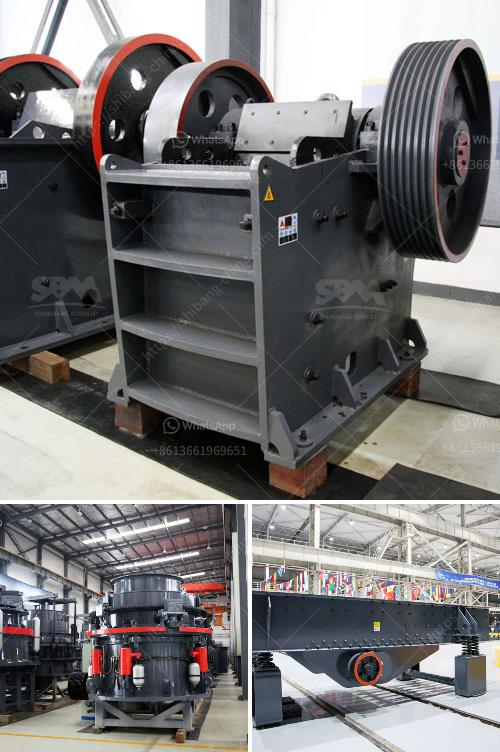

<h3>سعر الكسارة بمقدار الطن في الساعة</h3>
تعتبر الكسارة من أهم الآلات المستخدمة في صناعة الأعمال الإنشائية وتعدين المواد، حيث تقوم بتكسير المواد الصلبة مثل الصخور والحجارة إلى قطع صغيرة بحجم محدد. يختلف سعر الكسارة بمقدار الطن في الساعة على حسب عدة عوامل أساسية.

أولاً، تعتبر نوعية الكسارة أحد العوامل المهمة التي تؤثر على السعر. هناك العديد من أنواع الكسارات مثل الكسارات الفكية والكسارات المخروطية والكسارات الصدمية، وكل نوع له تكنولوجيا معينة ومميزات مختلفة. تعتبر الكسارات المخروطية والكسارات الصدمية ذات التقنيات المتقدمة والقدرة الإنتاجية العالية أغلى من الكسارات الفكية ذات القدرة الإنتاجية المتوسطة.

ثانياً، يتأثر سعر الكسارة بقوة المحرك والقدرة الإنتاجية. يعتبر المحرك القوي والقدرة الإنتاجية العالية مؤشراً على جودة الكسارة وقدرتها على التعامل مع الأحمال الثقيلة. بالتالي، فإن الكسارات ذات المحرك القوي والقدرة الإنتاجية العالية تكون أكثر تكلفة من الكسارات ذات المحركات الأضعف والقدرات الإنتاجية المنخفضة.

ثالثاً، تعتبر الإضافات والملحقات الخاصة بالكسارة عاملاً مؤثرًا على السعر. هناك العديد من الإضافات الهامة التي يمكن تثبيتها على الكسارة لزيادة الكفاءة وتحسين الأداء، مثل الغرابيل الاهتزازية والمغناطيس المستخدم لفصل المواد المعدنية عن الحجارة. قد ترفع هذه الإضافات من التكلفة الإجمالية للكسارة.

أخيراً، تعتبر سوق العرض والطلب أحد العوامل الأساسية التي تؤثر على السعر. يمكن أن يتأثر سعر الكسارة بمقدار الطن في الساعة بتغيرات في الطلب على المواد الإنشائية والتعدين في السوق. عندما يكون الطلب على الكسارة عاليًا، فإن سعرها يرتفع، في حين أن الطلب المنخفض يمكن أن يؤدي إلى انخفاض الأسعار.

بشكل عام، يتراوح سعر الكسارة بمقدار الطن في الساعة ما بين عدة آلاف إلى عشرات الآلاف من الدولارات، حسب العوامل المذكورة أعلاه. يعتبر اختيار الكسارة المناسبة للاحتياجات والمتطلبات الخاصة للمشروع هو الأمر المهم، حيث يتطلب اختيار الكسارة الصحيحة دراسة دقيقة للموضوع والتشاور مع الخبراء والمهندسين المختصين.
<h3>Contact us</h3><ul><li><strong>Whatsapp:&nbsp;<a href="https://wa.me/8613661969651">+8613661969651</a></strong></li><li><a href="https://swt.shibang-china.com/?git&amp;zhl&amp;سعر الكسارة بمقدار الطن في الساعة"><strong>Online Service(chat now)</strong></a></li></ul><h3>Related</h3><ul><li><a href='فرق بين مطحنة ريموند وضغط عالي.md'>فرق بين مطحنة ريموند وضغط عالي</a></li><li><a href='كسارة محمولة للحطام.md'>كسارة محمولة للحطام</a></li><li><a href='آلة كسارة للبيع بسعر منخفض في أوريسا.md'>آلة كسارة للبيع بسعر منخفض في أوريسا</a></li><li><a href='مصنع كسارة الكسارات للبيع في جنوب أفريقيا.md'>مصنع كسارة الكسارات للبيع في جنوب أفريقيا</a></li><li><a href='مصنع آلات مطحنة الكرة.md'>مصنع آلات مطحنة الكرة</a></li></ul>