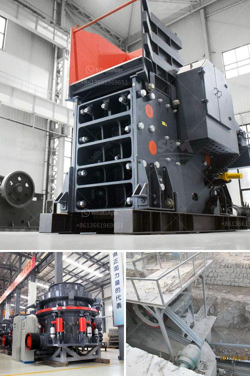

<h3>سعر الكسارة من الصين</h3>
تعد الصين إحدى الدول الرائدة في صناعة الكسارات، حيث توفر العديد من الخيارات المتنوعة وذات الجودة العالية. يعتبر سعر الكسارة من الصين مغريًا للعديد من العملاء حول العالم، حيث يمكن الحصول على كسارة بجودة عالية بسعر أقل مقارنة بالبلدان الأخرى.

تعتبر الكسارات الصينية متوافقة مع المعايير الدولية، وتوفر أفضل تكنولوجيا الصيانة والاستخدام الثابت. وبالتالي، فإن شراء كسارة من الصين قد يكون اختيارًا جيدًا لأولئك الذين يبحثون عن كسارة تتمتع بالجودة العالية والأداء الممتاز بأسعار تنافسية.

عند النظر في نطاق السعر المذكور، يتوفر العديد من الطرز المختلفة من الكسارات التي تحتوي على ميزات متنوعة تتناسب مع احتياجات المستخدم. قد تتراوح الأحجام المتاحة من 200 إلى 400 ملم، وهذا يعني أن الكسارات المتاحة قد تتراوح بين النماذج الصغيرة وحتى النماذج الأكبر حسب احتياجات المراجعين.

يعد سعر الكسارة الصينية بين 200 إلى 400 بأقل تكلفة من منافسيها. هذا الاختلاف في السعر يرجع إلى عوامل عديدة مثل تكلفة المواد الخام وقوة العمل المتاحة في الصين مما يساعد على تقليل التكاليف الإجمالية للإنتاج.

بالإضافة إلى ذلك، يتميز سوق الكسارات الصيني بتنافسية قوية بين الشركات المصنعة، مما يجبرهم على تقديم جودة عالية بأسعار مناسبة لتلبية احتياجات العملاء. بالتالي، فإن العملاء يستفيدون من هذا التنافس الشديد من خلال الحصول على أفضل مستوى من الجودة والأداء بأقل تكلفة.

على الرغم من أن سعر الكسارة من الصين يبدو جذابًا بشكل عام، إلا أنه هام أن يتم اختيار الشركة المصنعة بعناية. يُنصح بالعمل مع شركات موثوقة وذات سمعة جيدة، والتي تستخدم مكونات عالية الجودة وتلتزم بمعايير الجودة العالمية.

باختصار، سعر الكسارة من الصين مغري بسبب التكاليف المنخفضة والجودة العالية، والتنافسية الشديدة في سوق الكسارات الصيني. لذا، فإن شراء كسارة من الصين بسعر يتراوح بين 200 إلى 400 دولار يمكن أن يكون خيارًا جيدًا للعملاء الذين يبحثون عن كسارة بأداء ممتاز وبأسعار تنافسية. ومع ذلك، يجب أن يتم اختيار الشركة المصنعة بعناية لضمان الجودة والموثوقية.
<h3>Contact us</h3><ul><li><strong>Whatsapp:&nbsp;<a href="https://wa.me/8613661969651">+8613661969651</a></strong></li><li><a href="https://swt.shibang-china.com/?git&amp;zhl&amp;سعر الكسارة من الصين"><strong>Online Service(chat now)</strong></a></li></ul><h3>Related</h3><ul><li><a href='كسارة السيليكون الوافر.md'>كسارة السيليكون الوافر</a></li><li><a href='سعر مطحنة الكرة.md'>سعر مطحنة الكرة</a></li><li><a href='محطم متنقل لسحق الفحم.md'>محطم متنقل لسحق الفحم</a></li><li><a href='ناقل حزام لتصميم الفحم في الهند.md'>ناقل حزام لتصميم الفحم في الهند</a></li><li><a href='معدات تحميل وسائط مطحنة الكرة.md'>معدات تحميل وسائط مطحنة الكرة</a></li></ul>