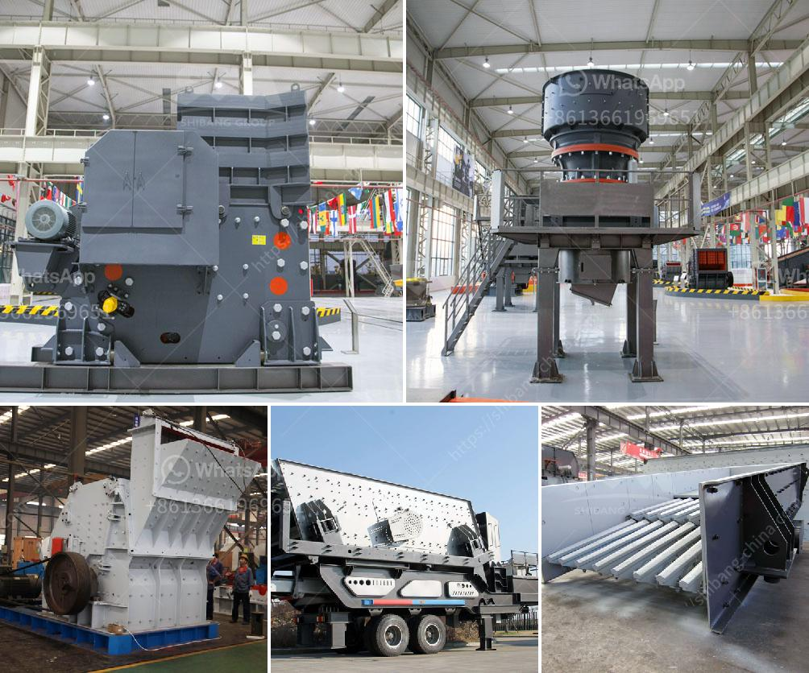

<h3>سعر المطحنة للمعادن في بوليفيا</h3>
في بوليفيا، تعتبر صناعة التعدين واحدة من القطاعات الرئيسية التي تلعب دوراً حاسماً في اقتصاد البلاد. ومن بين المعدنين الرئيسيين التي تستخرج في بوليفيا هي المعادن الثمينة مثل الفضة والذهب والقصدير والرصاص وغيرها. ولإنتاج هذه المعادن، تعتبر المطاحن واحدة من الأجهزة المهمة لتجهيز المواد المعدنية المستخرجة ليتم تصفيتها وتكريرها.

تتوفر مطاحن المعادن في بوليفيا بأسعار متنوعة بين 200-400 دولار أمريكي. يتفاوت السعر حسب حجم المطحنة ونوعيتها ومواصفاتها. على سبيل المثال، هناك المطاحن الصغيرة الحجم التي يمكن شراؤها بأسعار تتراوح بين 200-300 دولار أمريكي. تلك المطاحن الصغيرة تكون مناسبة للاستخدام المنزلي أو التجاري الصغير حيث يتم تجهيز كميات قليلة من المواد المعدنية.

بالمقابل، هناك المطاحن الأكبر الحجم التي يمكن شراؤها بأسعار تتراوح بين 300-400 دولار أمريكي. تلك المطاحن الكبيرة تستخدم في الصناعات الكبيرة التي تنتج كميات كبيرة من المواد المعدنية وتحتاج إلى معدات أكبر وأكثر تطوراً.

وتتوافر المطاحن بمختلف الطرز والماركات في السوق، وتختلف التكنولوجيا المستخدمة فيها وقدرتها على الأداء والصلابة والتحمل. ومن المهم أن يتم اختيار المطحنة المناسبة وفقاً لاحتياجات ومتطلبات كل شخص أو صناعة.

تجدر الإشارة إلى أنه بالإضافة إلى سعر المطحنة نفسها، قد تحتاج أيضاً إلى معدات ولوازم إضافية مثل قطع الغيار والأجهزة الإضافية ومستلزمات الصيانة. هذه الملحقات قد تؤثر على السعر النهائي للمطحنة.

باختصار، تتوفر مطاحن المعادن بأسعار تتراوح بين 200-400 دولار أمريكي في بوليفيا. يتفاوت السعر حسب حجم ونوع المطحنة. سواء كنت تعمل في صناعة التعدين أو ترغب في استخدام المطحنة في المنزل أو التجارة الصغيرة، تجد مجموعة متنوعة من المطاحن التي تلبي احتياجاتك وتناسب ميزانيتك في سوق بوليفيا.
<h3>Contact us</h3><ul><li><strong>Whatsapp:&nbsp;<a href="https://wa.me/8613661969651">+8613661969651</a></strong></li><li><a href="https://swt.shibang-china.com/?git&amp;zhl&amp;سعر المطحنة للمعادن في بوليفيا"><strong>Online Service(chat now)</strong></a></li></ul><h3>Related</h3><ul><li><a href='أسعار مطاحن المطرقة في الرأس الشرقي.md'>أسعار مطاحن المطرقة في الرأس الشرقي</a></li><li><a href='كسارات مخروط هيدروليكية.md'>كسارات مخروط هيدروليكية</a></li><li><a href='مطاحن الكرة الاصطناعية الجبس.md'>مطاحن الكرة الاصطناعية الجبس</a></li><li><a href='مطحنة الكرة للصبغة.md'>مطحنة الكرة للصبغة</a></li><li><a href='مصنع كسارة السخام في الهند.md'>مصنع كسارة السخام في الهند</a></li></ul>