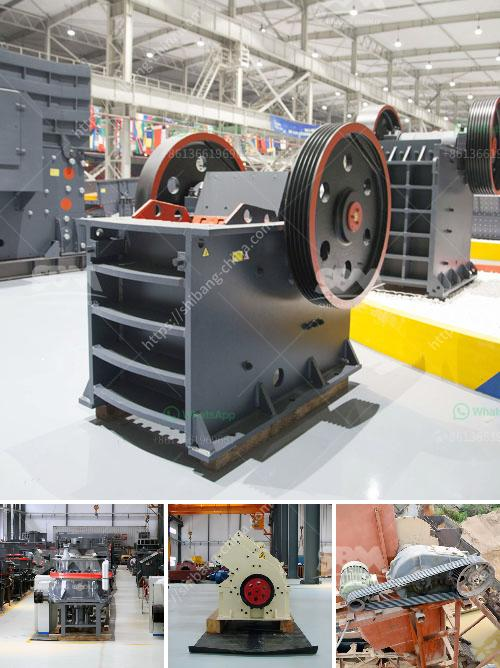

<h3>سعر المكبس لمطحنة المطرقة</h3>
تعتبر مطاحن المطرقة من أهم الأدوات التي يستخدمها مزارعو الحبوب والعلف في عملية تصنيع المواد الغذائية والأعلاف. ومن بين العناصر الرئيسية في هذه المطاحن هو المكبس، الذي يعد جزءًا أساسيًا في عملية سحق وطحن المواد الخام.

يعتبر سعر المكبس لمطاحن المطرقة من العوامل المحددة لجودة المطحنة وكفاءتها. فعند اختيار المربي أو صاحب المزرعة لشراء مطحنة المطرقة، يجب أن ينظر إلى العديد من العوامل التي تؤثر في سعر المكبس. ومن أهم هذه العوامل:

1. الجودة والمتانة: المكبس يجب أن يكون مصنوعًا من مواد ذات جودة عالية وقوية، حيث يتعرض للكثير من الضغوط أثناء عملية التشغيل. يجب أن يستطيع التحمل والتحمل لفترة طويلة دون أية تلفيات.

2. الأداء: المكبس يجب أن يكون قادرًا على سحق وطحن المواد الخام بكفاءة وسرعة عالية. يجب أن يتمتع بنظام محكم وفعال يسمح بتحقيق أعلى نسبة من الإنتاجية.

3. الحجم والوزن: يجب أن يكون المكبس ذو حجم ووزن مناسبين، بحيث يتناسب مع حجم وطاقة المطحنة بشكل عام. فإذا كان المكبس أكبر من الحاجة، فسيتسبب ذلك في زيادة التكاليف بدون فائدة، وإذا كان أصغر، فقد لا يكون قادرًا على القيام بالمهام المطلوبة.

4. الموثوقية: يجب أن يعتمد المكبس على تقنيات حديثة وموثوقة في صناعته. يجب أن يتم تصنيعه باستخدام أحدث التقنيات وأفضل الممارسات لضمان عدم حدوث أي عطل في الجهاز.

أما فيما يتعلق بالسعر، فإنه يتفاوت حسب العلامة التجارية والجودة والحجم والوزن والأداء. يمكن العثور على مكابس مطاحن المطرقة بأسعار تتراوح عادة من 200 إلى 400 دولار، ولكن هناك أيضًا مكابس ذات جودة عالية تباع بأسعار أعلى من ذلك.

في النهاية، فإن اختيار مكبس مطحنة المطرقة يجب أن يتم بناءً على الاعتبارات المذكورة أعلاه، بالإضافة إلى الميزانية المتاحة. يجب على المزارعين وأصحاب المزارع أن يتعاونوا مع موردي المعدات والمطاحن المحترفين لضمان شراء المكبس الذي يلبي احتياجاتهم من حيث الجودة والأداء والسعر.
<h3>Contact us</h3><ul><li><strong>Whatsapp:&nbsp;<a href="https://wa.me/8613661969651">+8613661969651</a></strong></li><li><a href="https://swt.shibang-china.com/?git&amp;zhl&amp;سعر المكبس لمطحنة المطرقة"><strong>Online Service(chat now)</strong></a></li></ul><h3>Related</h3><ul><li><a href='كسارات الحجر في ماليزيا.md'>كسارات الحجر في ماليزيا</a></li><li><a href='آلة طحن السليكات في الهند.md'>آلة طحن السليكات في الهند</a></li><li><a href='مصنع كسارة الحجر 100 tph.md'>مصنع كسارة الحجر 100 tph</a></li><li><a href='مصنع تكسير خام الحديد.md'>مصنع تكسير خام الحديد</a></li><li><a href='آلة كسارة الحصى.md'>آلة كسارة الحصى</a></li></ul>