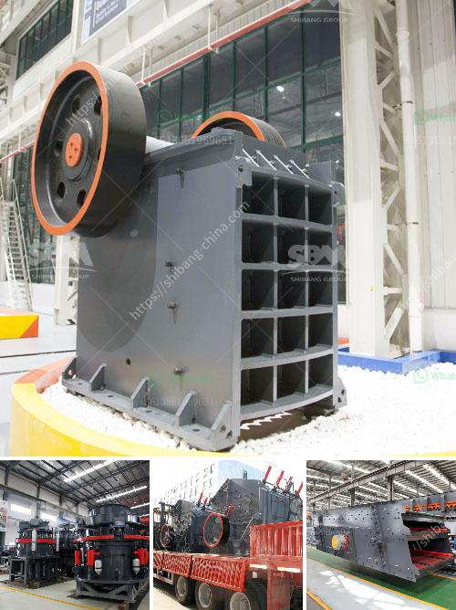

<h3>سعر النحاس</h3>
سعر النحاس هو أحد المواضيع المهمة للعديد من الناس في جميع أنحاء العالم. ويعتبر النحاس أحد المعادن الثمينة والمهمة في الصناعة والتجارة. وتعود أهمية النحاس إلى خصائصه المميزة مثل مرونته وقابليته للتوصيل الحراري والكهربائي، وقدرته على مقاومة التآكل. وهذه الخصائص جعلته مادة أساسية في صناعات عديدة مثل صناعة السيارات والأجهزة المنزلية والأعمال الكهربائية.

على مدى السنوات العديدة الماضية، شهدت أسعار النحاس تقلبات كبيرة. ويرتبط سعر النحاس بالعديد من العوامل المؤثرة مثل العرض والطلب والأحداث السياسية والاقتصادية. ولاسيما في السنوات الأخيرة، شهد سعر النحاس ارتفاعًا وانخفاضًا كبيرًا نتيجة التداعيات الاقتصادية لجائحة كوفيد-19 والتوترات التجارية العالمية. وقد تأثر سعر النحاس أيضًا بتغيرات أسعار العملات وتقلبات الأسواق المالية.

يعتمد سعر النحاس أيضًا على نوعية النحاس ونسبة النقاء. ويقاس سعر النحاس عادة بالطن أو الكيلوغرام. وفي إطار سعر النحاس العالمي، يتم تداوله عبر البورصات والأسواق المالية العالمية. وتواجه الشركات والمستثمرون تقلبات في سعر النحاس ويتعين عليهم ضبط استراتيجياتهم للتعامل مع هذه التقلبات.

من الجدير بالذكر أن ارتفاع سعر النحاس يمكن أن يكون علامة على تعافي الاقتصاد العالمي ونمو الصناعات المختلفة. وعندما يكون الطلب على النحاس مرتفعًا، فإن ذلك يشير إلى زيادة الأنشطة الاقتصادية ونمو الصناعات التي تستخدم النحاس كمادة أساسية في عملياتها. وعلى الجانب المقابل، عندما ينخفض سعر النحاس، يعكس ذلك عادة تراجعًا في النشاط الاقتصادي وتباطؤ الصناعة.

في النهاية، سعر النحاس يعتبر مؤشرًا مهمًا للتنبؤ بالأحوال الاقتصادية العالمية ونمو الصناعات المختلفة. ويتابعه الكثيرون من المستثمرين والمهتمين بقطاع الصناعة. وعلى الرغم من تقلباته المستمرة، فإن النحاس لا يزال يحتفظ بأهميته وقيمته في السوق ويستخدم على نطاق واسع في العديد من الصناعات المختلفة.
<h3>Contact us</h3><ul><li><strong>Whatsapp:&nbsp;<a href="https://wa.me/8613661969651">+8613661969651</a></strong></li><li><a href="https://swt.shibang-china.com/?git&amp;zhl&amp;سعر النحاس"><strong>Online Service(chat now)</strong></a></li></ul><h3>Related</h3><ul><li><a href='آلة طحن لكربونات الكالسيوم من ألمانيا.md'>آلة طحن لكربونات الكالسيوم من ألمانيا</a></li><li><a href='معدات سحق الصناعات الثقيلة في ماليزيا.md'>معدات سحق الصناعات الثقيلة في ماليزيا</a></li><li><a href='كسارة الهامر العمودية.md'>كسارة الهامر العمودية</a></li><li><a href='سعر آلة تصنيع لوحات الجبس.md'>سعر آلة تصنيع لوحات الجبس</a></li><li><a href='تكلفة ناقل الحزام لصناعة التعدين.md'>تكلفة ناقل الحزام لصناعة التعدين</a></li></ul>