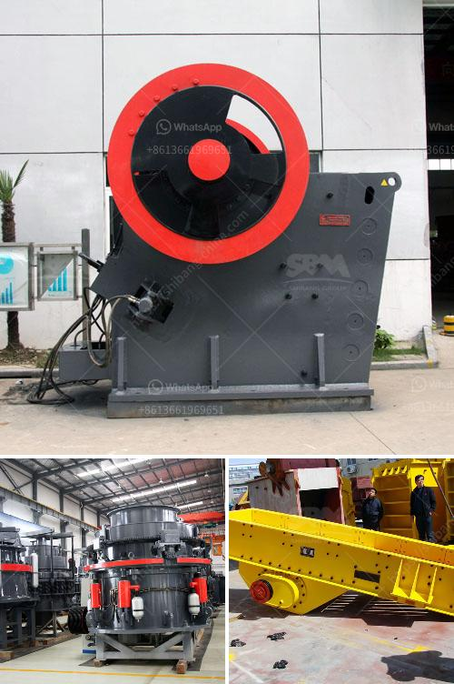

<h3>سعر تشغيل المطحنة للطن في ماليزيا</h3>
تُعد صناعة الطحين من الصناعات الرئيسية في ماليزيا، حيث توجد العديد من المطاحن في مختلف أنحاء البلاد. يعد سعر تشغيل المطحنة للطن في ماليزيا معلومة هامة بالنسبة لأصحاب المطاحن وللمزارعين الذين يعتمدون على المطاحن لتحويل أنتاجهم إلى طحين جاهز.

يعتمد سعر تشغيل المطحنة للطن في ماليزيا على العديد من العوامل، بما في ذلك حجم المطحنة والتكنولوجيا المستخدمة وتكاليف المواد الخام والطاقة والعمالة.

من الناحية التكنولوجية، فإن المطاحن الأكثر تطوراً والتي تستخدم أحدث التقنيات غالبًا ما تكون تكاليف تشغيلها أعلى بشكل عام. تتوفر في ماليزيا مطاحن تعتمد على التقنيات الحديثة والتي توفر إنتاجية عالية وجودة عالية للطحين المنتج.

بالنسبة لتكاليف المواد الخام، فإن اعتماد المطحنة على المواد الخام المحلية يمكن أن يؤدي إلى انخفاض تكلفة تشغيل المطحنة للطن. لذا فإن توافر الحبوب المحلية بكميات كافية يقلل تبعًا لذلك من تكاليف الشحن والاستيراد.

تكلفة الطاقة أيضًا عاملاً هامًا في تحديد سعر تشغيل المطحنة للطن في ماليزيا، حيث يحتاج عمل المطحنة إلى كميات كبيرة من الكهرباء والوقود. تعتمد تكلفة الطاقة على أسعار الكهرباء والوقود في السوق، وقد تتأثر بتغيرات سعر النفط العالمي.

لا يمكن تجاهل تكلفة العمالة، حيث يجب أن يتم توظيف فريق ماهر من العمال لتشغيل المطحنة بشكل فعال. ارتفاع أجور العمالة يؤثر على تكلفة تشغيل المطحنة، ولكن قد تعوض هذه التكاليف إذا تم تحقيق إنتاجية عالية.

من الناحية العامة، فإن سعر تشغيل المطحنة للطن في ماليزيا يتراوح عادةً بين 200 و 400 رنجت ماليزي. قد تختلف هذه التكلفة من مطحنة إلى أخرى ومن منطقة إلى أخرى بناءً على العوامل المذكورة سابقًا.

تحديد سعر تشغيل المطحنة للطن في ماليزيا يعتبر أمرًا هامًا لأصحاب المطاحن وللمزارعين أيضًا، حيث يساعد في تحديد تكاليف إنتاج الطحين وتحقيق الربحية. بالتالي، فإنه من الضروري مراعاة جميع العوامل المؤثرة لتحديد سعر تشغيل المطحنة بشكل دقيق.
<h3>Contact us</h3><ul><li><strong>Whatsapp:&nbsp;<a href="https://wa.me/8613661969651">+8613661969651</a></strong></li><li><a href="https://swt.shibang-china.com/?git&amp;zhl&amp;سعر تشغيل المطحنة للطن في ماليزيا"><strong>Online Service(chat now)</strong></a></li></ul><h3>Related</h3><ul><li><a href='كسارات مستعملة في نيجيريا.md'>كسارات مستعملة في نيجيريا</a></li><li><a href='كسارة مخروطية سلسلة CS.md'>كسارة مخروطية سلسلة CS</a></li><li><a href='مطحنة استرداد الذهب المحمولة للبيع.md'>مطحنة استرداد الذهب المحمولة للبيع</a></li><li><a href='آلة تصنيع الحجر من جنوب أفريقيا.md'>آلة تصنيع الحجر من جنوب أفريقيا</a></li><li><a href='آلات إنتاج الرمل سحق الطحن والفرز.md'>آلات إنتاج الرمل سحق الطحن والفرز</a></li></ul>