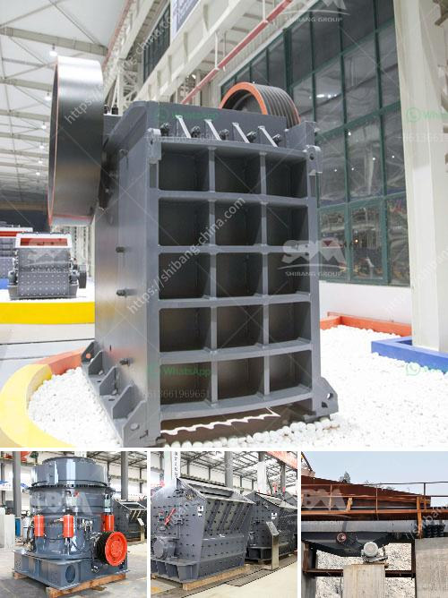

<h3>سعر تكسير الخرسانة في جنوب أفريقيا</h3>
تكسير الخرسانة هو عملية تطبق عندما يكون هناك حاجة لإزالة الخرسانة الموجودة بناءً على أسباب مختلفة. قد تشمل هذه الأسباب تجديد أو تجديد المباني ، أو إصلاح الأضرار ، أو حتى إزالة الخرسانة المعطلة. لكن السؤال الذي يطرح معظم الأشخاص هو كم تكلفة تكسير الخرسانة في جنوب أفريقيا؟

إجراءات تكسير الخرسانة يعتمد في سعره على عدة عوامل. من بين هذه العوامل حجم المشروع ، ومركز العمل ، وحجم الخرسانة التي ينبغي تكسيرها ، وصعوبة الوصول إليها. ويوفر سوق الخدمات مجموعة متنوعة من الشركات التي تقدم خدمة تكسير الخرسانة في جنوب أفريقيا. كما أن لكل شركة سياسة تسعير خاصة بها. ومع ذلك ، يمكن التوصل إلى تقدير تقريبي لتكلفة تكسير الخرسانة.

عادةً ما يتم تقدير تكلفة تكسير الخرسانة بواسطة المتر المكعب. وتتراوح أسعار التكسير في جنوب أفريقيا عادةً بين 200 و 400 راند للمتر المكعب. يجب أن يتم أخذ هذه الأرقام على أنها تقديرات فقط ، وقد يختلف السعر الفعلي حسب العوامل السابقة المذكورة.

إضافةً إلى ذلك ، يجب أن يؤخذ في الاعتبار أن سعر تكسير الخرسانة لا يشمل فقط تكلفة العمل الفعلية لتكسير الخرسانة وازالتها ، ولكن أيضاً تكاليف الأدوات والمعدات المستخدمة وتكلفة التخلص من الخرسانة المكسورة. بعض الشركات قد تحتسب تكلفة النقل أيضًا في السعر الإجمالي.

لذا ، قبل استئجار شركة لتنفيذ عملية تكسير الخرسانة ، يجب الحصول على عروض أسعار من مجموعة متنوعة من الشركات ومقارنة العروض والخدمات المقدمة. يجب أيضًا أن يؤخذ في الاعتبار جودة العمل وتوقيته وسمعتها في السوق.

وفي النهاية ، يحكم العميل اختيار الشركة المناسبة لتكسير الخرسانة وفقًا لاحتياجاته ومتطلباته وميزانيته. يجب أن تكون الشركة قادرة على توفير خدمة عالية الجودة بسعر معقول لتلبية توقعات العميل.
<h3>Contact us</h3><ul><li><strong>Whatsapp:&nbsp;<a href="https://wa.me/8613661969651">+8613661969651</a></strong></li><li><a href="https://swt.shibang-china.com/?git&amp;zhl&amp;سعر تكسير الخرسانة في جنوب أفريقيا"><strong>Online Service(chat now)</strong></a></li></ul><h3>Related</h3><ul><li><a href='شركات آلات مصانع الحجر في سالم تاميل نادو.md'>شركات آلات مصانع الحجر في سالم تاميل نادو</a></li><li><a href='تكلفة مصنع كسارة خام الحديد.md'>تكلفة مصنع كسارة خام الحديد</a></li><li><a href='كسارة محمولة للكوبالت.md'>كسارة محمولة للكوبالت</a></li><li><a href='حجم مدخلات ومخرجات مصنع تكسير الكوارتز.md'>حجم مدخلات ومخرجات مصنع تكسير الكوارتز</a></li><li><a href='مصنع كسارة المحاجر في إيطاليا.md'>مصنع كسارة المحاجر في إيطاليا</a></li></ul>