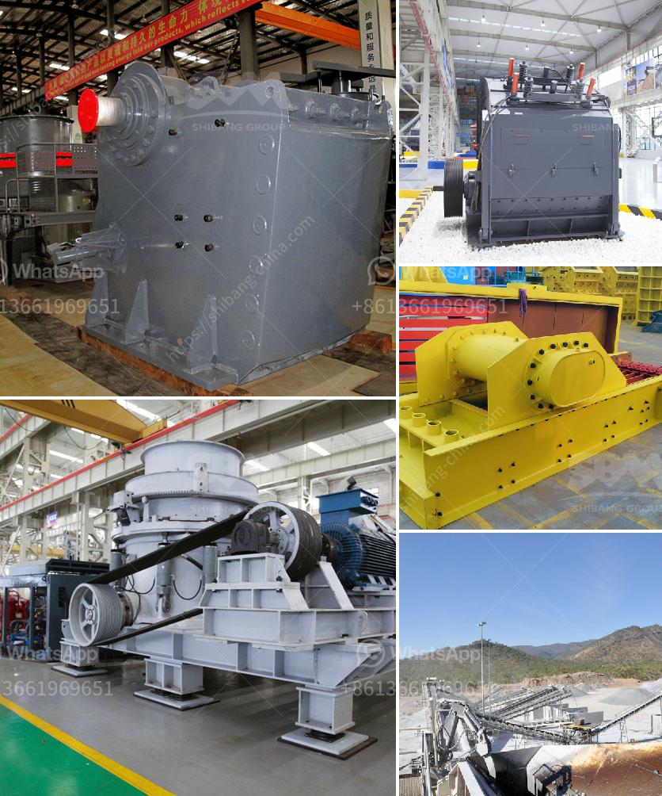

<h3>سعر حزام النقل</h3>
حزام النقل أو السير الناقل هو جهاز ميكانيكي يستخدم لنقل المواد من مكان إلى آخر في المصانع والمحطات والمناجم والمرافق الأخرى. فعلى سبيل المثال، يتم استخدامه في صناعة التعدين لنقل الحصى والرمال، وفي صناعة الأغذية لنقل الحبوب والمنتجات الأخرى.

يتأثر سعر حزام النقل بعدة عوامل مختلفة. أحد العوامل الرئيسية التي تؤثر في سعر هذا الجهاز هي طول الحزام المطلوب. كلما زادت المسافة التي يجب أن يغطيها الحزام، زاد سعره. وذلك لأنه يتطلب المزيد من المواد والكميات الأخرى لتصنيع حزام أطول. بالإضافة إلى ذلك، زيادة الطول يتطلب أيضًا تكلفة إضافية لتركيب وتثبيت الحزام بشكل صحيح.

عامل آخر يؤثر في سعر حزام النقل هو عرض الحزام. حيث يظهر أن الأحزمة ذات العرض الأكبر تكون أغلى من تلك ذات العرض الأصغر. هذا يعود إلى حاجة المزيد من المواد في صنع الأحزمة التي تكون أعرض. علاوة على ذلك، قد يتطلب تنظيم الحزام الأعرض استخدام معدات خاصة ومتطورة لضمان عمله بكفاءة، وهذا يرفع السعر أيضًا.

تكنولوجيا الحزام الناقل هي عامل آخر يؤثر في سعره. هناك تطورات مستمرة في تقنيات تصنيع الأحزمة الناقلة، وهذا يترتب على زيادة السعر. فمثلاً، يمكن أن تكون هناك تقنيات جديدة تتيح للحزام نقل المواد بسرعة أعلى مع استهلاك طاقة أقل، وهذا قد يرفع سعر الحزام. إضافة إلى ذلك، يتم تصنيع الأحزمة بمواد أكثر جودة ومتانة من قبل الشركات المتخصصة، مما يعكس على السعر أيضًا.

بشكل عام، يتفاوت سعر حزام النقل بين 200 و 400 دولار للمتر الواحد حيث يعتمد السعر على العوامل المذكورة سابقًا. ويجب أن يتم اختيار حزام النقل بعناية بناءً على احتياجات المشروع والمواد المتنقلة، وليس فقط بناءً على السعر. فعلى سبيل المثال، قد يكون سعر حزام نقل ذو جودة عالية أغلى بالمقارنة مع آخر ذو جودة منخفضة، ولكنه قد يوفر كفاءة أعلى وعمرًا أطول مما يترتب عليه توفير نفقات صيانة أقل على المدى الطويل.

في النهاية، من المهم النظر في جودة وكفاءة الحزام الناقل، بالإضافة إلى سعره، للحصول على أفضل صفقة وتلبية احتياجات المشروع بشكل مثالي.
<h3>Contact us</h3><ul><li><strong>Whatsapp:&nbsp;<a href="https://wa.me/8613661969651">+8613661969651</a></strong></li><li><a href="https://swt.shibang-china.com/?git&amp;zhl&amp;سعر حزام النقل"><strong>Online Service(chat now)</strong></a></li></ul><h3>Related</h3><ul><li><a href='من مصنع تصنيع البوكسيت في الصين.md'>من مصنع تصنيع البوكسيت في الصين</a></li><li><a href='آلة طحن الكرة من المنغنيز.md'>آلة طحن الكرة من المنغنيز</a></li><li><a href='قائمة بشركات تصنيع مصنع كسارة الحجر.md'>قائمة بشركات تصنيع مصنع كسارة الحجر</a></li><li><a href='آلات معالجة الكاولين للبيع.md'>آلات معالجة الكاولين للبيع</a></li><li><a href='تأجير كسارة صغيرة دبلن.md'>تأجير كسارة صغيرة دبلن</a></li></ul>