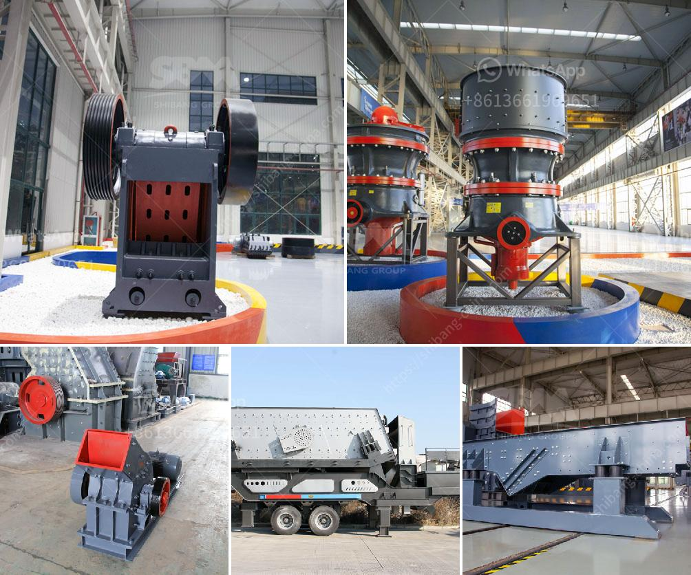

<h3>سعر خط إنتاج الجبس</h3>
تتناول هذه المقالة سعر خط إنتاج الجبس، وهو أحد العوامل الرئيسية التي تؤثر على تكلفة إنتاج هذه المادة المهمة المستخدمة في العديد من الصناعات. تراوح سعر خط إنتاج الجبس عادة بين 200 و 400 ألف دولار ، وقد يتفاوت هذا السعر وفقًا للحجم والقدرات والمواصفات المتاحة في الخط.

يتكون خط إنتاج الجبس عادة من العديد من الأجزاء والمعدات المختلفة التي تعمل معًا لإنتاج الجبس بشكل فعال. ومن بين هذه الأجزاء الرئيسية آلة صب الجبس والتجفيف والتبريد، والمفرزة، ومعدات التعبئة والتغليف، وغيرها من المكونات الأخرى. تعتمد تكلفة الخط بشكل كبير على تقنية تصنيع هذه الأجزاء وجودتها وقدرتها على إنتاج الجبس بكفاءة واستدامة عالية.

بالإضافة إلى ذلك، يؤثر حجم الخط أيضًا على سعره، حيث يكون لخطوط الإنتاج الأكبر حجمًا وقدرة أكبر على إنتاج كميات أكبر من الجبس. وبالتالي، فإن خطوط الإنتاج الأكبر تكون عادة أغلى من خطوط الإنتاج الأصغر حجمًا.

من الجدير بالذكر أنّ سعر خط إنتاج الجبس قد يختلف أيضًا بناءً على الشركة المصنعة، حيث توجد العديد من الشركات المصنعة لخطوط إنتاج الجبس وتوفر خيارات متعددة. وقد تختلف تكاليف التشغيل والخدمات المقدمة بالإضافة إلى التكنولوجيا المستخدمة من شركة لأخرى.

قد يعتبر سعر خط إنتاج الجبس مستثمرًا كبيرًا للشركات التي تهدف للانخراط في صناعة الجبس. ولكن، يعود استخدام خط إنتاج الجبس بالكفاءة والاستدامة العالية على الشركات بزيادة إنتاجها وتحسين جودة منتجاتها، مما يعني انتعاشًا اقتصاديًا للمؤسسة على المدى الطويل.

في الختام، يمكن القول إن سعر خط إنتاج الجبس يتراوح عادة بين 200 و 400 ألف دولار، ويتأثر السعر بالحجم والقدرات والمواصفات المختلفة للمعدات. ومن الجدير بالذكر أنّ استثمار الشركات في خطوط إنتاج الجبس يساهم في تحقيق تنمية اقتصادية وتوفير فرص عمل في الصناعة.
<h3>Contact us</h3><ul><li><strong>Whatsapp:&nbsp;<a href="https://wa.me/8613661969651">+8613661969651</a></strong></li><li><a href="https://swt.shibang-china.com/?git&amp;zhl&amp;سعر خط إنتاج الجبس"><strong>Online Service(chat now)</strong></a></li></ul><h3>Related</h3><ul><li><a href='نموذج عملي لكسارة الحجر.md'>نموذج عملي لكسارة الحجر</a></li><li><a href='سعة مطحنة الكرة بالأطنان.md'>سعة مطحنة الكرة بالأطنان</a></li><li><a href='موردي مطاحن الأسطوانة في المكسيك.md'>موردي مطاحن الأسطوانة في المكسيك</a></li><li><a href='نوع الفك محطم.md'>نوع الفك محطم</a></li><li><a href='مطحنة رايموند في بورور.md'>مطحنة رايموند في بورور</a></li></ul>