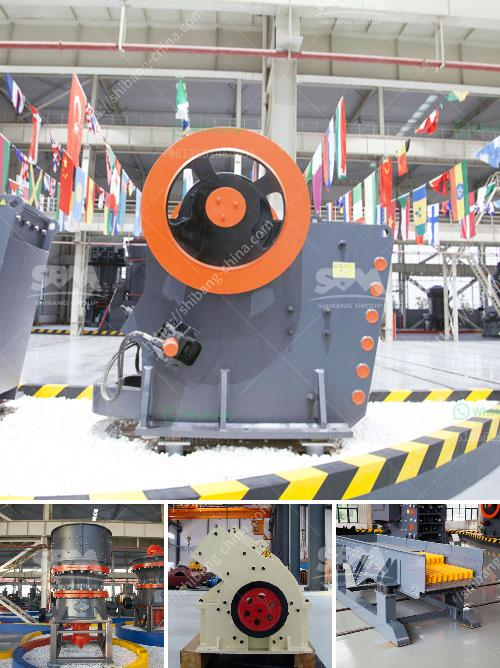

<h3>سعر رخيص لآلة تصنيع حبيبات الفحم</h3>
لا شك في أن الطلب على الفحم كوقود احترافي يزيد يوماً بعد يوم. ومع ذلك، قد يواجه العديد من المشغلين الصناعيين صعوبة في العثور على آلات تصنيع حبيبات الفحم التي تتناسب مع ميزانيتهم.

ومع ذلك، يتوفر اليوم على سوق الآلات مجموعة واسعة من المعدات التي تلبي الاحتياجات المحددة لصناعة حبيبات الفحم، بأسعار تتراوح بين 200 و400 دولار. يمكن للمشغلين الاستفادة من هذه الآلات بسهولة وفاعلية لتلبية الطلب المتزايد على الفحم.

تعتبر آلة تصنيع حبيبات الفحم ضرورة حتمية لصناعة الفحم الحيوي، إذ تتيح تحويل فحم الخشب أو نشارة الخشب إلى حبيبات صغيرة ومدمجة، مما يسهل عمليات النقل والتخزين والحرق. وتعمل هذه الآلات عن طريق تقنية الكبس الحراري، حيث يتم تسخين الفحم بضغط عالٍ لتشكيله في شكل حبيبات صلبة وموحدة.

مع ذلك، فإن أسعار الآلات التي تستخدم تقنية الكبس الحراري تكون عادةً مرتفعة للغاية، مما يجعلها خارجة عن متناول العديد من المشغلين الصغار. ولكن مع التطور التكنولوجي السريع، ظهرت اليوم آلات تصنيع حبيبات الفحم بأسعار معقولة، تتميز بجودة عالية وأداء موثوق.

من بين هذه الآلات المتاحة بأسعار رخيصة، تتميز العديد منها بقدرتها على معالجة كميات كبيرة من الفحم في وقت قياسي، مما يضمن فعالية وسرعة الإنتاج. كما تتميز بتقنيات متقدمة توفر استهلاكًا أقل للطاقة وإنتاجًا أكثر تنوعًا في الحجم والأشكال.

بالإضافة إلى ذلك، تتميز هذه الآلات أيضًا بالتكنولوجيا المتقدمة المستخدمة فيها، حيث يتم تجهيزها بأجهزة التحكم الآلي التي تسهل عملية التشغيل وتحسن دقة العملية بشكل كبير.

في النهاية، تعتبر آلة تصنيع حبيبات الفحم بأسعار رخيصة خيارًا مثاليًا للمشغلين الصناعيين الذين يبحثون عن زيادة الإنتاجية وتحسين الكفاءة بتكلفة أقل. من خلال الاستثمار في هذه الآلات، يمكن للمشغلين تلبية الطلب المتزايد على الفحم وتحقيق أرباح أكبر في ظل المنافسة المتنامية في سوق الوقود الحيوي.
<h3>Contact us</h3><ul><li><strong>Whatsapp:&nbsp;<a href="https://wa.me/8613661969651">+8613661969651</a></strong></li><li><a href="https://swt.shibang-china.com/?git&amp;zhl&amp;سعر رخيص لآلة تصنيع حبيبات الفحم"><strong>Online Service(chat now)</strong></a></li></ul><h3>Related</h3><ul><li><a href='معدات طحن مطحنة ريموند.md'>معدات طحن مطحنة ريموند</a></li><li><a href='آلة تكسير الصخور في الفلبين.md'>آلة تكسير الصخور في الفلبين</a></li><li><a href='معدات إنتاج الركام.md'>معدات إنتاج الركام</a></li><li><a href='كسارة حجرية مستعملة للبيع.md'>كسارة حجرية مستعملة للبيع</a></li><li><a href='تكلفة المعدات المستخدمة في تعدين خام الرصاص.md'>تكلفة المعدات المستخدمة في تعدين خام الرصاص</a></li></ul>