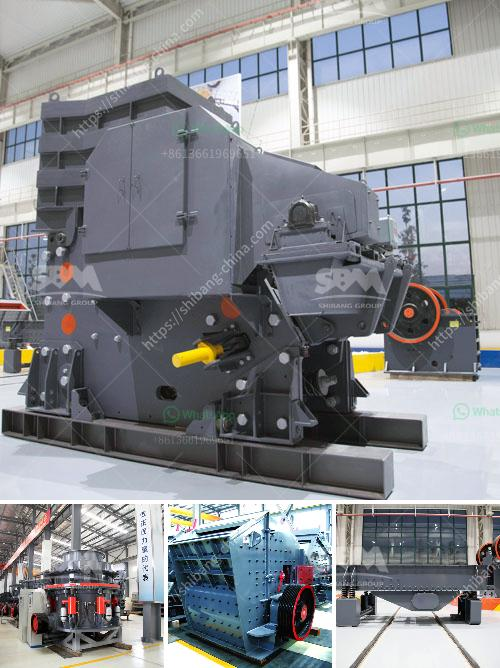

<h3>سعر طاحونة المطرقة</h3>
تعتبر طاحونة المطرقة أداة رئيسية في صناعة الأعلاف والدقيق، حيث تُستخدم لطحن المواد الخام والحبوب لتصنيع منتجات ذات جودة عالية. واحدة من العوامل المهمة التي ينبغي النظر فيها عند البحث عن طاحونة مطرقة هي السعر. يتراوح سعر طاحونة المطرقة بشكل عام ما بين 200 إلى 400 دولار، وتتفاوت هذه الأسعار بناءً على الحجم والقوة والمواصفات التقنية المتاحة.

قد تكون الطواحين الصغيرة ذات الأسعار المنخفضة بسيطة وتناسب الاحتياجات الأساسية مثل طحن القمح في المنزل للاستخدام الشخصي. ومع ذلك، قد يكون لديها بعض القيود فيما يتعلق بإمكانات الإنتاج وسرعة طحن المواد الخام. على الجانب الآخر، فإن الطواحين الكبيرة ذات الأسعار المرتفعة تتمتع بمزيد من القوة والقدرة على طحن كميات أكبر من المواد الخام في وقت أقل.

تتأثر أيضًا الأسعار بالماركة والبلد المصنع، إذ أن بعض العلامات التجارية المعروفة تتميز بالجودة والمتانة وتكون أغلى بسبب ذلك. كما ينبغي أخذ الحجم في الاعتبار أيضًا، فقد تتطلب الطواحين الكبيرة تكاليف إضافية للشحن والتركيب.

من الأمور التي ينبغي مراعاتها عند الاختيار هو معرفة الاحتياجات الخاصة بك. إذا كنت مالكًا لمزرعة صغيرة فإن طاحونة متوسطة الحجم تكون مناسبة لتلبية احتياجاتك. من ناحية أخرى، إذا كنت تعمل في صناعة الأعلاف بمقياس أكبر، فيجب مراعاة استثمار في طاحونة أكبر وأكثر قوة.

باختيار طاحونة المطرقة المناسبة، يمكن للمزارعين وصناع الأعلاف تحقيق مزايا عديدة، مثل زيادة الإنتاجية وتوفير التكاليف. لذا، يجب على المستهلكين دراسة مواصفات الطواحين المختلفة واختيار تلك التي تتناسب مع احتياجاتهم وميزانيتهم.
<h3>Contact us</h3><ul><li><strong>Whatsapp:&nbsp;<a href="https://wa.me/8613661969651">+8613661969651</a></strong></li><li><a href="https://swt.shibang-china.com/?git&amp;zhl&amp;سعر طاحونة المطرقة"><strong>Online Service(chat now)</strong></a></li></ul><h3>Related</h3><ul><li><a href='كسارة التعدين في تنزانيا.md'>كسارة التعدين في تنزانيا</a></li><li><a href='تجار كسارة الفك المحمولة في كينيا.md'>تجار كسارة الفك المحمولة في كينيا</a></li><li><a href='مطحنة هامر 7 في 8 للذهب والكوارتز.md'>مطحنة هامر 7 في 8 للذهب والكوارتز</a></li><li><a href='تاجر آلة كسارة الحجر نيبال.md'>تاجر آلة كسارة الحجر نيبال</a></li><li><a href='سعر آلة طحن في الهند.md'>سعر آلة طحن في الهند</a></li></ul>