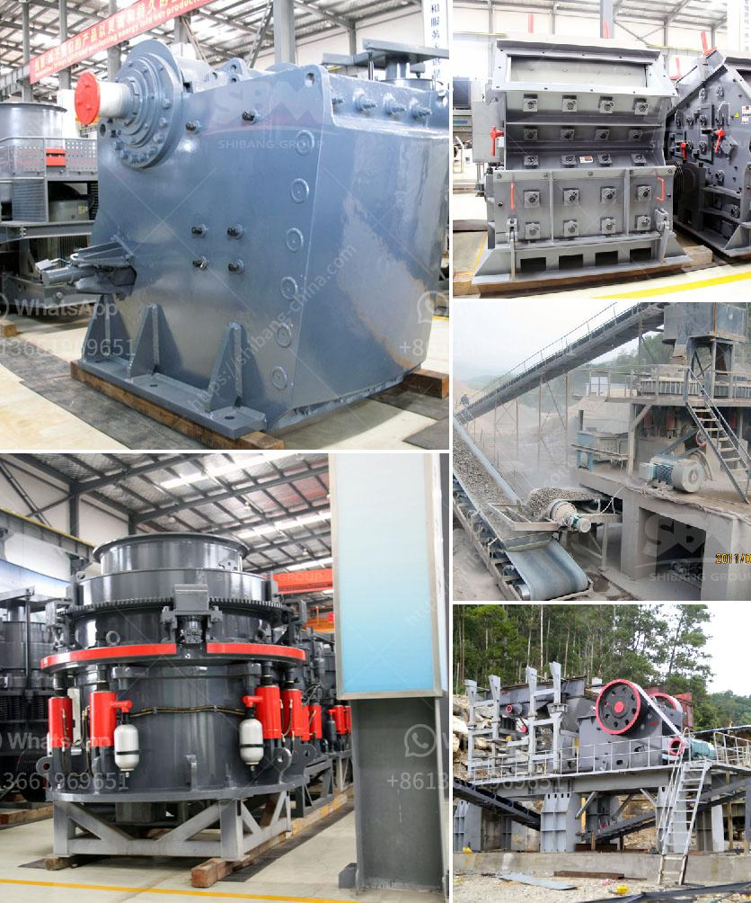

<h3>سعر فحص الرمل بسعة كبيرة للبيع</h3>
يُعد الرمل أحد الموارد الطبيعية القيمة التي تلعب دورًا حيويًا في العديد من الصناعات، بدءًا من البناء وحتى الزراعة والصناعات الكيماوية. وبالتالي، فإن جودة الرمل تعد أمرًا حاسمًا لنجاح أي مشروع يستخدم الرمل كمادة أساسية. ومن أجل ضمان جودة الرمل، يتعين فحصه بشكل منتظم من قبل أجهزة فحص الرمل ذات السعة الكبيرة.

تعتبر أجهزة فحص الرمل بسعة كبيرة أدوات حديثة تستخدم في مجموعة متنوعة من الصناعات. تعمل هذه الأجهزة بطرق متنوعة، بما في ذلك الاهتزاز والتصفية والسحق، لفصل الرمل عن المواد الغريبة الأخرى مثل الحصى والأتربة. وبفضل قدرتها على التعامل مع كميات كبيرة من الرمل في وقت قصير، توفر هذه الأجهزة فحصًا فعالًا ودقيقًا.

تشتمل أجهزة فحص الرمل بسعة كبيرة على مكونات أساسية مثل المحركات الكهربائية والشاشات والفلاتر. يتم تشغيل الآلة بواسطة المحرك الكهربائي، الذي ينقل الحركة إلى شاشة الفحص لتهتز وتفصل أحجام الرمل المختلفة. وتسمح الفلاتر المثبتة في الجهاز بتصفية أي شوائب دقيقة قد تكون موجودة في الرمل.

تتوفر أجهزة فحص الرمل بسعة كبيرة بمختلف الأحجام والموديلات، حسب احتياجات المشروع المحدد. تتراوح السعات من عدة أطنان في الساعة إلى عدة عشرات من الأطنان في الساعة، مما يمكن المستخدم من معالجة كميات كبيرة من الرمل في وقت قصير. وبفضل التكنولوجيا المتقدمة المستخدمة في هذه الأجهزة، فإنها توفر نتائج فحص دقيقة وموثوقة في كل مرة.

وتعتبر أسعار فحص الرمل بسعة كبيرة متفاوتة وتعتمد على السعة والموديل والجودة العامة للجهاز. يتراوح السعر بين 200 إلى 400 دولار، حسب المواصفات والميزات المطلوبة. بالطبع، يعتبر سعر الجهاز استثمارًا جيدًا لأي منشأة تحتاج إلى فحص الرمل بشكل مكثف.

وفي الختام، يُعد فحص الرمل بسعة كبيرة أمرًا حاسمًا للتأكد من جودة الرمل وفصله عن المواد الغريبة الأخرى. وباستخدام أجهزة فحص الرمل ذات السعة الكبيرة، يمكن للشركات والمنشآت ضمان جودة الرمل المستخدم في مشاريعها. وعلى الرغم من أن أسعار الجهاز قد تكون مرتفعة، إلا أن استثمارها يعود بالفائدة عندما يتعلق الأمر بجودة المشروع ونجاحه.
<h3>Contact us</h3><ul><li><strong>Whatsapp:&nbsp;<a href="https://wa.me/8613661969651">+8613661969651</a></strong></li><li><a href="https://swt.shibang-china.com/?git&amp;zhl&amp;سعر فحص الرمل بسعة كبيرة للبيع"><strong>Online Service(chat now)</strong></a></li></ul><h3>Related</h3><ul><li><a href='آلة كسارة الفك في المملكة العربية السعودية.md'>آلة كسارة الفك في المملكة العربية السعودية</a></li><li><a href='كسارة حجر في تروخيلو، بوليفيا.md'>كسارة حجر في تروخيلو، بوليفيا</a></li><li><a href='مصنعي معدات تعدين الذهب في الدنمارك.md'>مصنعي معدات تعدين الذهب في الدنمارك</a></li><li><a href='مصنع كسارة متنقلة للبيع.md'>مصنع كسارة متنقلة للبيع</a></li><li><a href='مطحنة ليستر في كينيا.md'>مطحنة ليستر في كينيا</a></li></ul>