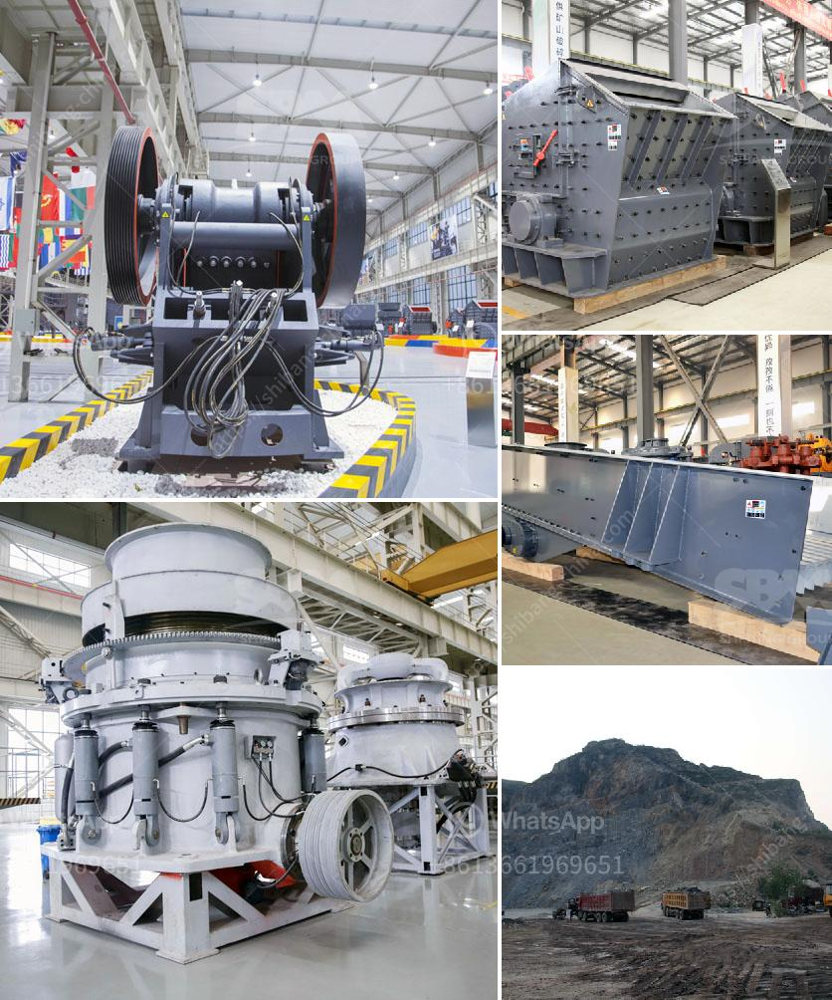

<h3>سعر كسارات الحجر في لاغوس</h3>
تعتبر كسارات الحجر من العناصر الأساسية في صناعة البناء والإنشاءات، حيث تستخدم في تكسير الصخور وتحويلها إلى مواد بناء مفيدة. وتعتبر مدينة لاغوس في نيجيريا واحدة من المدن التي تتمتع بوجود العديد من كسارات الحجر المختلفة.

يتأثر سعر كسارات الحجر في لاغوس بعدة عوامل، منها نوع الكسارة وحجمها وجودتها. إذ تختلف الكسارات في الحجم، حيث تتراوح بين الصغيرة المحمولة والكبيرة الثابتة، وكل منها له استخدام مختلف ويتطلب معدات مختلفة.

أيضًا، يلعب طول فترة التأجير دورًا في تحديد سعر الكسارة، حيث يمكن استئجارها لفترة قصيرة أو طويلة. عادةً ما يكون سعر الايجار لفترة طويلة أرخص من الفترة القصيرة.

وبشكل عام، يمكن القول أن سعر كسارات الحجر في لاغوس يتراوح بين 200 إلى 400 دولار للكسارة الصغيرة المحمولة وتزيد التكلفة مع ازدياد حجم الكسارة. ومن المهم أن يتم اختيار الكسارة المناسبة والتأكد من جودتها وكفاءتها قبل القرار بشراءها أو استئجارها.

وبالإضافة إلى سعر الكسارة نفسها، يجب الأخذ في الاعتبار أيضًا تكاليف الصيانة والاستبدال لأجزاء الكسارة التالفة والاستهلاكية. يجب أن يكون لدى المستخدم ميزانية محددة لهذه التكاليف ويجب أن يتعاقد مع مزود صيانة موثوق لضمان عمل الكسارة بكفاءة عالية لفترة طويلة.

وفي النهاية، يجب على العملاء أن يفهموا أن شراء أو استئجار الكسارات الحجر في لاغوس ليس فقط مسؤولية اقتصادية ولكن أيضا مسؤولية بيئية. يجب على المستخدمين اتخاذ إجراءات صحيحة للتخلص من النفايات وضمان الحفاظ على البيئة المحيطة من التلوث.

باختصار، سعر كسارات الحجر في لاغوس يتأثر بعدة عوامل مثل حجم الكسارة وجودتها وفترة الاستئجار. ويجب أن يكون لدى المستخدم ميزانية ملائمة لتكاليف الاستخدام الطويل الأجل بالإضافة إلى الاعتبارات البيئية للتخلص من النفايات بشكل صحيح.
<h3>Contact us</h3><ul><li><strong>Whatsapp:&nbsp;<a href="https://wa.me/8613661969651">+8613661969651</a></strong></li><li><a href="https://swt.shibang-china.com/?git&amp;zhl&amp;سعر كسارات الحجر في لاغوس"><strong>Online Service(chat now)</strong></a></li></ul><h3>Related</h3><ul><li><a href='مطاحن رايموند في المكسيك.md'>مطاحن رايموند في المكسيك</a></li><li><a href='سعر كسارة الفحم القدرة.md'>سعر كسارة الفحم القدرة</a></li><li><a href='أنواع الجبس.md'>أنواع الجبس</a></li><li><a href='شركة تصنيع لطحن الكلنكر.md'>شركة تصنيع لطحن الكلنكر</a></li><li><a href='غسالة مواد خام جرايستون مستعملة.md'>غسالة مواد خام جرايستون مستعملة</a></li></ul>