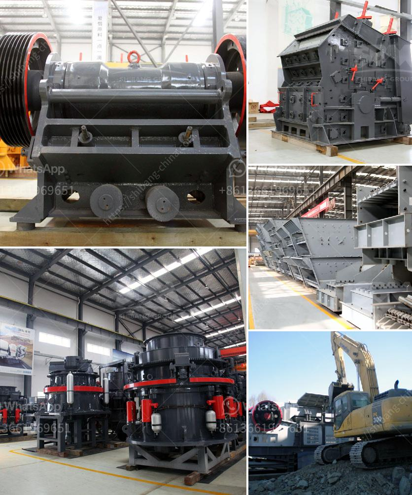

<h3>سعر كسارة الأسطوانة</h3>
تعد كسارة الأسطوانة أداة أساسية في صناعة التعدين ومعالجة المواد الخام. تهدف هذه الأداة إلى سحق المواد الصلبة إلى قطع صغيرة قابلة للتحمل وللإستخدام في العديد من التطبيقات المختلفة. تتراوح أسعار كسارة الأسطوانة عادةً بين 200 و 400 دولار وتتأثر هذه الأسعار بالعديد من العوامل المختلفة.

أحد العوامل الرئيسية التي تؤثر في سعر كسارة الأسطوانة هي جودتها والمواد المستخدمة في تصنيعها. هناك مجموعة واسعة من الكسارات المتاحة في السوق بأسعار مختلفة. تختلف جودة هذه الكسارات من الأدوات الرخيصة المصنوعة من مواد ضعيفة إلى الكسارات المتطورة والقوية التي تستخدم لفترات طويلة. عندما تشتري كسارة الأسطوانة ، يجب أن تأخذ في الاعتبار تلك الأنواع التي تناسب احتياجاتك الخاصة والتي تستخدم المواد الأنسب في تصنيعها.

علاوة على ذلك ، تؤثر أيضًا العلامة التجارية للكسارة وسمعتها في سعرها. العلامات التجارية المعروفة بجودتها وموثوقيتها عادةً ما تكون أغلى من العلامات التجارية الغير مشهورة. إذا كنت تبحث عن كسارة ذات جودة عالية وتستخدم لفترات طويلة ، فمن الأفضل أن تبحث عن العلامات التجارية المعروفة والتي تتمتع بسمعة جيدة في السوق.

عوامل أخرى تؤثر أيضًا على سعر كسارة الأسطوانة هي الحجم والسعة والقوة. الكسارات الصغيرة بسعات منخفضة وقوة قليلة عادةً ما تكون أرخص من الكسارات الكبيرة بسعات عالية وقوة كبيرة. يجب أن تختار الكسارة التي تناسب حجم واحتياجات الإنتاج للمواد التي ترغب في سحقها.

بالإضافة إلى ذلك ، تختلف أيضًا تكلفة الصيانة وقطع الغيار للكسارة من كسارة إلى أخرى. من المهم أن تأخذ ذلك في الاعتبار أيضًا عند اختيار الكسارة الأنسب لاحتياجاتك.

بشكل عام ، يمكن القول أن سعر كسارة الأسطوانة يتأثر بالعديد من العوامل المختلفة وأنه يجب عليك اختيار الكسارة التي تناسب احتياجاتك الخاصة والتي تتناسب مع ميزانيتك المالية. يمكن العثور على الكسارات في العديد من المتاجر عبر الإنترنت والمتاجر المحلية المختلفة ومن الأفضل أن تقارن الأسعار والمواصفات قبل اتخاذ قرار الشراء النهائي.
<h3>Contact us</h3><ul><li><strong>Whatsapp:&nbsp;<a href="https://wa.me/8613661969651">+8613661969651</a></strong></li><li><a href="https://swt.shibang-china.com/?git&amp;zhl&amp;سعر كسارة الأسطوانة"><strong>Online Service(chat now)</strong></a></li></ul><h3>Related</h3><ul><li><a href='تركيبة مواد كسارة الفحم.md'>تركيبة مواد كسارة الفحم</a></li><li><a href='كسارات الحجر في غانا.md'>كسارات الحجر في غانا</a></li><li><a href='مصنع غسيل الذهب المستخدمة.md'>مصنع غسيل الذهب المستخدمة</a></li><li><a href='مورد كسارة الأسطوانة المزدوجة.md'>مورد كسارة الأسطوانة المزدوجة</a></li><li><a href='آلة سحق الكالسيت.md'>آلة سحق الكالسيت</a></li></ul>