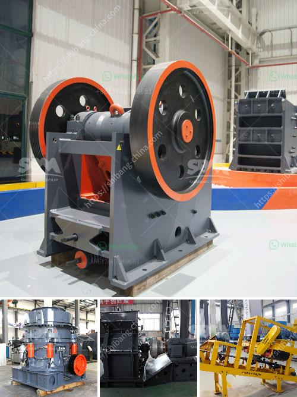

<h3>سعر كسارة الباريت</h3>
يُعد الباريت معدنًا غير معدني مشهورًا في صناعات النفط والغاز والطلاء والطبية والتعدين. يستخدم الباريت بشكل أساسي كمادة تعزيز في الطلاء وبودرة تثقيل في صناعة النفط والغاز. بناءً على استخداماته الواسعة واحتياجات السوق المتزايدة، فإن سعر كسارة الباريت يعد مرغوبًا ومهمًا في السوق.

يتأثر سعر كسارة الباريت بعدة عوامل منها العرض والطلب. على الرغم من وجود احتياطات وافرة من الباريت في العالم، إلا أن الطلب عليه يزداد باستمرار نظرًا لتوسع صناعات النفط والغاز والبناء والتعدين. تعتبر الصين أحد أكبر المستوردين للباريت، حيث يتم استخدامه بكثافة في صناعة النفط والغاز والطلاء. يعتبر الطلب القوي من الصين عاملًا رئيسيًا في زيادة سعر كسارة الباريت.

بجانب العرض والطلب، تؤثر أيضًا تكلفة إنتاج الباريت في سعر كسارة الباريت. يتم استخراج الباريت من المناجم ويتم معالجته لاستخدامه في الصناعات المختلفة. تكون عمليات استخراج الباريت مكلفة وتستدعي موارد وجهود كبيرة. بالإضافة إلى ذلك، يوجد مجموعة متنوعة من المواصفات والجودات للباريت، والتي تؤثر أيضًا على التكلفة. إذا كان الباريت مصنفًا عالي الجودة وطازجًا، فمن المحتمل أن يكون أغلى بالنسبة للمستهلكين.

يتحمل المستهلكون أيضًا تكاليف النقل والتوزيع لكسارة الباريت. قد يتواجد الباريت في مناطق نائية أو بعيدة، مما يستدعي تكاليف نقل إضافية. يؤثر ذلك أيضًا على سعر كسارة الباريت.

بشكل عام، يتفاوت سعر كسارة الباريت بين الموردين والأسواق المختلفة. قد تكون هناك أسواق تقدم كسارة الباريت بأسعار منخفضة نظرًا لتواجدها الوفير والقرب من مناطق الاستخراج. في المقابل، قد تكون هناك أسواق تعرض كسارة الباريت بأسعار مرتفعة نظرًا للاقتصاد القوي في تلك الدولة أو الإقليم والطلب القوي على الباريت.

في النهاية، يُعد سعر كسارة الباريت مهمًا لأولئك الذين يعملون في صناعات النفط والغاز والبناء والتعدين. يتأثر بعوامل متعددة مثل العرض والطلب وتكلفة الإنتاج وتكاليف النقل والتوزيع. لذا، ينبغي أن يكون العملاء على استعداد لتوجيه استفساراتهم ومقارنة الأسعار من موردين مختلفين قبل اتخاذ القرار النهائي.
<h3>Contact us</h3><ul><li><strong>Whatsapp:&nbsp;<a href="https://wa.me/8613661969651">+8613661969651</a></strong></li><li><a href="https://swt.shibang-china.com/?git&amp;zhl&amp;سعر كسارة الباريت"><strong>Online Service(chat now)</strong></a></li></ul><h3>Related</h3><ul><li><a href='مصانع مطاحن الأسمنت.md'>مصانع مطاحن الأسمنت</a></li><li><a href='مطحنة قضيب الطحن الجاف.md'>مطحنة قضيب الطحن الجاف</a></li><li><a href='مستخدمة لمطاحن ريموند للبيع في الهند.md'>مستخدمة لمطاحن ريموند للبيع في الهند</a></li><li><a href='آلة سحق البلاد.md'>آلة سحق البلاد</a></li><li><a href='كسارات حجر بسيطة من زيفيث في كينيا.md'>كسارات حجر بسيطة من زيفيث في كينيا</a></li></ul>