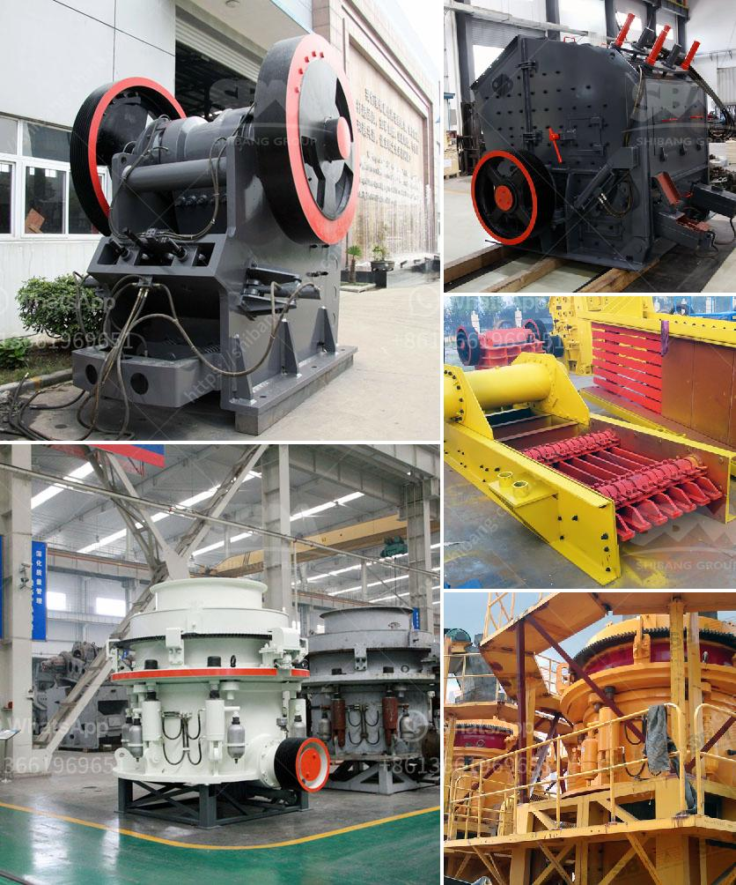

<h3>سعر كسارة الح</h3>
تعد كسارة الحجر أداة مهمة في صناعة البناء والتشييد. فهي تقوم بكسر الحجر الكبير إلى حجم صغير يمكن استخدامه في مشاريع البناء المختلفة. واحدة من العوامل الرئيسية التي تؤثر على اختيار الكسارة هي سعرها.

سعر كسارة الحجر يتنوع بشكل كبير ويتأثر بعدة عوامل، مثل حجم الكسارة وطاقتها وجودتها ومكان المصنع وبلد الصناعة والعلامة التجارية المصنِّعة والتكنولوجيا المستخدمة في التصنيع. ومن المعروف أن الكسارات الصغيرة التي تعمل باليد أو بمحرك صغير تكون أرخص من الكسارات الكبيرة المتطورة التي تعمل بمحرك كهربائي ثقيل.

بشكل عام، يمكن الحصول على كسارة حجرية بسعر تتراوح ما بين 200 و 400 دولار تقريبًا. هذه الكسارات البسيطة والمنخفضة التكلفة تكون مناسبة للاستخدام المنزلي البسيط أو للمشاريع الصغيرة. تعمل هذه الكسارات بنظام يعتمد على اليدوية أو على محرك صغير، وغالبًا ما تستخدم لكسر الحجارة الصغيرة والصخور الناعمة.

من ناحية أخرى، هناك كسارات حجرية أكثر تطورًا وتكلفة للمشاريع الكبيرة والاحترافية. سعر هذه الكسارات يترواح بين 2000 و 5000 دولار ، والتي تعمل بمحرك كهربائي عالي القوة وتتمتع بمزايا تقنية عالية. يحتوي هذا النوع من الكسارات على إعدادات قابلة للتعديل لتحديد حجم الجسيمات المطلوبة، وتتميز بسرعة عالية وكفاءة في الأداء.

باختيار الكسارة المناسبة، يجب أن يتم اختيارها وفقًا للاحتياجات المحددة لكل مشروع. يجب اختيار الحجم والطاقة المطلوبة والوظائف التقنية ومتطلبات العمل والميزانية الخاصة بك. كما يجب النظر في الجودة والمتانة والصيانة المطلوبة للكسارة.

في النهاية، تبقى ميزانيتك هي العامل الأهم في تحديد الكسارة المثلى. إن كسارة الحجر بسعر 200-400 دولار تعتبر ميسورة التكلفة وقد تكون مناسبة للاستخدام المنزلي البسيط أو لمشاريع البناء الصغيرة. ومع ذلك، يجب النظر في الاحتياجات الفردية والمتطلبات للمشروع قبل شراء كسارة. كما يجب أخذ جودة الكسارة وسهولة صيانتها في الاعتبار لضمان الحصول على أداء ممتاز ودائم في مشروعك.
<h3>Contact us</h3><ul><li><strong>Whatsapp:&nbsp;<a href="https://wa.me/8613661969651">+8613661969651</a></strong></li><li><a href="https://swt.shibang-china.com/?git&amp;zhl&amp;سعر كسارة الح"><strong>Online Service(chat now)</strong></a></li></ul><h3>Related</h3><ul><li><a href='شركة تصنيع كسارة في جوجارات.md'>شركة تصنيع كسارة في جوجارات</a></li><li><a href='موردين معدات سحق السيليكا.md'>موردين معدات سحق السيليكا</a></li><li><a href='كسارة الرمال والحجر في فرايبورج.md'>كسارة الرمال والحجر في فرايبورج</a></li><li><a href='شركة تصنيع معدات التكسير.md'>شركة تصنيع معدات التكسير</a></li><li><a href='سعر كسارة الحجر سعة طن في الساعة.md'>سعر كسارة الحجر سعة طن في الساعة</a></li></ul>